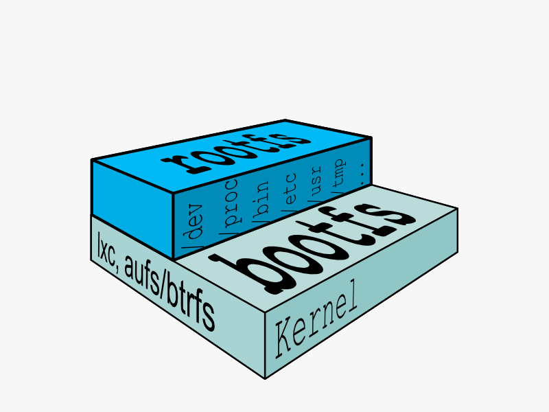
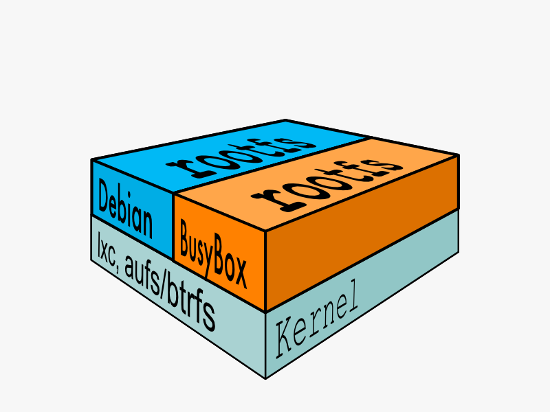
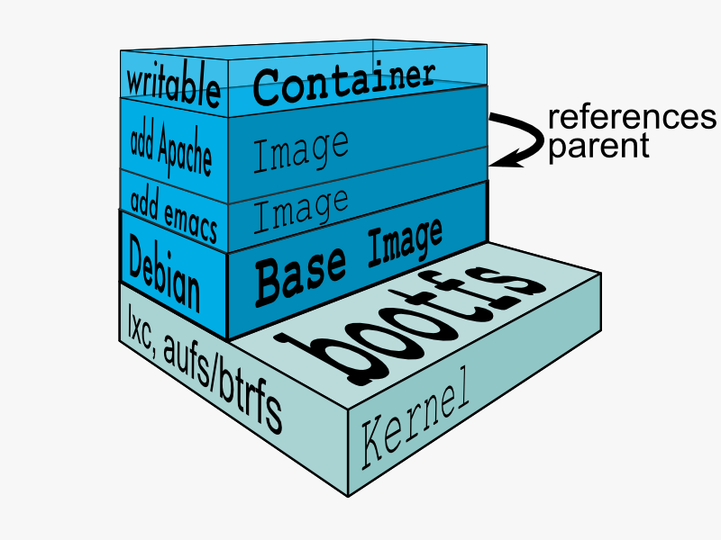
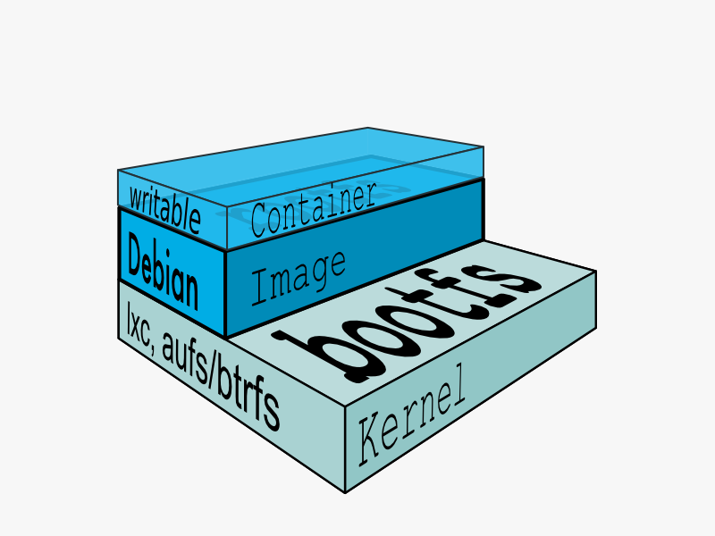
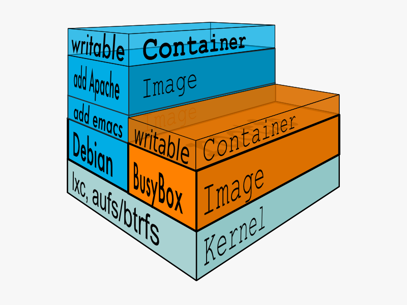

## 核心技术预览

Docker的核心是操作系统级的虚拟化。虚拟化技术主要包含四个方面：隔离性、可配额/可度量、便携性、安全性。

### 隔离性：Linux Namespace(ns)

每个用户实例之间相互隔离, 互不影响。 一般的硬件虚拟化方法给出的方法是VM，而LXC给出的方法是container，更细一点讲就是kernel namespace。其中pid、net、ipc、mnt、uts、user等namespace将container的进程、网络、消息、文件系统、UTS("UNIX Time-sharing System")和用户空间隔离开。

#### pid namespace

不同用户的进程就是通过pid namespace隔离开的，且不同 namespace 中可以有相同pid。所有的LXC进程在docker中的父进程为docker进程，每个lxc进程具有不同的namespace。同时由于允许嵌套，因此可以很方便的实现 Docker in Docker。

#### net namespace

有了 pid namespace, 每个namespace中的pid能够相互隔离，但是网络端口还是共享host的端口。网络隔离是通过net namespace实现的， 每个net namespace有独立的 network devices, IP addresses, IP routing tables, /proc/net 目录。这样每个container的网络就能隔离开来。docker默认采用veth的方式将container中的虚拟网卡同host上的一个docker bridge: docker0连接在一起。

#### ipc namespace

container中进程交互还是采用linux常见的进程间交互方法(interprocess communication - IPC), 包括常见的信号量、消息队列和共享内存。然而同 VM 不同的是，container 的进程间交互实际上还是host上具有相同pid namespace中的进程间交互，因此需要在IPC资源申请时加入namespace信息 - 每个IPC资源有一个唯一的 32 位 ID。

#### mnt namespace

类似chroot，将一个进程放到一个特定的目录执行。mnt namespace允许不同namespace的进程看到的文件结构不同，这样每个 namespace 中的进程所看到的文件目录就被隔离开了。同chroot不同，每个namespace中的container在/proc/mounts的信息只包含所在namespace的mount point。

#### uts namespace

UTS("UNIX Time-sharing System") namespace允许每个container拥有独立的hostname和domain name, 使其在网络上可以被视作一个独立的节点而非Host 上的一个进程。

#### user namespace

每个container可以有不同的 user 和 group id, 也就是说可以在container内部用container内部的用户执行程序而非Host上的用户。

### 可配额/可度量 - Control Groups (cgroups)

cgroups 实现了对资源的配额和度量。 cgroups 的使用非常简单，提供类似文件的接口，在 /cgroup目录下新建一个文件夹即可新建一个group，在此文件夹中新建task文件，并将pid写入该文件，即可实现对该进程的资源控制。groups可以限制blkio、cpu、cpuacct、cpuset、devices、freezer、memory、net_cls、ns九大子系统的资源，以下是每个子系统的详细说明：

1. blkio 这个子系统设置限制每个块设备的输入输出控制。例如:磁盘，光盘以及usb等等。
2. cpu 这个子系统使用调度程序为cgroup任务提供cpu的访问。
3. cpuacct 产生cgroup任务的cpu资源报告。
4. cpuset 如果是多核心的cpu，这个子系统会为cgroup任务分配单独的cpu和内存。
5. devices 允许或拒绝cgroup任务对设备的访问。
6. freezer 暂停和恢复cgroup任务。
7. memory 设置每个cgroup的内存限制以及产生内存资源报告。
8. net_cls 标记每个网络包以供cgroup方便使用。
9. ns 名称空间子系统。

### 便携性: AUFS

AUFS (AnotherUnionFS) 是一种 Union FS, 简单来说就是支持将不同目录挂载到同一个虚拟文件系统下(unite several directories into a single virtual filesystem)的文件系统, 更进一步的理解, AUFS支持为每一个成员目录(类似Git Branch)设定readonly、readwrite 和 whiteout-able 权限, 同时 AUFS 里有一个类似分层的概念, 对 readonly 权限的 branch 可以逻辑上进行修改(增量地, 不影响 readonly 部分的)。通常 Union FS 有两个用途, 一方面可以实现不借助 LVM、RAID 将多个disk挂到同一个目录下, 另一个更常用的就是将一个 readonly 的 branch 和一个 writeable 的 branch 联合在一起，Live CD正是基于此方法可以允许在 OS image 不变的基础上允许用户在其上进行一些写操作。Docker 在 AUFS 上构建的 container image 也正是如此，接下来我们从启动 container 中的 linux 为例来介绍 docker 对AUFS特性的运用。

典型的启动Linux运行需要两个FS: bootfs + rootfs:

bootfs (boot file system) 主要包含 bootloader 和 kernel, bootloader主要是引导加载kernel, 当boot成功后 kernel 被加载到内存中后 bootfs就被umount了. rootfs (root file system) 包含的就是典型 Linux 系统中的 /dev, /proc,/bin, /etc 等标准目录和文件。

对于不同的linux发行版, bootfs基本是一致的, 但rootfs会有差别, 因此不同的发行版可以公用bootfs 如下图:

典型的Linux在启动后，首先将 rootfs 设置为 readonly, 进行一系列检查, 然后将其切换为 "readwrite" 供用户使用。在Docker中，初始化时也是将 rootfs 以readonly方式加载并检查，然而接下来利用 union mount 的方式将一个 readwrite 文件系统挂载在 readonly 的rootfs之上，并且允许再次将下层的 FS(file system) 设定为readonly 并且向上叠加, 这样一组readonly和一个writeable的结构构成一个container的运行时态, 每一个FS被称作一个FS层。如下图:

得益于AUFS的特性, 每一个对readonly层文件/目录的修改都只会存在于上层的writeable层中。这样由于不存在竞争, 多个container可以共享readonly的FS层。 所以Docker将readonly的FS层称作 "image" - 对于container而言整个rootfs都是read-write的，但事实上所有的修改都写入最上层的writeable层中, image不保存用户状态，只用于模板、新建和复制使用。

上层的image依赖下层的image，因此Docker中把下层的image称作父image，没有父image的image称作base image。因此想要从一个image启动一个container，Docker会先加载这个image和依赖的父images以及base image，用户的进程运行在writeable的layer中。所有parent image中的数据信息以及 ID、网络和lxc管理的资源限制等具体container的配置，构成一个Docker概念上的container。如下图:

### 安全性：AppArmor, SELinux, GRSEC

安全永远是相对的，这里有三个方面可以考虑Docker的安全特性:

1. 由kernel namespaces和cgroups实现的Linux系统固有的安全标准;
2. Docker Deamon的安全接口;
3. Linux本身的安全加固解决方案,类如AppArmor, SELinux;