## Docker 源码分析

### Docker总架构图

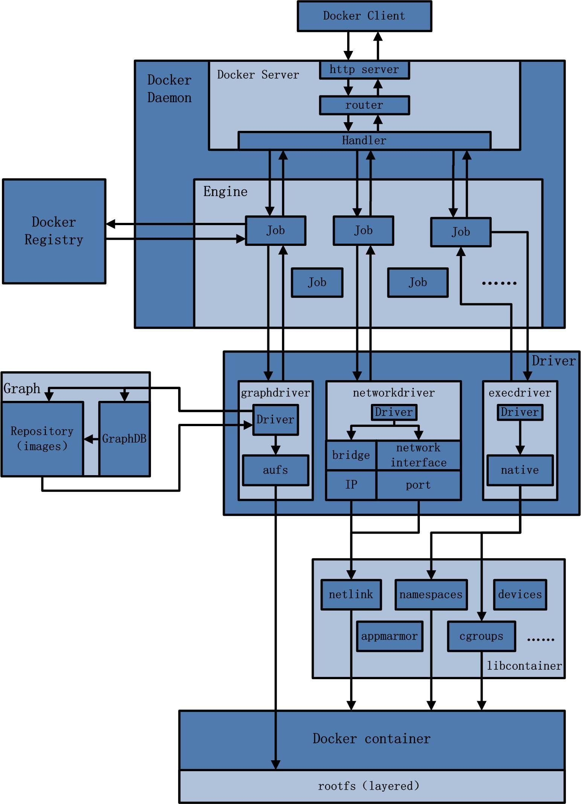

主要的模块有：Docker Client、Docker Daemon、Docker Registry、Graph、Driver、libcontainer以及Docker container。

#### Docker Client

Docker Client是Docker架构中用户用来和Docker Daemon建立通信的客户端。

#### Docker Daemon

Docker Daemon是Docker架构中一个常驻在后台的系统进程，功能是：接受并处理Docker Client发送的请求。该守护进程在后台启动了一个Server，Server负责接受Docker Client发送的请求；接受请求后，Server通过路由与分发调度，找到相应的Handler来执行请求。Docker Daemon启动所使用的可执行文件也为docker，与Docker Client启动所使用的可执行文件docker相同。在docker命令执行时，通过传入的参数来判别Docker Daemon与Docker Client。

Docker Daemon的架构，大致可以分为以下三部分：Docker Server、Engine 和 Job。

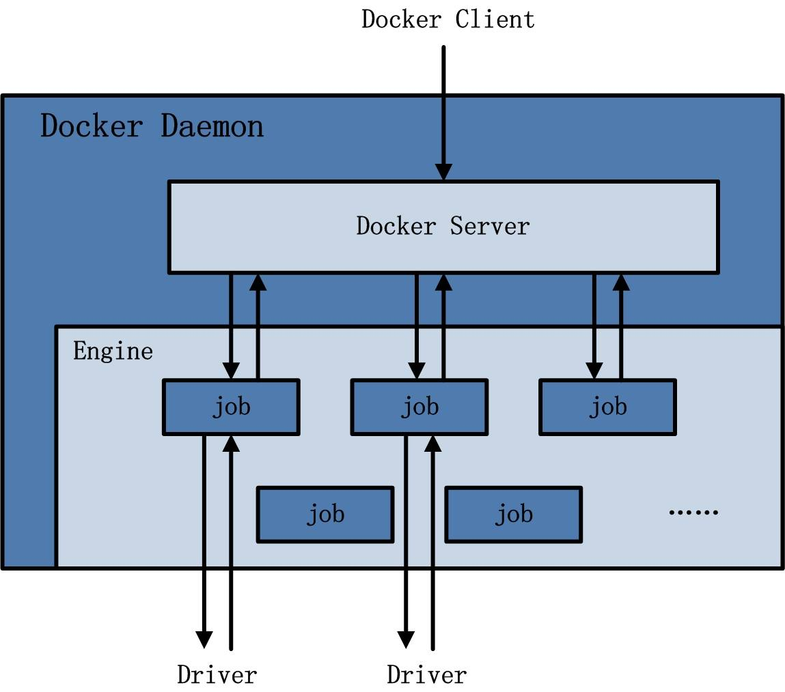

##### Docker Server

Docker Server在Docker架构中是专门服务于Docker Client的server。该server的功能是：接受并调度分发Docker Client发送的请求。

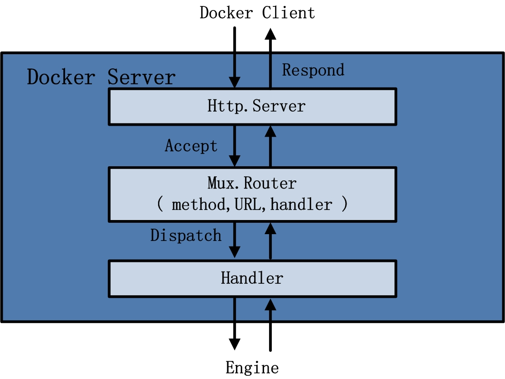

在Docker的启动过程中，通过包gorilla/mux，创建了一个mux.Router，提供请求的路由功能。在Golang中，gorilla/mux是一个强大的URL路由器以及调度分发器。该mux.Router中添加了众多的路由项，每一个路由项由HTTP请求方法（PUT、POST、GET或DELETE）、URL、Handler三部分组成。

若Docker Client通过HTTP的形式访问Docker Daemon，创建完mux.Router之后，Docker将Server的监听地址以及mux.Router作为参数，创建一个httpSrv=http.Server{}，最终执行httpSrv.Serve()为请求服务。

在Server的服务过程中，Server在listener上接受Docker Client的访问请求，并创建一个全新的goroutine来服务该请求。在goroutine中，首先读取请求内容，然后做解析工作，接着找到相应的路由项，随后调用相应的Handler来处理该请求，最后Handler处理完请求之后回复该请求。

需要注意的是：Docker Server的运行在Docker的启动过程中，是靠一个名为"serveapi"的job的运行来完成的。原则上，Docker Server的运行是众多job中的一个，但是为了强调Docker Server的重要性以及为后续job服务的重要特性，将该"serveapi"的job单独抽离出来分析，理解为Docker Server。

##### Engine

Engine是Docker架构中的运行引擎，同时也Docker运行的核心模块。它扮演Docker container存储仓库的角色，并且通过执行job的方式来操纵管理这些容器。

在Engine数据结构的设计与实现过程中，有一个handler对象。该handler对象存储的都是关于众多特定job的handler处理访问。

##### Job

一个Job可以认为是Docker架构中Engine内部最基本的工作执行单元。Docker可以做的每一项工作，都可以抽象为一个job。Job的设计者，把Job设计得与Unix进程相仿。比如说：Job有一个名称，有参数，有环境变量，有标准的输入输出，有错误处理，有返回状态等。

#### Docker Registry

Docker Registry是一个存储容器镜像的仓库。而容器镜像是在容器被创建时，被加载用来初始化容器的文件架构与目录。

在Docker的运行过程中，Docker Daemon会与Docker Registry通信，并实现搜索镜像、下载镜像、上传镜像三个功能，这三个功能对应的job名称分别为"search"，"pull" 与 "push"。

#### Graph

Graph在Docker架构中扮演已下载容器镜像的保管者，以及已下载容器镜像之间关系的记录者。一方面，Graph存储着本地具有版本信息的文件系统镜像，另一方面也通过GraphDB记录着所有文件系统镜像彼此之间的关系。

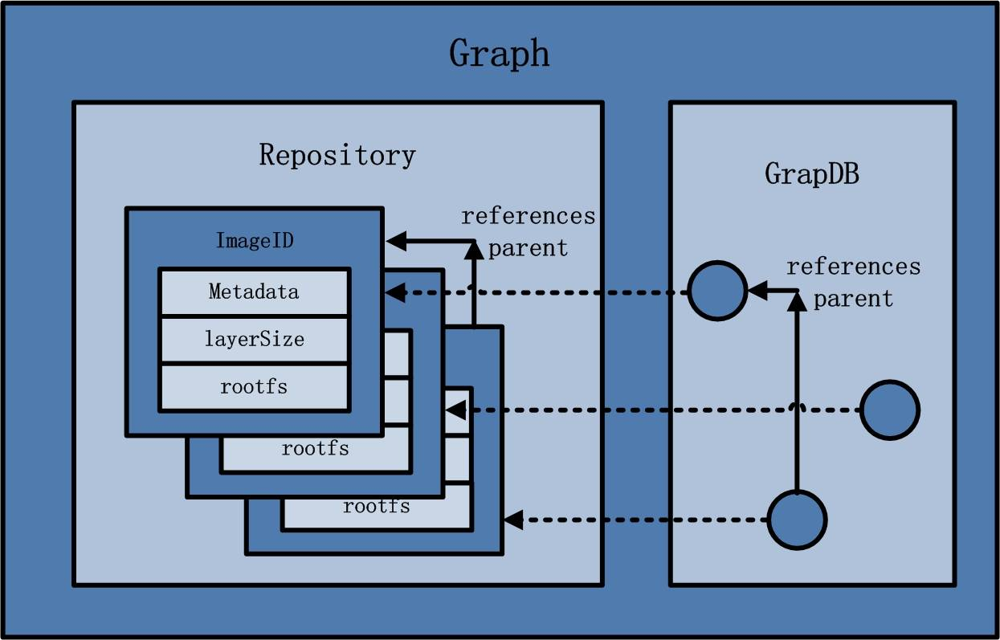

其中，GraphDB是一个构建在SQLite之上的小型图数据库，实现了节点的命名以及节点之间关联关系的记录。它仅仅实现了大多数图数据库所拥有的一个小的子集，但是提供了简单的接口表示节点之间的关系。

同时在Graph的本地目录中，关于每一个的容器镜像，具体存储的信息有：该容器镜像的元数据，容器镜像的大小信息，以及该容器镜像所代表的具体rootfs。

#### Driver

Driver是Docker架构中的驱动模块。通过Driver驱动，Docker可以实现对Docker容器执行环境的定制。Driver是Docker架构中的驱动模块。通过Driver驱动，Docker可以实现对Docker容器执行环境的定制。由于Docker运行的生命周期中，并非用户所有的操作都是针对Docker容器的管理，另外还有关于Docker运行信息的获取，Graph的存储与记录等。因此，为了将Docker容器的管理从Docker Daemon内部业务逻辑中区分开来，设计了Driver层驱动来接管所有这部分请求。

在Docker Driver的实现中，可以分为以下三类驱动：graphdriver、networkdriver和execdriver。

##### graphdriver

graphdriver主要用于完成容器镜像的管理，包括存储与获取。即当用户需要下载指定的容器镜像时，graphdriver将容器镜像存储在本地的指定目录；同时当用户需要使用指定的容器镜像来创建容器的rootfs时，graphdriver从本地镜像存储目录中获取指定的容器镜像。在graphdriver的初始化过程之前，有4种文件系统或类文件系统在其内部注册，它们分别是aufs、btrfs、vfs和devmapper。而Docker在初始化之时，通过获取系统环境变量”DOCKER_DRIVER”来提取所使用driver的指定类型。而之后所有的graph操作，都使用该driver来执行。

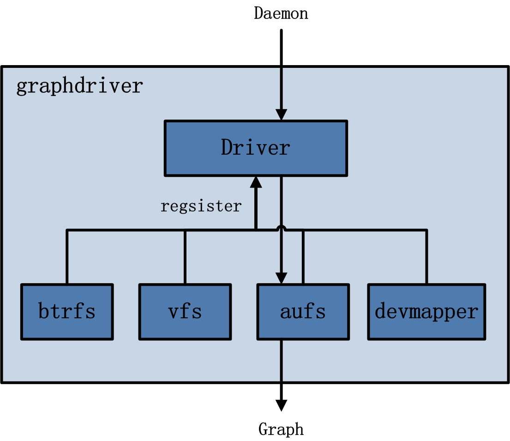

##### networkdriver

networkdriver的用途是完成Docker容器网络环境的配置，其中包括Docker启动时为Docker环境创建网桥；Docker容器创建时为其创建专属虚拟网卡设备；以及为Docker容器分配IP、端口并与宿主机做端口映射，设置容器防火墙策略等。

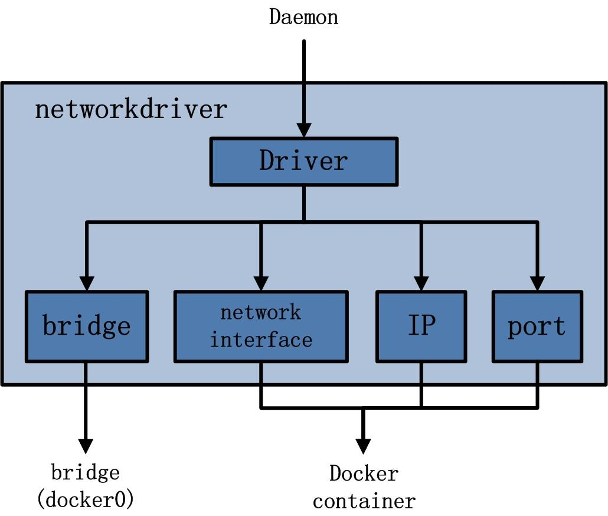

##### execdriver

execdriver作为Docker容器的执行驱动，负责创建容器运行命名空间，负责容器资源使用的统计与限制，负责容器内部进程的真正运行等。在execdriver的实现过程中，原先可以使用LXC驱动调用LXC的接口，来操纵容器的配置以及生命周期，而现在execdriver默认使用native驱动，不依赖于LXC。

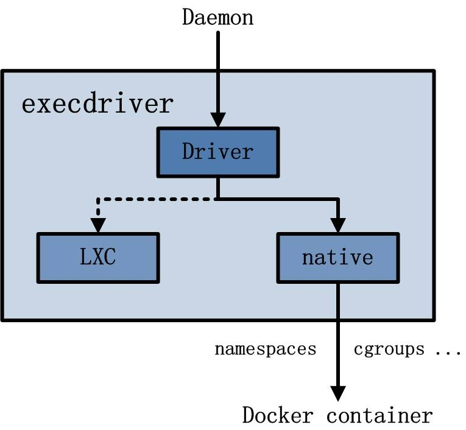

#### libcontainer

libcontainer是Docker架构中一个使用Go语言设计实现的库，设计初衷是希望该库可以不依靠任何依赖，直接访问内核中与容器相关的API。

正是由于libcontainer的存在，Docker可以直接调用libcontainer，而最终操纵容器的namespace、cgroups、apparmor、网络设备以及防火墙规则等。这一系列操作的完成都不需要依赖LXC或者其他包。

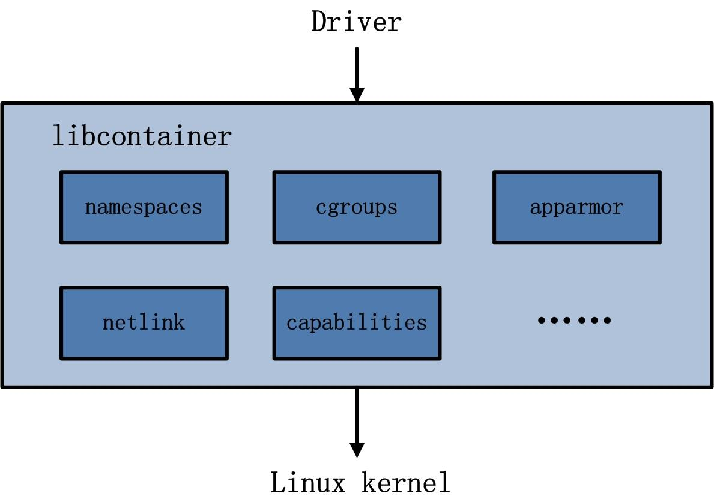

#### Docker container

Docker container（Docker容器）是Docker架构中服务交付的最终体现形式。

Docker按照用户的需求与指令，订制相应的Docker容器：

- 用户通过指定容器镜像，使得Docker容器可以自定义rootfs等文件系统；
- 用户通过指定计算资源的配额，使得Docker容器使用指定的计算资源；
- 用户通过配置网络及其安全策略，使得Docker容器拥有独立且安全的网络环境；
- 用户通过指定运行的命令，使得Docker容器执行指定的工作。

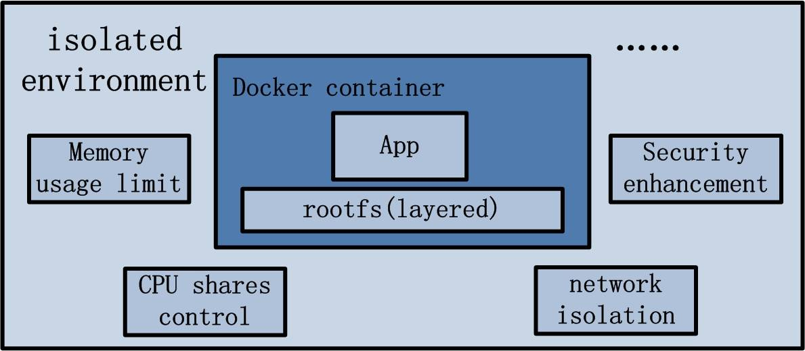

### Docker 运行案例分析

#### docker pull

docker pull命令的作用为：从Docker Registry中下载指定的容器镜像，并存储在本地的Graph中，以备后续创建Docker容器时的使用。

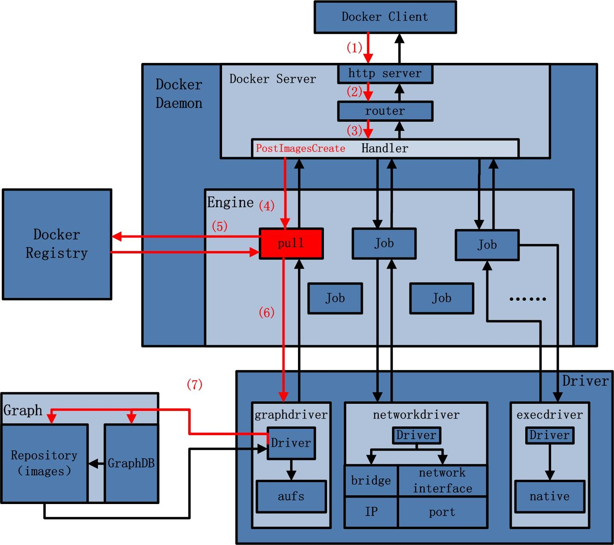

1. Docker Client接受docker pull命令，解析完请求以及收集完请求参数之后，发送一个HTTP请求给Docker Server，HTTP请求方法为POST，请求URL为"/images/create? "+"xxx"；
2. Docker Server接受以上HTTP请求，并交给mux.Router，mux.Router通过URL以及请求方法来确定执行该请求的具体handler；
3. mux.Router将请求路由分发至相应的handler，具体为PostImagesCreate；
4. 在PostImageCreate这个handler之中，一个名为"pull"的job被创建，并开始执行；
5. 名为"pull"的job在执行过程中，执行pullRepository操作，即从Docker Registry中下载相应的一个或者多个image；
6. 名为"pull"的job将下载的image交给graphdriver；
7. graphdriver负责将image进行存储，一方创建graph对象，另一方面在GraphDB中记录image之间的关系。

#### docker run

docker run命令的作用是在一个全新的Docker容器内部运行一条指令。Docker在执行这条命令的时候，所做工作可以分为两部分：第一，创建Docker容器所需的rootfs；第二，创建容器的网络等运行环境，并真正运行用户指令。因此，在整个执行流程中，Docker Client给Docker Server发送了两次HTTP请求，第二次请求的发起取决于第一次请求的返回状态。

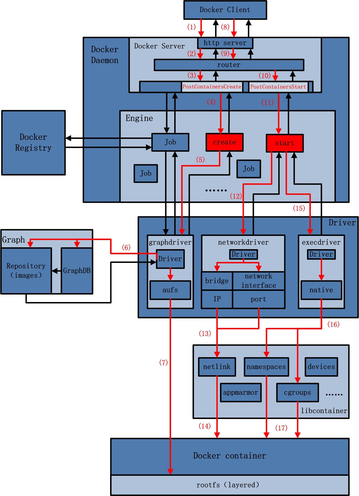

1. Docker Client接受docker run命令，解析完请求以及收集完请求参数之后，发送一个HTTP请求给Docker Server，HTTP请求方法为POST，请求URL为"/containers/create? "+"xxx"；
2. Docker Server接受以上HTTP请求，并交给mux.Router，mux.Router通过URL以及请求方法来确定执行该请求的具体handler；
3. mux.Router将请求路由分发至相应的handler，具体为PostContainersCreate；
4. 在PostImageCreate这个handler之中，一个名为"create"的job被创建，并开始让该job运行；
5. 名为"create"的job在运行过程中，执行Container.Create操作，该操作需要获取容器镜像来为Docker容器创建rootfs，即调用graphdriver；
6. graphdriver从Graph中获取创建Docker容器rootfs所需要的所有的镜像；
7. graphdriver将rootfs所有镜像，加载安装至Docker容器指定的文件目录下；
8. 若以上操作全部正常执行，没有返回错误或异常，则Docker Client收到Docker Server返回状态之后，发起第二次HTTP请求。请求方法为"POST"，请求URL为"/containers/"+container_ID+"/start"；
9. Docker Server接受以上HTTP请求，并交给mux.Router，mux.Router通过URL以及请求方法来确定执行该请求的具体handler；
10. mux.Router将请求路由分发至相应的handler，具体为PostContainersStart；
11. 在PostContainersStart这个handler之中，名为"start"的job被创建，并开始执行；
12. 名为"start"的job执行完初步的配置工作后，开始配置与创建网络环境，调用networkdriver；
13. networkdriver需要为指定的Docker容器创建网络接口设备，并为其分配IP，port，以及设置防火墙规则，相应的操作转交至libcontainer中的netlink包来完成；
14. netlink完成Docker容器的网络环境配置与创建；
15. 返回至名为"start"的job，执行完一些辅助性操作后，job开始执行用户指令，调用execdriver；
16. execdriver被调用，初始化Docker容器内部的运行环境，如命名空间，资源控制与隔离，以及用户命令的执行，相应的操作转交至libcontainer来完成；
17. libcontainer被调用，完成Docker容器内部的运行环境初始化，并最终执行用户要求启动的命令。