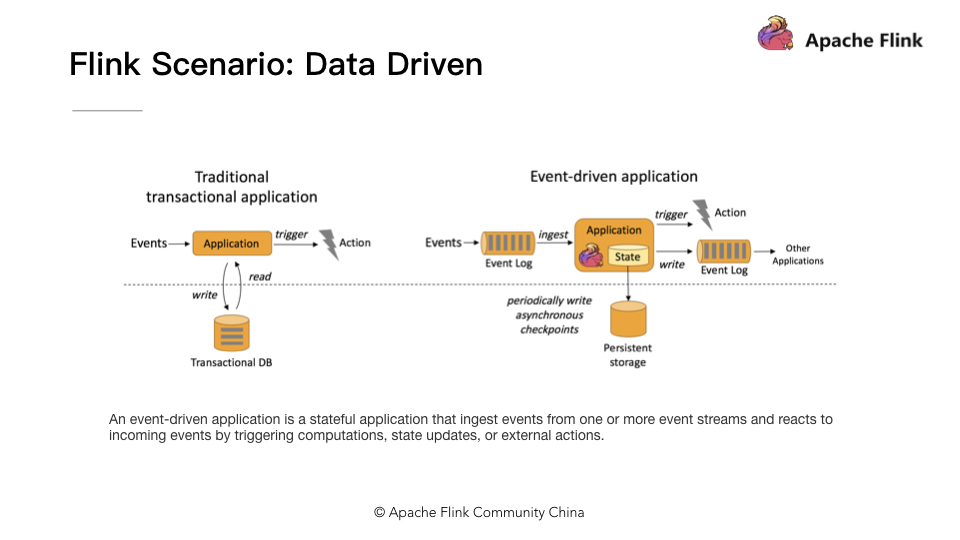

### **一、Apache Flink 的定义、架构及原理**

Apache Flink 是一个分布式大数据处理引擎，可对有限数据流和无限数据流进行有状态或无状态的计算，能够部署在各种集群环境，对各种规模大小的数据进行快速计算。

#### **1. Flink Application**

了解Flink 应用开发需要先理解Flink 的Streams、State、Time 等基础处理语义以及Flink 兼顾灵活性和方便性的多层次API。

- **Streams**：流，分为有限数据流与无限数据流，unbounded stream 是有始无终的数据流，即无限数据流；而bounded stream 是限定大小的有始有终的数据集合，即有限数据流，二者的区别在于无限数据流的数据会随时间的推演而持续增加，计算持续进行且不存在结束的状态，相对的有限数据流数据大小固定，计算最终会完成并处于结束的状态。
- **State**，状态是计算过程中的数据信息，在容错恢复和Checkpoint 中有重要的作用，流计算在本质上是Incremental Processing，因此需要不断查询保持状态；另外，为了确保Exactly- once 语义，需要数据能够写入到状态中；而持久化存储，能够保证在整个分布式系统运行失败或者挂掉的情况下做到Exactly- once，这是状态的另外一个价值。
- **Time**，分为Event time、Ingestion time、Processing time，Flink 的无限数据流是一个持续的过程，时间是我们判断业务状态是否滞后，数据处理是否及时的重要依据。
- **API**，API 通常分为三层，由上而下可分为SQL / Table API、DataStream API、ProcessFunction 三层，API 的表达能力及业务抽象能力都非常强大，但越接近SQL 层，表达能力会逐步减弱，抽象能力会增强，反之，ProcessFunction 层API 的表达能力非常强，可以进行多种灵活方便的操作，但抽象能力也相对越小。

#### **2. Flink Architecture**

在架构部分，主要分为以下四点：

第一，Flink 具备统一的框架处理有界和无界两种数据流的能力

第二， 部署灵活，Flink 底层支持多种资源调度器，包括Yarn、Kubernetes 等。Flink 自身带的Standalone 的调度器，在部署上也十分灵活。

第三， 极高的可伸缩性，可伸缩性对于分布式系统十分重要，阿里巴巴双11大屏采用Flink 处理海量数据，使用过程中测得Flink 峰值可达17 亿/秒。

第四， 极致的流式处理性能。Flink 相对于Storm 最大的特点是将状态语义完全抽象到框架中，支持本地状态读取，避免了大量网络IO，可以极大提升状态存取的性能。

#### **3. Flink Operation**

后面会有专门课程讲解，此处简单分享Flink 关于运维及业务监控的内容：

- Flink具备7 X 24 小时高可用的SOA（面向服务架构），原因是在实现上Flink 提供了一致性的Checkpoint。Checkpoint是Flink 实现容错机制的核心，它周期性的记录计算过程中Operator 的状态，并生成快照持久化存储。当Flink 作业发生故障崩溃时，可以有选择的从Checkpoint 中恢复，保证了计算的一致性。
- Flink本身提供监控、运维等功能或接口，并有内置的WebUI，对运行的作业提供DAG 图以及各种Metric 等，协助用户管理作业状态。

#### **4. Flink 的应用场景**

##### **4.1 Flink** **的应用场景：Data Pipeline**

Data Pipeline 的核心场景类似于数据搬运并在搬运的过程中进行部分数据清洗或者处理，而整个业务架构图的左边是Periodic ETL，它提供了流式ETL 或者实时ETL，能够订阅消息队列的消息并进行处理，清洗完成后实时写入到下游的Database或File system 中。场景举例：

###### **实时数仓**

当下游要构建实时数仓时，上游则可能需要实时的Stream ETL。这个过程会进行实时清洗或扩展数据，清洗完成后写入到下游的实时数仓的整个链路中，可保证数据查询的时效性，形成实时数据采集、实时数据处理以及下游的实时Query。

###### **搜索引擎推荐**

搜索引擎这块以淘宝为例，当卖家上线新商品时，后台会实时产生消息流，该消息流经过Flink 系统时会进行数据的处理、扩展。然后将处理及扩展后的数据生成实时索引，写入到搜索引擎中。这样当淘宝卖家上线新商品时，能在秒级或者分钟级实现搜索引擎的搜索。

##### **4.2 Flink** **应用场景：Data Analytics**

Data Analytics，如图，左边是Batch Analytics，右边是Streaming Analytics。Batch Analytics 就是传统意义上使用类似于Map Reduce、Hive、Spark Batch 等，对作业进行分析、处理、生成离线报表；Streaming Analytics 使用流式分析引擎如Storm、Flink 实时处理分析数据，应用较多的场景如实时大屏、实时报表。

##### **4.3 Flink** **应用场景：Data Driven**

从某种程度上来说，所有的实时的数据处理或者是流式数据处理都是属于Data Driven，流计算本质上是Data Driven 计算。应用较多的如风控系统，当风控系统需要处理各种各样复杂的规则时，Data Driven 就会把处理的规则和逻辑写入到Datastream 的API 或者是ProcessFunction 的API 中，然后将逻辑抽象到整个Flink 引擎，当外面的数据流或者是事件进入就会触发相应的规则，这就是Data Driven 的原理。在触发某些规则后，Data Driven 会进行处理或者是进行预警，这些预警会发到下游产生业务通知，这是Data Driven 的应用场景，Data Driven 在应用上更多应用于复杂事件的处理。

### **二、「有状态的流式处理」概念解析**

#### **1. 传统批处理**

传统批处理方法是持续收取数据，以时间作为划分多个批次的依据，再周期性地执行批次运算。但假设需要计算每小时出现事件转换的次数，如果事件转换跨越了所定义的时间划分，传统批处理会将中介运算结果带到下一个批次进行计算；除此之外，当出现接收到的事件顺序颠倒情况下，传统批处理仍会将中介状态带到下一批次的运算结果中，这种处理方式也不尽如人意。

#### **2. 理想方法**

**第一点**，要有理想方法，这个理想方法是引擎必须要有能力可以累积状态和维护状态，累积状态代表着过去历史中接收过的所有事件，会影响到输出。

**第二点**，时间，时间意味着引擎对于数据完整性有机制可以操控，当所有数据都完全接收到后，输出计算结果。

**第三点**，理想方法模型需要实时产生结果，但更重要的是采用新的持续性数据处理模型来处理实时数据，这样才最符合Continuous data 的特性。

#### **3.****流式处理**

流式处理简单来讲即有一个无穷无尽的数据源在持续收取数据，以代码作为数据处理的基础逻辑，数据源的数据经过代码处理后产生出结果，然后输出，这就是流式处理的基本原理。

#### **4.****分布式流式处理**

假设Input Streams 有很多个使用者，每个使用者都有自己的ID，如果计算每个使用者出现的次数，我们需要让同一个使用者的出现事件流到同一运算代码，这跟其他批次需要做Group by 是同样的概念，所以跟Stream 一样需要做分区，设定相应的Key，然后让同样的 Key 流到同一个 Computation instance 做同样的运算。

#### **5. 有状态分布式流式处理**

如图，上述代码中定义了变数X，X 在数据处理过程中会进行读和写，在最后输出结果时，可以依据变数X 决定输出的内容，即状态X 会影响最终的输出结果。这个过程中，第一个重点是先进行了状态Co-partitioned key by，同样的 Key 都会流到Computation instance，与使用者出现次数的原理相同，次数即所谓的状态，这个状态一定会跟同一个Key 的事件累积在同一个 Computation instance。类似于根据输入流的Key 重新分区的状态，当分区进入 Stream 之后，这个 Stream 会累积起来的状态也变成 Copartiton 。

第二个重点是embeded local state backend。有状态分散式流式处理的引擎，状态可能会累积到非常大，当 Key 非常多时，状态可能就会超出单一节点的 Memory 的负荷量，这时候状态必须有状态后端去维护它；在这个状态后端在正常状况下，用In-memory 维护即可。

### **三、Apache Flink 的优势**

#### **1.****状态容错**

当我们考虑状态容错时难免会想到精确一次的状态容错，应用在运算时累积的状态，每笔输入的事件反映到状态，更改状态都是精确一次，如果修改超过一次的话也意味着数据引擎产生的结果是不可靠的。

- 如何确保状态拥有精确一次（Exactly-once guarantee）的容错保证？
- 如何在分散式场景下替多个拥有本地状态的运算子产生一个全域一致的快照（Global consistent snapshot）？
- 更重要的是，如何在不中断运算的前提下产生快照？

##### **1.1** **简单场景的精确一次容错方法**

还是以使用者出现次数来看，如果某个使用者出现的次数计算不准确，不是精确一次，那么产生的结果是无法作为参考的。在考虑精确的容错保证前，我们先考虑最简单的使用场景，如无限流的数据进入，后面单一的Process 进行运算，每处理完一笔计算即会累积一次状态，这种情况下如果要确保Process 产生精确一次的状态容错，每处理完一笔数据，更改完状态后进行一次快照，快照包含在队列中并与相应的状态进行对比，完成一致的快照，就能确保精确一次。

##### **1.2** **分布式状态容错**

Flink作为分布式的处理引擎，在分布式的场景下，进行多个本地状态的运算，只产生一个全域一致的快照，如需要在不中断运算值的前提下产生全域一致的快照，就涉及到分散式状态容错。

- **Global consistent snapshot**

关于Global consistent snapshot，当Operator 在分布式的环境中，在各个节点做运算，首先产生Global consistent snapshot 的方式就是处理每一笔数据的快照点是连续的，这笔运算流过所有的运算值，更改完所有的运算值后，能够看到每一个运算值的状态与该笔运算的位置，即可称为Consistent snapshot，当然，Global consistent snapshot 也是简易场景的延伸。

###### **容错恢复**

首先了解一下Checkpoint，上面提到连续性快照每个Operator 运算值本地的状态后端都要维护状态，也就是每次将产生检查点时会将它们传入共享的DFS 中。当任何一个Process 挂掉后，可以直接从三个完整的Checkpoint 将所有的运算值的状态恢复，重新设定到相应位置。Checkpoint的存在使整个Process 能够实现分散式环境中的Exactly-once。

##### **1.3** **分散式快照（Distributed Snapshots）方法**

关于Flink 如何在不中断运算的状况下持续产生Global consistent snapshot，其方式是基于用 Simple lamport 演算法机制下延伸的。已知的一个点Checkpoint barrier，Flink 在某个Datastream 中会一直安插Checkpoint barrier，Checkpoint barrier 也会N – 1等等，Checkpoint barrier N 代表着所有在这个范围里面的数据都是Checkpoint barrier N。

举例：假设现在需要产生Checkpoint barrier N，但实际上在Flink 中是由Job manager 触发Checkpoint，Checkpoint 被触发后开始从数据源产生Checkpoint barrier。当Job 开始做Checkpoint barrier N 的时候，可以理解为Checkpoint barrier N 需要逐步填充左下角的表格。

如图，当部分事件标为红色，Checkpoint barrier N 也是红色时，代表着这些数据或事件都由Checkpoint barrier N 负责。Checkpoint barrier N 后面白色部分的数据或事件则不属于Checkpoint barrier N。

在以上的基础上，当数据源收到Checkpoint barrier N 之后会先将自己的状态保存，以读取Kafka资料为例，数据源的状态就是目前它在Kafka 分区的位置，这个状态也会写入到上面提到的表格中。下游的Operator 1 会开始运算属于Checkpoint barrier N 的数据，当Checkpoint barrier N 跟着这些数据流动到Operator 1 之后,Operator 1 也将属于Checkpoint barrier N 的所有数据都反映在状态中，当收到Checkpoint barrier N 时也会直接对Checkpoint去做快照。

当快照完成后继续往下游走，Operator 2 也会接收到所有数据，然后搜索Checkpoint barrier N 的数据并直接反映到状态，当状态收到Checkpoint barrier N 之后也会直接写入到Checkpoint N 中。以上过程到此可以看到Checkpoint barrier N 已经完成了一个完整的表格，这个表格叫做Distributed Snapshots，即分布式快照。分布式快照可以用来做状态容错，任何一个节点挂掉的时候可以在之前的Checkpoint 中将其恢复。继续以上Process，当多个Checkpoint 同时进行，Checkpoint barrier N 已经流到Job manager 2，Flink job manager 可以触发其他的Checkpoint，比如Checkpoint N + 1，Checkpoint N + 2 等等也同步进行，利用这种机制，可以在不阻挡运算的状况下持续地产生Checkpoint。

#### **2. 状态维护**

状态维护即用一段代码在本地维护状态值，当状态值非常大时需要本地的状态后端来支持。

如图，在Flink 程序中，可以采用getRuntimeContext().getState(desc); 这组API 去注册状态。Flink 有多种状态后端，采用API 注册状态后，读取状态时都是通过状态后端来读取的。Flink 有两种不同的状态值，也有两种不同的状态后端：

- **JVM Heap状态后端**，适合数量较小的状态，当状态量不大时就可以采用JVM Heap 的状态后端。JVM Heap 状态后端会在每一次运算值需要读取状态时，用Java object read / writes 进行读或写，不会产生较大代价，但当Checkpoint 需要将每一个运算值的本地状态放入Distributed Snapshots 的时候，就需要进行序列化了。

- **RocksDB状态后端**，它是一种out of core 的状态后端。在Runtime 的本地状态后端让使用者去读取状态的时候会经过磁盘，相当于将状态维护在磁盘里，与之对应的代价可能就是每次读取状态时，都需要经过序列化和反序列化的过程。当需要进行快照时只将应用序列化即可，序列化后的数据直接传输到中央的共享DFS 中。

Flink目前支持以上两种状态后端，一种是纯 Memory 的状态后端，另一种是有资源磁盘的状态后端，在维护状态时可以根据状态的数量选择相应的状态后端。

#### **3. Event – Time**

##### **3.1** **不同时间种类**

在Flink 及其他进阶的流式处理引擎出现之前，大数据处理引擎一直只支持Processing-time 的处理。假设定义一个运算 Windows 的窗口，Windows 运算设定每小时进行结算。Processing-time 进行运算时，可以发现数据引擎将3 点至4 点间收到的数据进行结算。实际上在做报表或者分析结果时是想了解真实世界中3 点至4 点之间实际产生数据的输出结果，了解实际数据的输出结果就必须采用Event – Time 了。

如图，Event – Time 相当于事件，它在数据最源头产生时带有时间戳，后面都需要用时间戳来进行运算。用图来表示，最开始的队列收到数据，每小时对数据划分一个批次，这就是Event – Time Process 在做的事情。

##### **3.2 Event – Time** **处理**

Event – Time 是用事件真实产生的时间戳去做Re-bucketing，把对应时间3 点到4 点的数据放在3 点到4 点的Bucket，然后Bucket 产生结果。所以Event – Time 跟Processing – time 的概念是这样对比的存在。

Event – Time 的重要性在于记录引擎输出运算结果的时间。简单来说，流式引擎连续24 小时在运行、搜集资料，假设Pipeline 里有一个 Windows Operator 正在做运算，每小时能产生结果，何时输出 Windows的运算值，这个时间点就是Event – Time 处理的精髓，用来表示该收的数据已经收到。

##### **3.3 Watermarks**

Flink实际上是用 Watermarks 来实现Event – Time 的功能。Watermarks 在Flink 中也属于特殊事件，其精髓在于当某个运算值收到带有时间戳“ T ”的 Watermarks 时就意味着它不会接收到新的数据了。使用Watermarks 的好处在于可以准确预估收到数据的截止时间。举例，假设预期收到数据时间与输出结果时间的时间差延迟5 分钟，那么Flink 中所有的 Windows Operator 搜索3 点至4 点的数据，但因为存在延迟需要再多等5分钟直至收集完4：05 分的数据，此时方能判定4 点钟的资料收集完成了，然后才会产出3 点至4 点的数据结果。这个时间段的结果对应的就是 Watermarks 的部分。

#### **4. 状态保存与迁移**

流式处理应用无时无刻不在运行，运维上有几个重要考量：

- 更改应用逻辑/修bug 等，如何将前一执行的状态迁移到新的执行？
- 如何重新定义运行的平行化程度？
- 如何升级运算丛集的版本号？

Checkpoint完美符合以上需求，不过Flink 中还有另外一个名词保存点（Savepoint），当手动产生一个Checkpoint 的时候，就叫做一个Savepoint。Savepoint 跟Checkpoint 的差别在于Checkpoint是Flink 对于一个有状态应用在运行中利用分布式快照持续周期性的产生Checkpoint，而Savepoint 则是手动产生的Checkpoint，Savepoint 记录着流式应用中所有运算元的状态。

如图，Savepoint A 和Savepoint B，无论是变更底层代码逻辑、修bug 或是升级Flink 版本，重新定义应用、计算的平行化程度等，最先需要做的事情就是产生Savepoint。

Savepoint产生的原理是在Checkpoint barrier 流动到所有的Pipeline 中手动插入从而产生分布式快照，这些分布式快照点即Savepoint。Savepoint 可以放在任何位置保存，当完成变更时，可以直接从Savepoint 恢复、执行。

从Savepoint 的恢复执行需要注意，在变更应用的过程中时间在持续，如Kafka 在持续收集资料，当从Savepoint 恢复时，Savepoint 保存着Checkpoint 产生的时间以及Kafka 的相应位置，因此它需要恢复到最新的数据。无论是任何运算，Event – Time 都可以确保产生的结果完全一致。

假设恢复后的重新运算用Process Event – Time，将 Windows 窗口设为1 小时，重新运算能够在10 分钟内将所有的运算结果都包含到单一的 Windows 中。而如果使用Event – Time，则类似于做Bucketing。在Bucketing 的状况下，无论重新运算的数量多大，最终重新运算的时间以及Windows 产生的结果都一定能保证完全一致。

### **四、总结**

本文首先从Apache Flink 的定义、架构、基本原理入手，对大数据流计算相关的基本概念进行辨析，在此基础上简单回顾了大数据处理方式的历史演进以及有状态的流式数据处理的原理，最后从目前有状态的流式处理面临的挑战分析Apache Flink 作为业界公认为最好的流计算引擎之一所具备的天然优势。希望有助于大家厘清大数据流式处理引擎涉及的基本概念，能够更加得心应手的使用Flink。