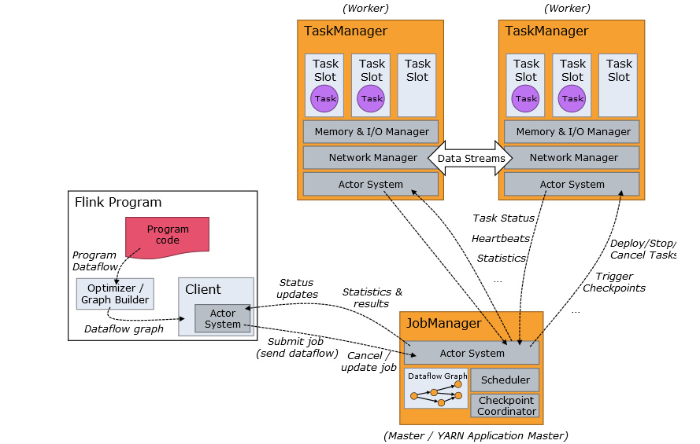
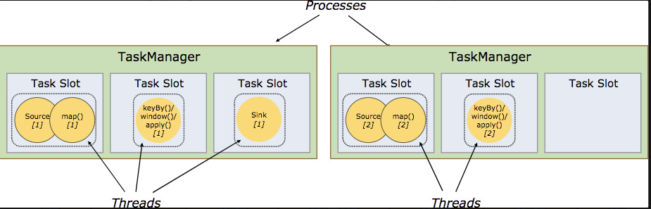

flink 作业提交架构流程可见下图：

1、Program Code：我们编写的 Flink 应用程序代码

2、Job Client：Job Client 不是 Flink 程序执行的内部部分，但它是任务执行的起点。 Job Client 负责接受用户的程序代码，然后创建数据流，将数据流提交给 Job Manager 以便进一步执行。 执行完成后，Job Client 将结果返回给用户

3、Job Manager：主进程（也称为作业管理器）协调和管理程序的执行。 它的主要职责包括安排任务，管理checkpoint ，故障恢复等。机器集群中至少要有一个 master，master 负责调度 task，协调 checkpoints 和容灾，高可用设置的话可以有多个 master，但要保证一个是 leader, 其他是 standby; Job Manager 包含 Actor system、Scheduler、Check pointing 三个重要的组件

4、Task Manager：从 Job Manager 处接收需要部署的 Task。Task Manager 是在 JVM 中的一个或多个线程中执行任务的工作节点。 任务执行的并行性由每个 Task Manager 上可用的任务槽决定。 每个任务代表分配给任务槽的一组资源。 例如，如果 Task Manager 有四个插槽，那么它将为每个插槽分配 25％ 的内存。 可以在任务槽中运行一个或多个线程。 同一插槽中的线程共享相同的 JVM。 同一 JVM 中的任务共享 TCP 连接和心跳消息。Task Manager 的一个 Slot 代表一个可用线程，该线程具有固定的内存，注意 Slot 只对内存隔离，没有对 CPU 隔离。默认情况下，Flink 允许子任务共享 Slot，即使它们是不同 task 的 subtask，只要它们来自相同的 job。这种共享可以有更好的资源利用率。

