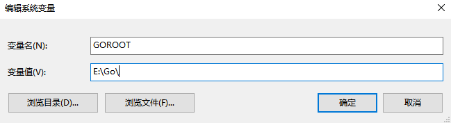
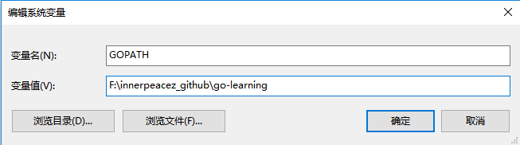
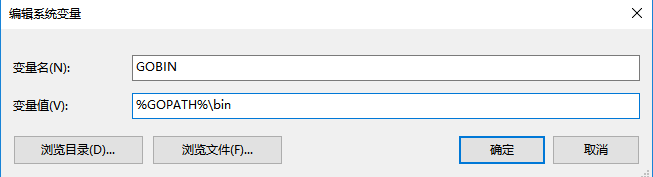

### Download

[官网下载地址](https://golang.org/dl/)

### windows  go环境变量配置

- GOROOT：GO语言安装路径
- GOPATH： GO开发工作空间
- GOBIN： 生成编译好的exe文件目录

#### 目录结构

```go
/src/              go语言源代码

/bin/              编译后的可执行文件

/pkg/              静态库,编译好的包对象文件
```

#### 设置环境变量

GOROOT(根据go语言的安装位置，设置路径)



GOPATH(根据自己的工作空间，设置路径)



GOBIN(根据自己的工作空间，设置路径)



设置完成之后可以使用`go env`命令查看是否生效

```go
go env
```

