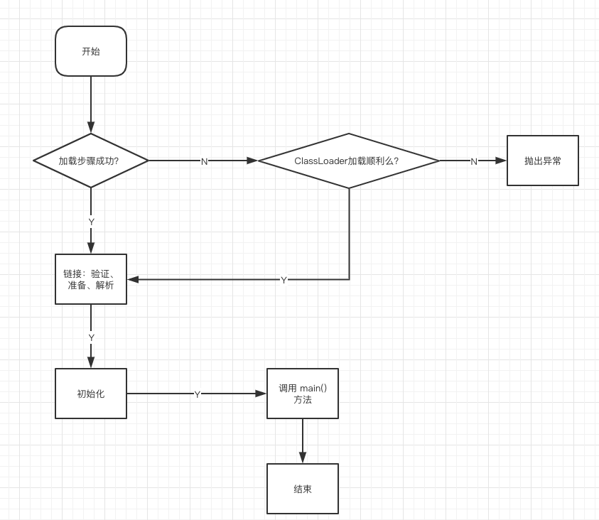

###java 虚拟机与程序的生命周期

#### java虚拟机在如下几种情况下将结束生命周期

- 执行 System.exit()
- 程序正常执行结束
- 程序执行时遇到异常或错误而异常终止
- 操作系统错误导致java进程终止

#### 类的加载、连接、初始化、使用、卸载

**加载**：查找并加载类的二进制数据

**链接**：

- 验证：确保被加载的类的正确性
- 准备：为类的静态变量分配内存，并将其初始化为默认值
- 解析：把类中的符号引用转换为直接引用

**初始化**：为类的静态变量 赋予正确的初始值



伪代码：

```java
class Test{
	public static int a =1;
}
```

Test.class -> a = 0 -> a = 1

**使用**：类的实例化、方法调用

**卸载**：类从内存中卸载，卸载后无法再使用该类


#### java 程序对类的使用可以分为两种

- 主动使用
- 被动使用

所有的 Java 虚拟机实现必须在每个类或者接口被 java 程序**首次主动使用**时才初始化

**主动使用**

1. 创建类的实例
2. 访问某个类或接口的静态变量，或者对该静态变量进行赋值
3. 调用该类的静态方法
4. 反射
5. 初始化一个类的子类
6. java 虚拟机启动时被标记为启动类（main）的类
7. 1.7 后支持的动态语言

**被动使用**

除了以上其中，其他的使用 java 类的方式都是**被动使用**，都不会导致类的**初始化**

#### 类的加载

类的加载指的是将类的 .class 文件中的二进制数据读入到内存中，将其放入**运行时数据区**的**方法区**内，然后在内存中创建一个 java.lang.Class 对象（jvm 规范中没有指明 Class 对象位于哪里， HotSpot 虚拟机将其放在了方法区中）用来封装类在方法区中的数据结构

**加载 .class 文件的方式**

- 从本地磁盘中直接加载
- 通过网络下载 .class 文件
- 从 ZIP 、JAR 等归档文件中加载 .class 文件
- 从专有的数据库中提取 .class 文件
- 将 java 源文件动态编译为 .class 文件

#### 小栗子

**例1**

```java

public class Test1 {

    public static void main(String[] args) {
        System.out.println(Child.str1);
    }
}

class Parent {

    public static String str1 = "parent";

    static {
        System.out.println("Parent static block.");
    }
}


class Child extends Parent {

    public static String str2 = "child";

    static {
        System.out.println("Child static block.");
    }
}
```

输出结果：

```
Parent static block.
parent
```

结论：

- 对一个静态字段来说，只有直接定义了该字段的类才会被初始化

- 当一个类初始化时，要求其父类已经全部初始化完成了

追踪类的加载信息并打印的虚拟机参数： 

```java
-XX:+TracceClassLoading
```

**例2**

```java
public class Test2 {

    public static void main(String[] args) {
        System.out.println(Parent2.str1);
    }
}

class Parent2 {

    public static final String str1 = "parent";

    static {
        System.out.println("Parent static block.");
    }
}
```

输出结果：

```cmd
parent
```

结论：

- 被 final 修饰的为常量
- 常量在编译阶段会被存入调用这个常量的方法的类的常量池（Test2 类的常量池）中，本质上并没有直接引用定义这个常量的了类
- 不会触发直接定义这个常量的类的初始化话
- 编译之后 Test2.class 和 Parent2.class 就没有任何关系了，直接删除 Parent.class 文件也**不会**对 Test2.class 造成影响

结论验证：

```java
$ javap -c Parent2.class
  
Compiled from "Test2.java"
class top.ipzgo.jvm.classload.Parent2 {
  public static java.lang.String str1;

  top.ipzgo.jvm.classload.Parent2();
    Code:
       0: aload_0
       1: invokespecial #1                  // Method java/lang/Object."<init>":()V
       4: return

  static {};
    Code:
       0: ldc           #2                  // String parent
       2: putstatic     #3                  // Field str1:Ljava/lang/String;
       5: getstatic     #4                  // Field java/lang/System.out:Ljava/io/PrintStream;
       8: ldc           #5                  // String Parent static block.
      10: invokevirtual #6                  // Method java/io/PrintStream.println:(Ljava/lang/String;)V
      13: return
}
```

助记符：

```
ldc: 表示将 int,float,String 类型的常量值从常量池中推送至栈顶
bipush: 表示将单字节 [-128,127] 的常量值从常量池推送至栈顶
sipush: 表示将短整型 [-32768,32767] 的常量值从常量池推送至栈顶
iconst_1: 表示将 int 类型 1 推送至栈顶 （iconst_m1 ~ iconst_5）分别对应 [1 ~ 5]

```

**例3**

```java
public class Test3 {

    public static void main(String[] args) {
        System.out.println(Parent3.str1);
    }
}

class Parent3 {

    public static final String str1 = UUID.randomUUID().toString();

    static {
        System.out.println("Parent static block.");
    }
}
```

输出结果：

```
Parent static block.
74f934db-c8d2-439f-b228-0fc849be1885
```

结论：

- 当一个常量的值并非编译期可以确定的，那么其值就不会被存入调用类的常量池中
- 此时调用类运行时，会导致主动使用直接定义这个常量的类，则会导致直接定义这个常量的类的初始化

**例4**

```java
public class Test4 {
    public static void main(String[] args) {

        Parent4[] parent4s = new Parent4[1];
        System.out.println(parent4s.getClass());
        System.out.println(parent4s.getClass().getSuperclass());
      
      	byte[] bytes = new byte[1];
        short[] shorts = new short[1];
        int[] ints = new int[1];
        char[] chars = new char[1];
        long[] longs = new long[1];
        float[] floats = new float[1];
        double[] doubles = new double[1];
        boolean[] booleans = new boolean[1];

        System.out.println("booleans --> " + booleans.getClass());
        System.out.println("doubles --> " + doubles.getClass());
        System.out.println("floats --> " + floats.getClass());
        System.out.println("longs --> " + longs.getClass());
        System.out.println("chars --> " + chars.getClass());
        System.out.println("ints --> " + ints.getClass());
        System.out.println("shorts --> " + shorts.getClass());
        System.out.println("bytes --> " + bytes.getClass());
    }
}

class Parent4 {

    public static final String str1 = UUID.randomUUID().toString();

    static {
        System.out.println("Parent static block.");
    }
}
```

输出结果：

```
class [Ltop.ipzgo.jvm.classload.Parent4;
class java.lang.Object

booleans --> class [Z
doubles --> class [D
floats --> class [F
longs --> class [J
chars --> class [C
ints --> class [I
shorts --> class [S
bytes --> class [B
```

结论：

- 对于数组实例来说，其类型由 JVM 在运行期动态生成
- 这种动态生成的类型，欺负类为 Object

**例5**

```java
public class Test5 {
    public static void main(String[] args) {
        System.out.println(Child5.b);
    }
}

interface Parent5 {
    int a = new Random().nextInt(1);
}

interface Child5 extends Parent5 {
    int b = 6;
}
```

结论：

- 当一个接口初始化时，并不要求其父接口都初始化完成
- 只有直接主动使用父接口时，才会初始化

**例6**

```java
public class Test6 {

    public static void main(String[] args) {

        Singleton singleton = Singleton.getSingleton();
        System.out.println(Singleton.counter1);
        System.out.println(Singleton.counter2);

        Singleton singleton1 = new Singleton();
        System.out.println(Singleton.counter1);
        System.out.println(Singleton.counter2);
    }
}

class Singleton {
    public static int counter1;

    public static Singleton singleton = new Singleton();

    public Singleton() {
        counter1++;
        counter2++;

        System.out.println(counter1);
        System.out.println(counter2);
    }

    public static int counter2 = 0;

    public static Singleton getSingleton() {
        return singleton;
    }
}
```

结论：

- 类加载顺序自上而下，此例子可以看出连接过程中的准备阶段，赋予静态变量默认值的重要性


#### 类加载器

有两种类加载器：

- Java 虚拟机自带的加载器
  - 根类加载器（Bootstrap ClassLoader）
  - 扩展类加载器（Extension ClassLoader）
  - 系统（应用）类加载器（App ClassLoader）
- 用户自定义的类加载器
  - java.lang.ClassLoader 的子类
  - 用户可以定制类的加载方法


#### 加载、链接、初始化的深入理解

##### **加载**：

- 类加载器并不需要等到某个类被**首次主动使用**时再加载
- JVM 规范允许类加载器再预料某个类将要被使用时就预先加载它，如果预先加载的过程中遇到 .class 文件缺失或者存在错误，类加载器必须在程序首次主动使用该类时，报告错误（LinkageError）
- 如果这个类一直没有被程序主动使用，那么类加载器不会报告错误

##### **链接**：

类被加载后，就进入链接阶段，链接就是将已经读入到内存中的二进制数据合并到虚拟机的运行时环境中

**验证**

- 类文件的结构检查
- 语义检查
- 字节码验证
- 二进制兼容性验证

**准备**

- Java 虚拟机为类的静态变量分配内存，并设置默认的初始值

##### **初始化**

- 准备阶段完成后，java 虚拟机执行初始化语句，为类的静态变量赋予初始值

- 静态变量初始化有两种途径：

  - 变量声明处直接初始化
  - 在静态代码块中初始化

- 类的初始化步骤：

  - 类如果没有被加载和链接，则先进行加载和链接
  - 类存在直接父类，且父类还没有被初始化，则先初始化直接父类
  - 类中存在初始化语句，则依次执行所有的初始化语句

- 类的初始化时机：[主动使用时进行初始化](主动使用)

  - Java 虚拟机初始化一个类时，要求所有的父类都已经被初始化，但是这条规则不适用于接口
    - 在初始化一个类时，并不会先初始化它所实现的所有接口
    - 在初始化一个接口时，并不会先初始化它的父接口
  - 一个父接口不会因为它的子接口或者实现类的初始化而初始化，只有当程序首次主动使用该接口的静态变量时，才会导致该接口初始化
  - 调用 ClassLoader 类的 loadClass 方法加载一个类，并不是对类的主动使用，不会导致类的初始化

  

##### 双亲委派机制

除了Java 虚拟机自带的根类加载器以外，其余的类加载器都只有一个父加载器，当 java 程序请求加载一个类时，类加载器会先请求其父类加载器先尝试加载，如果父类加载器能够完成加载任务，则该类加载器本身不在加载。

##### Java 自带的三种类加载器详细分析

**根类加载器（Bootstrap ClassLoader）**: 该加载器没有父加载器。它负责加载虚拟机的核心类库，如：`java.lang.*` 等。根类加载器从 `sun.boot.class.path` 所指定的目录中加载类库，可以通过 `-Xbootclasspath`虚拟机启动参数修改加载目录。根类加载器实现依赖于底层的操作系统，属于虚拟机实现是一部分，并没有继承 `java.land.ClassLoader` 类。

**扩展类加载器（Extension ClassLoader）**：该加载器的父类加载器是根类加载器。从 `java.ext.dirs` 系统属性指定的目录中加载类库，是 `java.lang.ClassLoader` 的子类。

**系统（应用）类加载器（App ClassLoader）**：该加载器的父类加载器是扩展类加载器。从环境变量 `classpath` 或者系统属性 `java.class.path` 所指定的目录中加载类。是用户自定义类加载器的默认父加载器，是 `java.lang.ClassLoader` 的子类。

