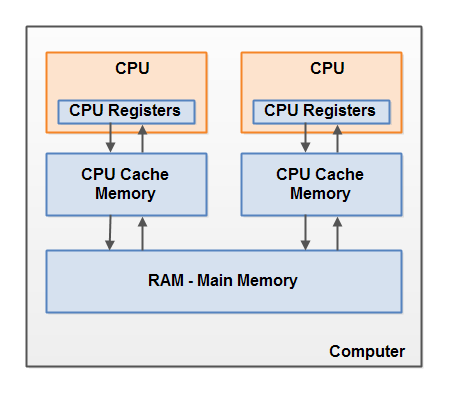

### 简介

> 内存模型描述了程序中各个变量（实例域、静态域和数组元素）之间的关系，以及在实际计算机系统中将变量存储到内存和从内存中取出变量这样的底层细节，对象最终是存储在内存里面的，这点没有错，但是编译器、运行库、处理器或者系统缓存可以有特权在变量指定内存位置存储或者取出变量的值。【`JMM`】（`Java Memory Model`的缩写）允许编译器和缓存以数据在处理器特定的缓存（或寄存器）和主存之间移动的次序拥有重要的特权，除非程序员使用了`volatile`或`synchronized`明确请求了某些可见性的保证。

### 冯·诺伊曼体系

### JAVA内存模型把Java虚拟机最主要的两个部分

- 线程栈（Thread Stack）
- 堆（Heap）

#### 哪些对象保存在栈中

- 原始类型的局部变量
- 引用类型的局部变量的引用
- 函数中的局部变量

#### 哪些对象保存在堆中

- 引用类型的本地变量的引用指向的对象
- 成员变量（原始类型，引用类型）

### 计算机内存模型

### Java内存模型和硬件内存架构之间的桥接

### volatile 关键字

参考：

- http://ifeve.com/java-memory-model-6/
- https://baike.baidu.com/item/java%E5%86%85%E5%AD%98%E6%A8%A1%E5%9E%8B/3399303