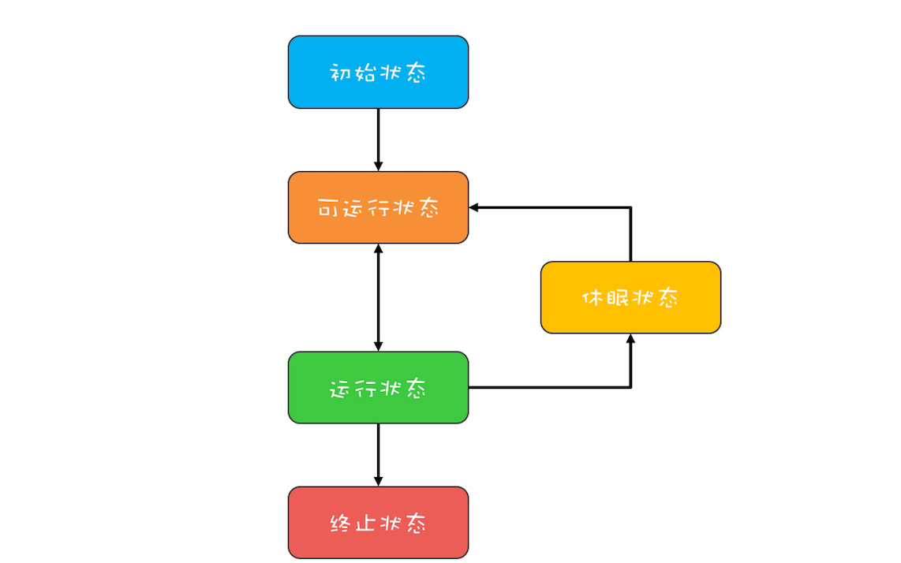
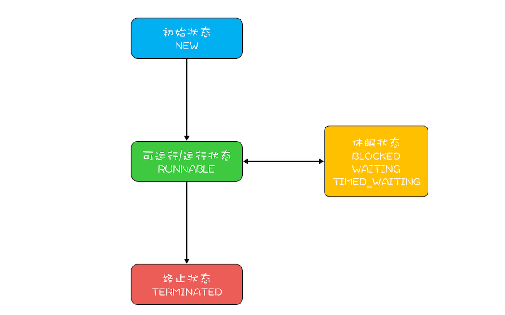

1. **初始状态**，指的是线程已经被创建，但是还不允许分配CPU执行。这个状态属于编程语言特有的，不过这里所谓的被创建，仅仅是在编程语言层面被创建，而在操作系统层面，真正的线程还没有创建。
2. **可运行状态**，指的是线程可以分配CPU执行。在这种状态下，真正的操作系统线程已经被成功创建了，所以可以分配CPU执行。
3. 当有空闲的CPU时，操作系统会将其分配给一个处于可运行状态的线程，被分配到CPU的线程的状态就转换成了**运行状态**。
4. 运行状态的线程如果调用一个阻塞的API（例如以阻塞方式读文件）或者等待某个事件（例如条件变量），那么线程的状态就会转换到**休眠状态**，同时释放CPU使用权，休眠状态的线程永远没有机会获得CPU使用权。当等待的事件出现了，线程就会从休眠状态转换到可运行状态。
5. 线程执行完或者出现异常就会进入**终止状态**，终止状态的线程不会切换到其他任何状态，进入终止状态也就意味着线程的生命周期结束了。

Java语言中线程共有六种状态，分别是：

1. NEW（初始化状态）
2. RUNNABLE（可运行/运行状态）
3. BLOCKED（阻塞状态）
4. WAITING（无时限等待）
5. TIMED_WAITING（有时限等待）
6. TERMINATED（终止状态）

