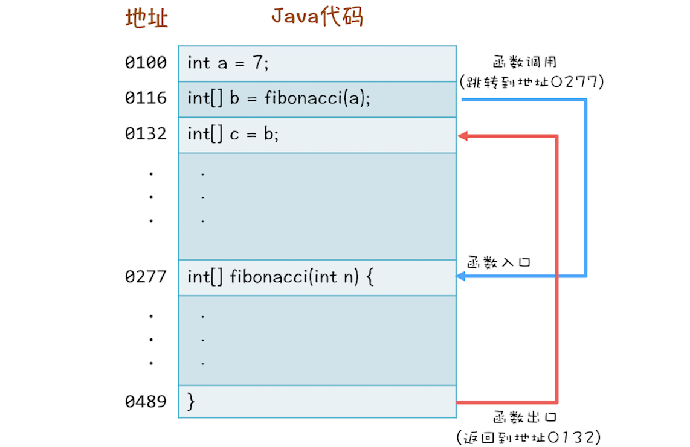
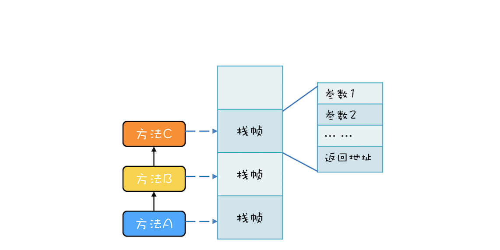
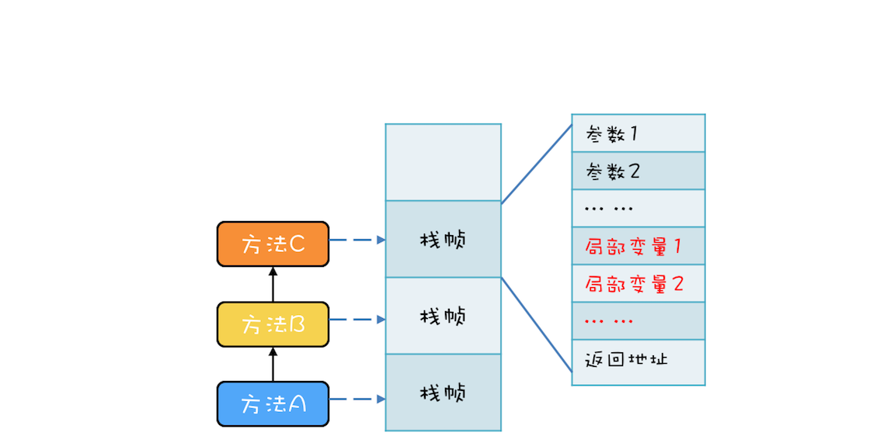
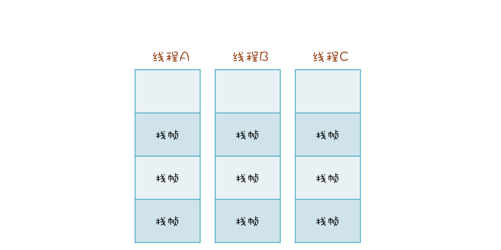

#### java中的方法调用过程

```java
int a = 7；
int[] b = fibonacci(a);
int[] c = b;
```




有三个方法A、B、C，他们的调用关系是A->B->C（A调用B，B调用C），在运行时，会构建出下面这样的调用栈。每个方法在调用栈里都有自己的独立空间，称为**栈帧**，每个栈帧里都有对应方法需要的参数和返回地址。当调用方法时，会创建新的栈帧，并压入调用栈；当方法返回时，对应的栈帧就会被自动弹出。也就是说，**栈帧和方法是同生共死的**。



#### 局部变量存哪里？

局部变量的作用域是方法内部，也就是说当方法执行完，局部变量就没用了，局部变量应该和方法同生共死。此时你应该会想到调用栈的栈帧，调用栈的栈帧就是和方法同生共死的，所以局部变量放到调用栈里那儿是相当的合理。事实上，的确是这样的，**局部变量就是放到了调用栈里**。于是调用栈的结构就变成了下图这样。



#### 调用栈与线程的关系

**每个线程都有自己独立的调用栈**。因为如果不是这样，那两个线程就互相干扰了。如下面这幅图所示，线程A、B、C每个线程都有自己独立的调用栈。

