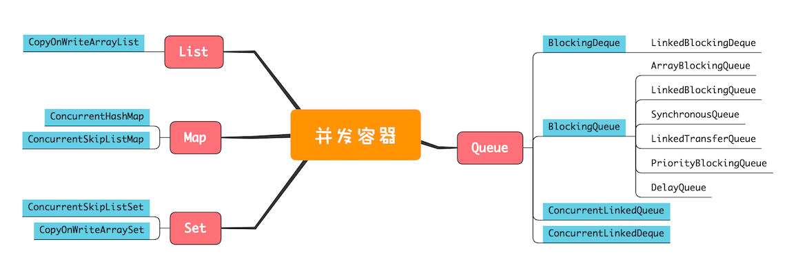
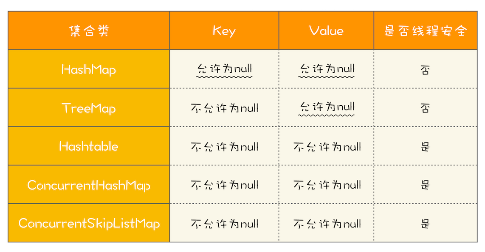

#### List

**CopyOnWriteArrayList**: 执行写操作时会将共享变量复制一份新的，这样做的好处时读操作完全无锁

坑：

1. 仅仅适用于写操作非常少的场景，而且读写并非完全一致性。
2. 其内部的迭代器是只读的，仅仅是一个快照

#### Map

**ConcurrentHashMap**：(key 无序)

**ConcurrentSkipListMap**: （key 有序）内部结构为 SkipList 跳表结构，CRUD 的时间复杂度为  O(log n), 理论上和并发线程数没有关系，所以在并发度非常高的情况下，若你对ConcurrentHashMap的性能还不满意，可以尝试一下ConcurrentSkipListMap。

#### Set

**CopyOnWriteArraySet**

**ConcurrentSkipListSet**

#### Queue

两个维度分类

1. **阻塞与非阻塞**:阻塞指的是当队列已满时，入队操作阻塞；当队列已空时，出队操作阻塞
2. **单端与双端**:单端指的是只能队尾入队，队首出队；而双端指的是队首队尾皆可入队出队

Java中关键字标识: **阻塞队列用 Blocking,单端队列用 Queue,双端队列用 Deque**

- **单端阻塞队列**

  - ArrayBlockingQueue
  - LinkedBlockingQueue
  - SynchronousQueue
  - LinkedTransferQueue
  - PriorityBlockingQueue
  - DelayQueue

  内部一般会持有一个队列，这个队列可以是数组（其实现是ArrayBlockingQueue）也可以是链表（其实现是LinkedBlockingQueue）；甚至还可以不持有队列（其实现是SynchronousQueue），此时生产者线程的入队操作必须等待消费者线程的出队操作。而LinkedTransferQueue融合LinkedBlockingQueue和SynchronousQueue的功能，性能比LinkedBlockingQueue更好；PriorityBlockingQueue支持按照优先级出队；DelayQueue支持延时出队

- **双端阻塞队列**

  - LinkedBlockingDeque

- **单端非阻塞队列**

  - ConcurrentLinkedQueue

- **双端非阻塞队列**

  - ConcurrentLinkedDeque

另外，使用队列时，需要格外注意队列是否支持有界（所谓有界指的是内部的队列是否有容量限制）。实际工作中，一般都不建议使用无界的队列，因为数据量大了之后很容易导致OOM。上面我们提到的这些Queue中，只有ArrayBlockingQueue和LinkedBlockingQueue是支持有界的，所以**在使用其他无界队列时，一定要充分考虑是否存在导致OOM的隐患**。