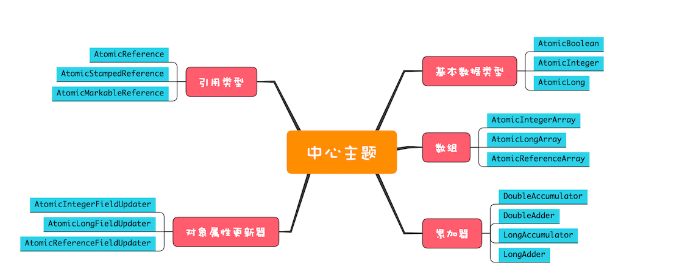

Java SDK并发包里提供的原子类内容很丰富，我们可以将它们分为五个类别：**原子化的基本数据类型、原子化的对象引用类型、原子化数组、原子化对象属性更新器**和**原子化的累加器**。



#### 原子化的基本数据类型

- AtomicBoolean
- AtomicInteger
- AtomicLong

常用方法

```java
getAndIncrement() //原子化i++
getAndDecrement() //原子化的i--
incrementAndGet() //原子化的++i
decrementAndGet() //原子化的--i
//当前值+=delta，返回+=前的值
getAndAdd(delta) 
//当前值+=delta，返回+=后的值
addAndGet(delta)
//CAS操作，返回是否成功
compareAndSet(expect, update)
//以下四个方法
//新值可以通过传入func函数来计算
getAndUpdate(func)
updateAndGet(func)
getAndAccumulate(x,func)
accumulateAndGet(x,func)
```

#### 原子化的对象引用类型

- AtomicReference
- AtomicStampedReference
- AtomicMarkableReference

利用它们可以实现对象引用的原子化更新。需要注意的是，对象引用的更新需要重点关注ABA问题，AtomicStampedReference和AtomicMarkableReference这两个原子类可以解决ABA问题。

#### 原子化数组

- AtomicIntegerArray
- AtomicLongArray
- AtomicReferenceArray

利用这些原子类，我们可以原子化地更新数组里面的每一个元素。这些类提供的方法和原子化的基本数据类型的区别仅仅是：每个方法多了一个数组的索引参数。

#### 原子化对象属性更新器

- AtomicIntegerFieldUpdater
- AtomicLongFieldUpdater
- AtomicReferenceFieldUpdater

利用它们可以原子化地更新对象的属性，这三个方法都是利用反射机制实现的。需要注意的是，**对象属性必须是volatile类型的，只有这样才能保证可见性**；如果对象属性不是volatile类型的，newUpdater()方法会抛出IllegalArgumentException这个运行时异常。

#### 原子化的累加器

- DoubleAccumulator
- DoubleAdder
- LongAccumulator
- LongAdder

