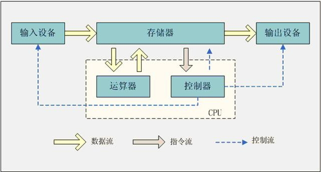
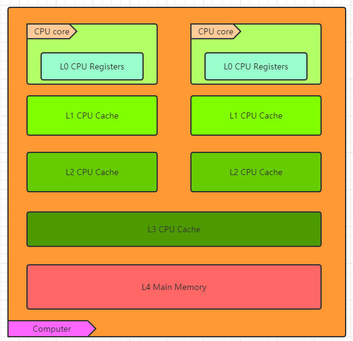

### 简介

> 内存模型描述了程序中各个变量（实例域、静态域和数组元素）之间的关系，以及在实际计算机系统中将变量存储到内存和从内存中取出变量这样的底层细节，对象最终是存储在内存里面的，这点没有错，但是编译器、运行库、处理器或者系统缓存可以有特权在变量指定内存位置存储或者取出变量的值。【`JMM`】（`Java Memory Model`的缩写）允许编译器和缓存以数据在处理器特定的缓存（或寄存器）和主存之间移动的次序拥有重要的特权，除非程序员使用了`volatile`或`synchronized`明确请求了某些可见性的保证。

想要了解JAVA的内存模型，就得了解计算机的内存模型，计算机中并不存在JVM的概念，但是真实的数据读写操作又是在计算机中运行的。下面我们先来了解一下计算机的相关知识。

### 冯·诺伊曼体系

著名的冯·诺伊曼体系中把计算机划分为5个部分，分别是：

- 输入设备
- 输出设备
- 存储器
- 运算器
- 控制器

存储器又分为：主存储器和辅存储器，运算器和控制器构成了计算机的CPU，主存储器就是我们所说的内存，辅存储器对应的是硬盘，这里我们只要关系主存储器。CPU与主存储器之间的数据交换模型，就是神秘的计算机内存模型。

### 计算机内存模型

CPU和主存储区的数据有一个过程，CPU要对主存储器中的数据进行操作时，首先要获取主存中的数据，会将主存储中数据复制到CPU缓存区中，（一般都会存在多级缓存区），再将CPU缓存中的数据、指令保存到寄存器中，CPU 内核执行寄存器中的指令，而且运算完成之后并不是马上更新到主存储器中，而是再CPU觉得合适的时候更新数据到主存中。

但CPU中计算遵循了一个标准：**线程级别结果正确**。即当前线程的数据在寄存器，缓冲区，主存中的数据一致。多个线程可能不一致，这就是导致线程安全的原因，也是学习计算机内存的原因。

