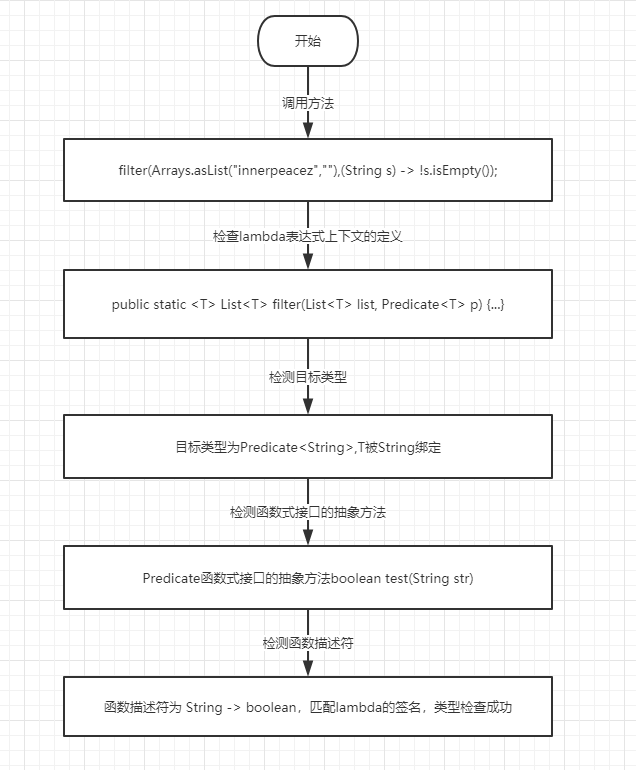

## 函数式接口

**定义：**只定义一个抽象方法的接口

JavaApi中常用的函数式接口

- Runnable
- Predicate
- Consumer
- Function
- Supplier

## 函数描述符

**定义：**函数式接口中定义的抽象方法(参数 -> 返回值)

例子：

```java
(String str) -> str.length()
```

则函数描述符为：

```java
String -> Integer
```

## @FunctionInterface

**作用：**检测接口是否是函数式接口

## Lambda表达式的类型推断

例子：

```java
public static <T> List<T> filter(List<T> list, Predicate<T> p) {
    List results = new ArrayList();
    list.forEach((T) -> {
        if (p.test(T)) {
            results.add(T);
        }
    });
    return results;
}
```

```java
filter(Arrays.asList("innerpeacez",""),(String s) -> !s.isEmpty());
```

流程图：



