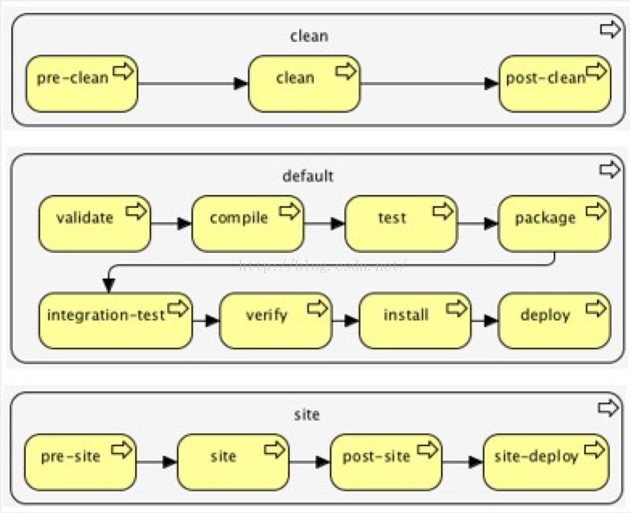
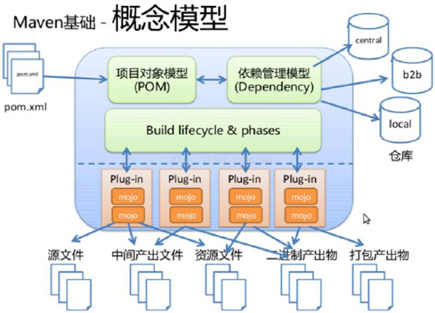
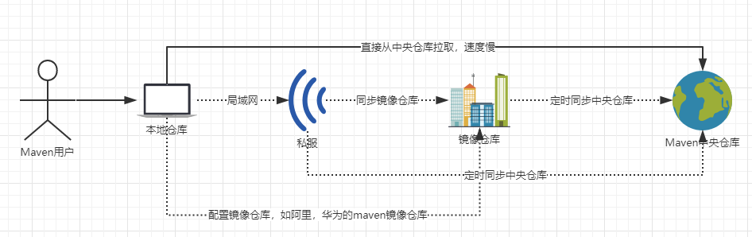

## Maven生命周期

- CleanLifecycle：在构建之前完成清理
- DefaulLifecycle：构建核心部分，包括：编译，测试，打包，部署等
- SiteLifecycle：生成项目报告，站点，发布站点

注意：不同的生命周期是相互独立的。可以独立完成。



### CleanLifecycle生命周期

#### clean生命周期的各个阶段：

| **Clean生命周期** |                                       |
| ----------------- | ------------------------------------- |
| **pre-clean**     | 执行一些需要在clean之前完成的工作     |
| **clean**         | 移除所有上一次构建生成的文件          |
| **post-clean**    | 执行一些需要在clean之后立刻完成的工作 |

#### 命令：

- mvn pre-clean
- mvn clean
- mvn post-clean

注意：生命周期后一个阶段包含了前面所有的阶段，即执行`mvn post-clean`时，`mvn pre-clean` ，`mvn clean` 都会被执行，等同于 `mvn pre-clean clean post clean`,用以简化命令行的输入。

### DefaulLifecycle生命周期

#### default生命周期的各个阶段


| default生命周期         |                                                              |
| ----------------------- | ------------------------------------------------------------ |
| validate                | 验证项目是否正确，以及所有为了完整构建必要的信息是否可用     |
| generate-sources        | 生成所有需要包含在编译过程中的源代码                         |
| process-sources         | 处理源代码，比如过滤一些值                                   |
| generate-resources      | 生成所有需要包含在打包过程中的资源文件                       |
| process-resources       | 复制并处理资源文件至目标目录，准备打包                       |
| compile                 | 编译项目的源代码                                             |
| process-classes         | 处理编译生成的文件，例如对Java类进行字节码增强（bytecode enhancement） |
| generate-test-sources   | 生成所有包含在测试编译过程中的测试源码                       |
| process-test-sources    | 处理测试源码，比如过滤一些值                                 |
| generate-test-resources | 生成测试需要的资源文件                                       |
| process-test-resources  | 复制并处理测试资源文件至测试目标目录                         |
| test-compile            | 编译测试源码至测试目标目录                                   |
| test                    | 使用合适的单元测试框架运行测试。这些测试应该不需要代码被打包或发布 |
| prepare-package         | 在真正的打包之前，执行一些准备打包必要的操作                 |
| package                 | 将编译好的代码打包成可分发的格式，如JAR，WAR，或者EAR        |
| pre-integration-test    | 执行一些在集成测试运行之前需要的动作。如建立集成测试需要的环境 |
| integration-test        | 如果有必要的话，处理包并发布至集成测试可以运行的环境         |
| post-integration-test   | 执行一些在集成测试运行之后需要的动作。如清理集成测试环境。   |
| verify                  | 执行所有检查，验证包是有效的，符合质量规范                   |
| install                 | 安装包至本地仓库，以备本地的其它项目作为依赖使用             |
| deploy                  | 复制最终的包至远程仓库，共享给其它开发人员和项目（通常和一次正式的发布相关） |

类似于clean生命周期，后面的命令也包含前面的操作，但是可以通过一些方式跳过某些阶段，如：跳过测试阶段（mvn install -DskipTest）

### site生命周期

#### site生命周期的各个阶段

| **Site生命周期** |                                                            |
| ---------------- | ---------------------------------------------------------- |
| **pre-site**     | 执行一些需要在生成站点文档之前完成的工作                   |
| **site**         | 生成项目的站点文档                                         |
| **post-site**    | 执行一些需要在生成站点文档之后完成的工作，并且为部署做准备 |
| **site-deploy**  | 将生成的站点文档部署到特定的服务器上                       |

## Maven插件



maven中能够执行的所有命令都是由插件完成的，maven本质上是一个插件框架。

maven官方提供的插件列表

- http://maven.apache.org/plugins/index.html

执行maven插件的语法：

```maven
mvn [plugin-name]:[goal-name]
例：
mvn compiler:compile
```

maven提供的两种插件类型

- 构建插件：在生成过程中执行，并应在pom.xml中的<build/>元素进行配置
- 报告插件：在网站生成期间执行的，应该在pom.xml中的<reporting/>元素进行配置

## Maven命令

### maven命令的两种格式

- `mvn [plugin-name]:[goal-name]`：指定执行的插件及插件目标
- `mvn [lifecycle]`:将插件目标与生命周期绑定

### 常用的maven命令

| Maven常用命令列表          |                                                              |
| -------------------------- | ------------------------------------------------------------ |
| **mvn –version**           | 显示版本信息                                                 |
| **mvn clean**              | 清理项目生产的临时文件,一般是模块下的target目录              |
| **mvn compile**            | 编译源代码，一般编译模块下的src/main/java目录                |
| **mvn package**            | 项目打包工具,会在模块下的target目录生成jar或war等文件        |
| **mvn test**               | 测试命令,或执行src/test/java/下junit的测试用例               |
| **mvn install**            | 将打包的jar/war文件复制到你的本地仓库中,供其他模块使用       |
| **mvn deploy**             | 将打包的文件发布到远程参考,提供其他人员进行下载依赖          |
| **mvn site**               | 生成项目相关信息的网站                                       |
| **mvn eclipse:eclipse**    | 将项目转化为Eclipse项目                                      |
| **mvn dependency:tree**    | 打印出项目的整个依赖树                                       |
| **mvn archetype:generate** | 创建Maven的普通java项目                                      |
| **mvn tomcat:run**         | 在tomcat容器中运行web应用                                    |
| **mvn jetty:run**          | 调用 Jetty 插件的 Run 目标在 Jetty Servlet 容器中启动 web 应用 |

**注意：**运行maven命令的时候，首先需要定位到maven项目的目录，也就是项目的pom.xml文件所在的目录。否则，必以通过参数来指定项目的目录。

### 命令行参数

| 命令行参数 |                                                              |
| ---------- | ------------------------------------------------------------ |
| **-D**     | 传入属性参数，如`mvn package -Dmaven.test.skip=true`，跳过单元测试打包 |
| **-P**     | 使用指定的Profile配置                                        |
| **-e **    | 显示maven运行出错的信息                                      |
| **-o**     | 离线执行命令,即不去远程仓库更新包                            |
| **-X**     | 显示maven允许的debug信息                                     |
| **-U**     | 强制去远程更新snapshot的插件或依赖，默认每天只更新一次       |

## Maven仓库

### maven用户拉取依赖流程图



**注意:**虚线为可以没有的仓库。首先会从本地仓库获取，如果本地没有的Maven回去远程仓库中获取依赖。

### maven仓库的种类

- 本地仓库
- 远程仓库
  - 中央仓库
  - 镜像仓库
  - 私服

#### 国内知名的镜像仓库

- 阿里Maven镜像库
- 华为Maven镜像库

#### 主流的私服

- Archiva（Apache）
- Artifactory（JFrog）
- Nexus（Sonatype）