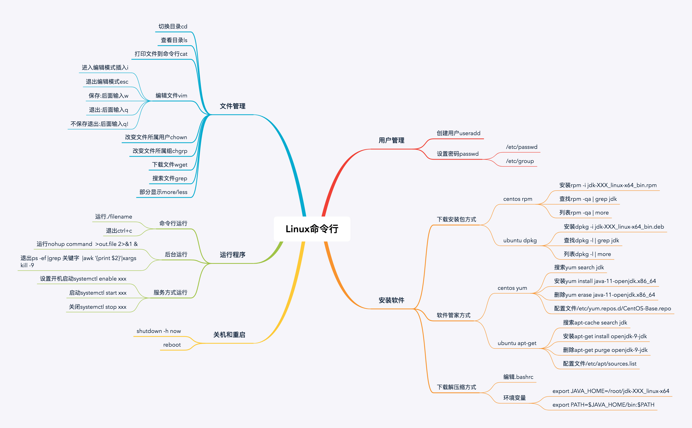

#### 修改密码 

```shell
passwd username (指定用户名)
passwd (不指定用户名，修改的是当前用户的密码)
```


#### 创建用户

```shell
useradd username (不指定密码，需要手动执行 passwd 命令来修改密码进行登陆)
```

用户信息存放在 `/etc/passwd` 目录下

```shell
用户名：密码：用户ID：组ID：用户目录：默认执行的命令行类型
root:x:0:0:root:/root:/bin/bash
```

用户组信息存放再`/etc/group`目录下


#### 查看目录中的文件和文件夹

```shell
ls -l
```


##### 第一个字段

第一个字段中包含10个字符 

第一个字符表示文件类型， （d 表示文件夹，  - 表示文件）

剩下9个字符，每三个一组，分别表示 ：当前`用户的权限`，用户`组权限`，`其他用户权限`

`rwx-` 分别表示： 读 写 可执行 没有权限

##### 第二个字段

硬链接数目

##### 第三个字段

所属用户

##### 第四个字段

所属组

#### 修改文件或文件夹的所属用户

```shell
chown 
```

#### 修改文件或文件夹的所属组

```shell
chgrp
```


#### 查看软件安装列表

```shell
rpm -qa (centos)

dpkg -l (ubuntu)
```


#### 分页查看命令

```shell
more （分页只能往后翻页，翻到最后一页结束或者按 q 键结束）

less （可以前后翻页，按 q 键结束）
```

##### 软件管家

```shell
yum (centos)

apt (ubuntu)
```

`/etc/yum.repos.d/CentOS-Base.repo`   可以在这个文件中设置下载源


#### 主要文件目录

- /usr/bin或者/usr/sbin 主执行文件目录
- /var 库文件目录
- /etc 配置文件目录


#### 压缩工具

```shell
tar 

zip 
```


#### 不挂起后台执行程序

```shell
nohup command > log.file 2>&1 &
```

1”表示文件描述符1，表示标准输出，“2”表示文件描述符2，意思是标准错误输出，“2>&1”表示标准输出和错误输出合并了。合并到哪里去呢？到`log.file`里


#### systemctl 命令

```
systemctl start xxx  启动 xxx 服务
systemctl enable xxx 设置开机启动

```

`/usr/lib/systemd/system` 目录存放服务文件


#### 关机和重启命令

```shell
shutdown -h now 立即关机

reboot 重启
```




#### 查看进程执行时的系统调用和所接受的信号

```shell
strace xxx
```

