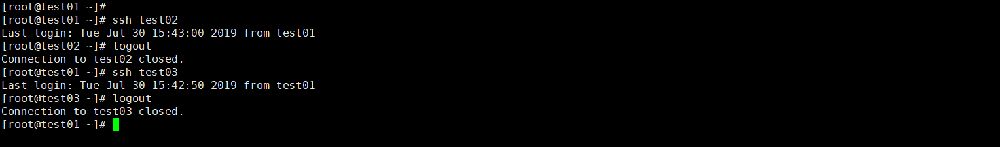

#### 先决条件

| IP             | 主机名 |
| -------------- | ------ |
| 192.168.10.196 | test01 |
| 192.168.10.76  | test02 |
| 192.168.10.84  | test03 |

#### 修改主机名称

如果你的主机名不为 test01,test02,test03 ，你可以使用以下命令分别在三台机器上进行设置，设置完成后重新登录；或者直接使用你自己的主机名。

```shell
ssh root@192.168.10.196
hostnamectl set-hostname test01
```

```shell
ssh root@192.168.10.76
hostnamectl set-hostname test02
```

```shell
ssh root@192.168.10.84
hostnamectl set-hostname test03
```

#### 设置 DNS 主机名解析

如果DNS 不支持解析主机名称，则需要修改 test01 机器的/etc/hosts文件，添加主机名和 IP 的对应关系：

```shell
cat >> /etc/hosts <<EOF
192.168.10.196 test01
192.168.10.76 test02
192.168.10.84 test03
EOF
```

####　配置免密登录

**生成 rsa** 

```shell
cd ~
mkdir rsa 
cd rsa
ssh-keygen -t rsa
```

**配置免密**

在 test 01 执行以下命令，并键入每个节点的密码即可

```shell
ssh-copy-id root@test01
ssh-copy-id root@test02
ssh-copy-id root@test03
```

#### 测试

