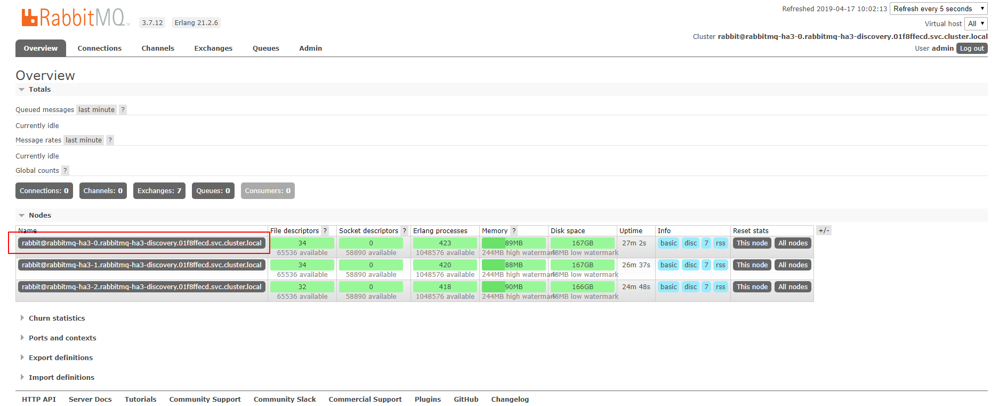

#### 起因

想要使用高可用的`rabbitmq-ha`，寻找最简单的方案，找到了`helm`官方`charts`中，有个`rabbitmq-ha`的`charts` ,就想先放到测试环境，验证一下可用性，就开始了有意思的事情。

<center>
    
    <br>
    <div style="color:orange; border-bottom: 1px solid #d9d9d9;
    display: inline-block;
    color: #999;
    padding: 2px;">皮一下很开心！</div>
</center>

#### 过程

首先使用使用的是helm/charts 仓库中的stable中的`rabbitmq`的`charts`和`rabbitmq-ha`的`charts`，分别启动了一个单机版的`rabbitmq`和一个`ha`版的`rabbitmq`

`rabbitmq`运行一段时间后，随着项目运行产生了一些`queue`,`channel`,`exchange`...

这个时候想要将`rabbitmq`换成ha版了，对ha版的进行了杀`pod`以及性能压测，得出可用的结论。

想要做到无感知的切换`rabbitmq`到`rabbitmq-ha,`首先是将`rabbitmq-ha`搭建好

##### queue 的创建分为两种

- 没有queue时自动创建
- 项目启动的时候创建

如果是第二种形式的，直接切换`mq`,会导致项目报错，所以需要将原先`rabbitmq`中已经存在的`queue`,`exchange`,`channel`等迁移到新的`rabbitmq-ha`中，所以决定采用`rabbitmqctl`进行创建队列，`google`一大圈之后，只找到一篇有用的，划重点：`erlang`表达式啥的我又看不懂。

**单机版的创建 queue**

```shell
rabbitmqctl eval 'rabbit_amqqueue:declare({resource, <<"/">>, queue, <<"test-queue">>}, true, false, [], none).'
```

但是放到ha版的却发现报错


后来发现在多节点时需要指定节点

**Ha版创建 queue**

```shell
rabbitmqctl eval 'rabbit_amqqueue:declare({resource, <<"/">>, queue, <<"test-queue">>}, true, false, [], none, "节点地址").'
```

节点地址在rabbitmq的dashboard界面可以找到



这里只需要在一个节点上创建queue,因为每个节点都是mirror节点，配置好pattern后，多个节点直接的信息都会同步

**列出原先 rabbitmq 中所有的 queue**

```shell
rabbitmqctl list_queues
```

**循环创建所有的 queue**

```shell
rabbitmqctl list_queues | awk '{print $1}' > queues.txt
```

将`queues.txt`导入到Ha的某个节点

```shell
cat queues.txt | while read queue ; do （rabbitmqctl eval 'rabbit_amqqueue:declare({resource, <<"/">>, queue, <<"test-queue">>}, true, false, [], none, "节点地址").'）& done
```

**注意** ： 这里没有进行消息的同步，而是找了一个消息很少的时候，可能会丢消息，当然消息可以进行消息补偿来弄。

**最后切流量**

将原先链接在单机版`rabbitmq`上的链接切换到`rabbitmq-ha`上，这里通过的是`k8s`中`service`的`pod selector`来寻找`Pod`的`label`来做的，结果符合预期。

#### 参考

- <https://my.oschina.net/hncscwc/blog/345546>