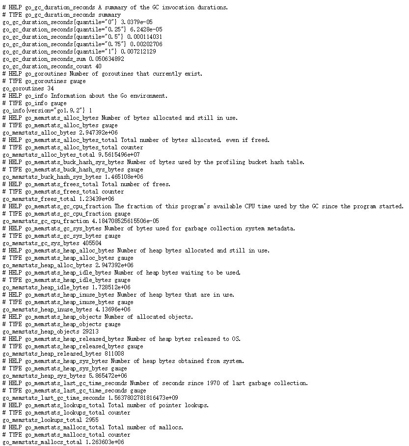

Node Exporter 简介

Node Exporter 采用Golang编写，并且不存在任何的第三方依赖。

在Prometheus的架构设计中，Prometheus Server并不直接服务监控特定的目标，其主要任务负责数据的收集，存储并且对外提供数据查询支持。因此为了能够能够监控到某些东西，如主机的CPU使用率，我们需要使用到Node Exporter。Prometheus周期性的从Exporter暴露的HTTP服务地址（通常是/metrics）拉取监控样本数据。

采集每个节点上的Node 数据，需要在每一个节点上都启动一个Node Exporter服务。

Node Exporter 启动后访问 9100端口：

metric 指标信息

| name                     | description                       |
| ------------------------ | --------------------------------- |
| node_boot_time           | 系统启动时间                      |
| node_cpu                 | 系统CPU使用量                     |
| node_disk*               | 磁盘IO                            |
| node_filesystem*         | 文件系统用量                      |
| node_load1               | 系统负载                          |
| node_memory*             | 内存使用量                        |
| node_network*            | 网络带宽                          |
| node_time                | 当前系统时间                      |
| go_*                     | node exporter中go相关指标         |
| process_*                | node exporter自身进程相关运行指标 |
| http_requests_*          |                                   |
| http_response_*          |                                   |
| node_arp_entries         |                                   |
| node_context_switches    |                                   |
| node_exporter_build_info |                                   |
| node_filefd_allocated    |                                   |
| node_netstat_*           |                                   |
|                          |                                   |
|                          |                                   |

