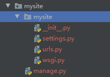

创建一个 Django 项目

```python
django-admin startproject mysite
```

创建后的目录结构



这些目录和文件的用处是：

- 最外层的 `mysite/` 根目录只是你项目的容器， Django 不关心它的名字，你可以将它重命名为任何你喜欢的名字。
- `manage.py`: 一个让你用各种方式管理 Django 项目的命令行工具。你可以阅读 [django-admin and manage.py](https://docs.djangoproject.com/zh-hans/2.2/ref/django-admin/) 获取所有 `manage.py` 的细节。
- 里面一层的 `mysite/` 目录包含你的项目，它是一个纯 Python 包。它的名字就是当你引用它内部任何东西时需要用到的 Python 包名。 (比如 `mysite.urls`).
- `mysite/__init__.py`：一个空文件，告诉 Python 这个目录应该被认为是一个 Python 包。如果你是 Python 初学者，阅读官方文档中的 [更多关于包的知识](https://docs.python.org/3/tutorial/modules.html#tut-packages)。
- `mysite/settings.py`：Django 项目的配置文件。如果你想知道这个文件是如何工作的，请查看 [Django 配置](https://docs.djangoproject.com/zh-hans/2.2/topics/settings/) 了解细节。
- `mysite/urls.py`：Django 项目的 URL 声明，就像你网站的“目录”。阅读 [URL调度器](https://docs.djangoproject.com/zh-hans/2.2/topics/http/urls/) 文档来获取更多关于 URL 的内容。
- `mysite/wsgi.py`：作为你的项目的运行在 WSGI 兼容的Web服务器上的入口。阅读 [如何使用 WSGI 进行部署](https://docs.djangoproject.com/zh-hans/2.2/howto/deployment/wsgi/) 了解更多细节。


本地运行 django

```python
python manage.py runserver
```

更换端口

```python
python manage.py runserver 8080
```


#### path() 函数

函数 [`path()`](https://docs.djangoproject.com/zh-hans/2.2/ref/urls/#django.urls.path) 具有四个参数，两个必须参数：`route` 和 `view`，两个可选参数：`kwargs` 和 `name`。现在，是时候来研究这些参数的含义了。

**[`path()`](https://docs.djangoproject.com/zh-hans/2.2/ref/urls/#django.urls.path) 参数： `route`[¶**](https://docs.djangoproject.com/zh-hans/2.2/intro/tutorial01/#path-argument-route)

`route` 是一个匹配 URL 的准则（类似正则表达式）。当 Django 响应一个请求时，它会从 `urlpatterns` 的第一项开始，按顺序依次匹配列表中的项，直到找到匹配的项。

这些准则不会匹配 GET 和 POST 参数或域名。例如，URLconf 在处理请求 `https://www.example.com/myapp/` 时，它会尝试匹配 `myapp/` 。处理请求 `https://www.example.com/myapp/?page=3` 时，也只会尝试匹配 `myapp/`。

**[`path()`](https://docs.djangoproject.com/zh-hans/2.2/ref/urls/#django.urls.path) 参数： `view`[¶**](https://docs.djangoproject.com/zh-hans/2.2/intro/tutorial01/#path-argument-view)

当 Django 找到了一个匹配的准则，就会调用这个特定的视图函数，并传入一个 [`HttpRequest`](https://docs.djangoproject.com/zh-hans/2.2/ref/request-response/#django.http.HttpRequest) 对象作为第一个参数，被“捕获”的参数以关键字参数的形式传入。稍后，我们会给出一个例子。

**[`path()`](https://docs.djangoproject.com/zh-hans/2.2/ref/urls/#django.urls.path) 参数： `kwargs`[¶**](https://docs.djangoproject.com/zh-hans/2.2/intro/tutorial01/#path-argument-kwargs)

任意个关键字参数可以作为一个字典传递给目标视图函数。本教程中不会使用这一特性。

**[`path()`](https://docs.djangoproject.com/zh-hans/2.2/ref/urls/#django.urls.path) 参数： `name`[¶**](https://docs.djangoproject.com/zh-hans/2.2/intro/tutorial01/#path-argument-name)

为你的 URL 取名能使你在 Django 的任意地方唯一地引用它，尤其是在模板中。这个有用的特性允许你只改一个文件就能全局地修改某个 URL 模式。

#### 默认Apps

[`INSTALLED_APPS`](https://docs.djangoproject.com/zh-hans/2.2/ref/settings/#std:setting-INSTALLED_APPS) 默认包括了以下 Django 的自带应用：

- [`django.contrib.admin`](https://docs.djangoproject.com/zh-hans/2.2/ref/contrib/admin/#module-django.contrib.admin) -- 管理员站点， 你很快就会使用它。
- [`django.contrib.auth`](https://docs.djangoproject.com/zh-hans/2.2/topics/auth/#module-django.contrib.auth) -- 认证授权系统。
- [`django.contrib.contenttypes`](https://docs.djangoproject.com/zh-hans/2.2/ref/contrib/contenttypes/#module-django.contrib.contenttypes) -- 内容类型框架。
- [`django.contrib.sessions`](https://docs.djangoproject.com/zh-hans/2.2/topics/http/sessions/#module-django.contrib.sessions) -- 会话框架。
- [`django.contrib.messages`](https://docs.djangoproject.com/zh-hans/2.2/ref/contrib/messages/#module-django.contrib.messages) -- 消息框架。
- [`django.contrib.staticfiles`](https://docs.djangoproject.com/zh-hans/2.2/ref/contrib/staticfiles/#module-django.contrib.staticfiles) -- 管理静态文件的框架。

##### 迁移数据并创建数据表

```python
python manage.py migrate
```

改变模型需要这三步：

- 编辑 `models.py` 文件，改变模型。
- 运行 [`python manage.py makemigrations`](https://docs.djangoproject.com/zh-hans/2.2/ref/django-admin/#django-admin-makemigrations) 为模型的改变生成迁移文件。
- 运行 [`python manage.py migrate`](https://docs.djangoproject.com/zh-hans/2.2/ref/django-admin/#django-admin-migrate) 来应用数据库迁移。

#### 交互式 python 命令行

```python
python manage.py shell
```

#### 创建一个管理员账号

```python
python manage.py createsuperuser
```

#### 启动开发服务器

```python
python manage.py runserver
```

#### 向管理应用中添加新的Model

```python
from django.contrib import admin

from .models import Question

admin.site.register(Question)
```

