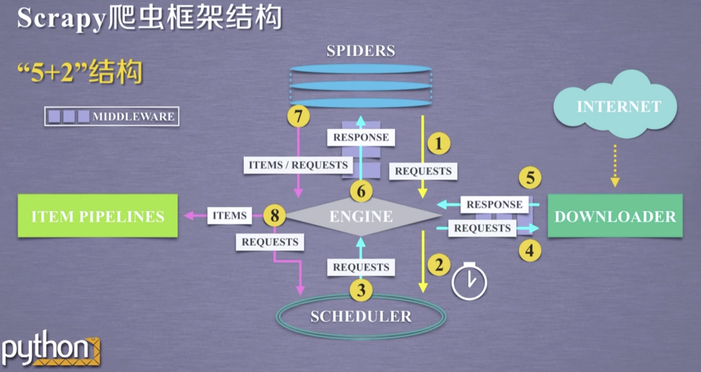
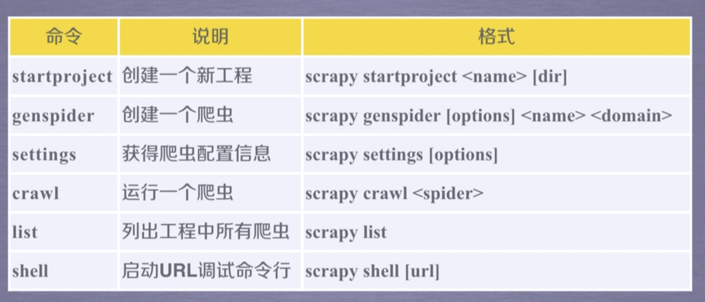
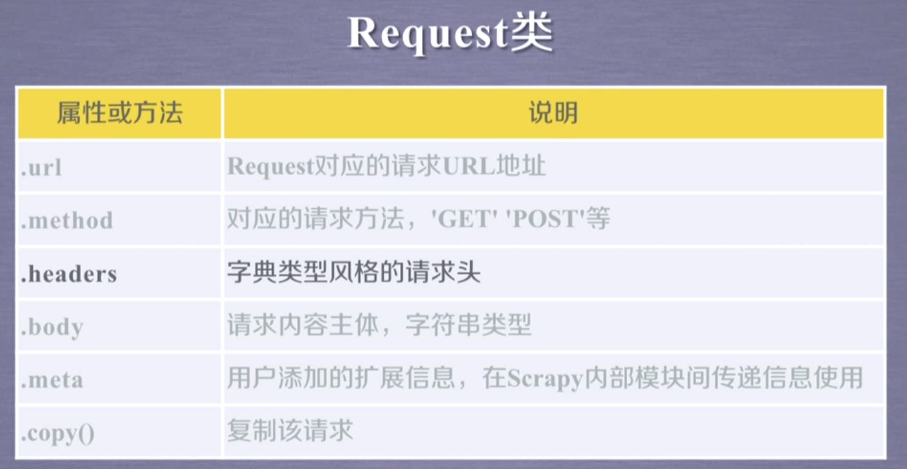
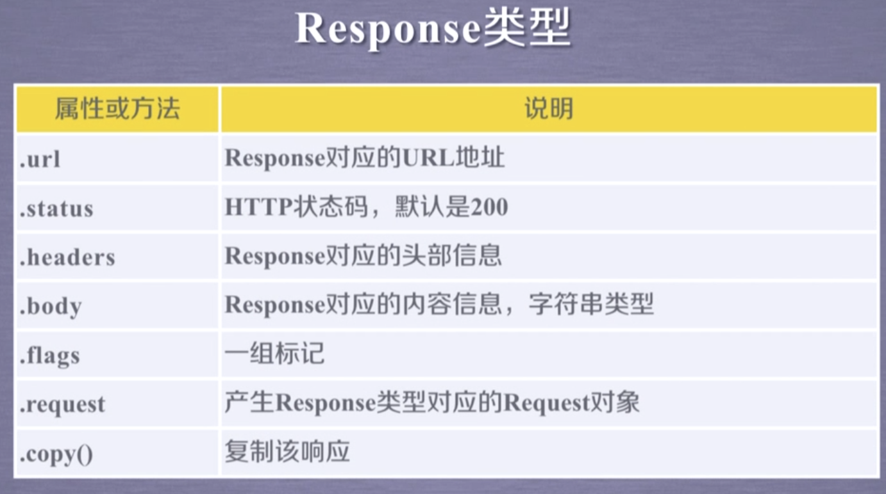

S c r

Engine：（不需要用户修改）

- 控制所有模块之间的数据流
- 根据条件触发事件、

Downloader：（不需要用户修改）

- 根据请求下载网页

Scheduler：（不需要用户修改）

- 对所有爬取请求进行调度管理

Downloader Middeleware（用户可以编写配置代码）

- 实施 Engine ，Scheduler ，Downloader 之间进行用户可配置的控制
- 修改，丢弃，新增请求或相应

Spider：（需要用户编写配置代码）

- 解析Downloader返回的响应（Response）
- 产生爬取项（spider item）
- 产生额外的爬取请求（Request）

Item Pipelines（需要用户编写配置代码）

- 以流水线的方式处理Spider产生的爬取项
- 由一组操作顺序组成，类似流水线，每个操作的一个Item Pipeline 类型
- 可能操作包括：清理，检验和查重爬取项中的HTML数据，将数据存储到数据库

Spider Middleware

- 对请求和爬取项的再处理

#### Scrapy 框架的常用命令

#### Scrapy 中的三个类

Request类

Response类

Item类

class scrapy.item.Item()

- Item 对象表示一个从HTML页面中提取的信息内容
- 由Spider生成，由Item Pipeline处理
- Item 类似字典类型，可以按照字典类型操作