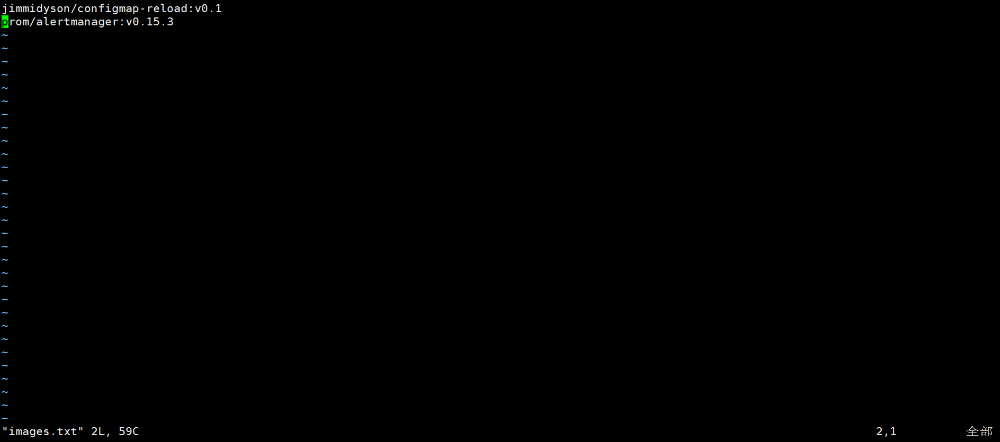

##### 从docker hub官方镜像仓库拉取镜像，push私有仓库

这个只是一个很简单的小脚本，主要是使用了`helm`官方`charts`包，里面很多镜像都是直接拉的 `docker hub` ,速度太慢，就想着直接拉到自己的本地仓库了。

1.登录到私有仓库

```shell
docker login "xxx"
```

2.将需要拉去的镜像放到`images.txt`文件中,每行一个。



3.执行`push-images.sh`脚本

```shell
#!/bin/bash
repo="私有仓库地址"
images=`cat images.txt`
for image in ${images};
do
  echo "docker pull ${image}"
  docker pull ${image}
  tag=${image#*:}
  image_profix=${image##*/}
  image_name=${image_profix%%:*}
  pushName=${repo}/${image_name}:${tag}
  echo "docker tag ${image} ${pushName}"
  docker tag ${image} ${pushName}
  echo "docker push ${pushName}"
  docker push ${pushName}
  echo "--------------------------------"
done
```

