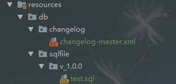
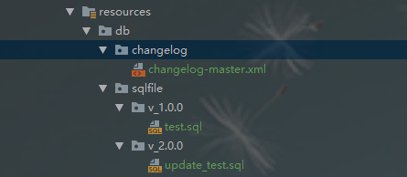

## 介绍

​	**Liquibase**是一个独立于开源数据库的库，用于跟踪，管理和应用数据库模式更改。它始于2006年，可以更轻松地跟踪数据库更改，尤其是在敏捷软件开发环境中。想要了解更多建议去[官网](http://www.liquibase.org/)。

## 特性

- 支持几乎所有主流的数据库，如MySQL, PostgreSQL, Oracle, H2等；
- 支持多开发者的协作维护；
- 日志文件支持多种格式，如XML, YAML, SQL等；
-  ...

## 本文目的

以前的数据库添加字段大多直接操作数据库，但可能在切换环境（如 dev，test，prod）时，忘记修改数据库导致出错，所以将数据库控制交给 liquibase 是个很好的方式，本文使用Spring Boot 2.0 集成 liquibase ，使用的是 sql 控制的方式，sql方式比较方便，但是存在弊端，sql不能兼容所有数据库。

<center>
    
    <br>
    <div style="color:orange; border-bottom: 1px solid #d9d9d9;
    display: inline-block;
    color: #999;
    padding: 2px;">enjoy coding！</div>
</center>

## 使用方法

[GitHub源码地址](https://github.com/innerpeacez/spring-boot-learning/tree/master/spring-boot-liquibase)

### 1.引入依赖

```xml
<dependency>
    <groupId>org.liquibase</groupId>
    <artifactId>liquibase-core</artifactId>
</dependency>
```

### 2.添加配置

```xml
spring:
  liquibase:
    # 开启 liquibase
    enabled: true 
    # 配置 changlog 文件路径
    change-log: classpath:/db/changelog/changelog-master.xml 
```

#### 详细配置项

| 配置Key                                    | 描述                                                         |
| ------------------------------------------ | ------------------------------------------------------------ |
| spring.liquibase.enabled                   | 是否开启 `liquibase`（默认为 `true`）                        |
| spring.liquibase.change-log                | 配置文件的路径，默认值为 classpath:/db/changelog/db.changelog-master.yaml |
| spring.liquibase.check-change-log-location | 检查 `change log`的位置是否存在，默认为true.                 |
| spring.liquibase.contexts                  | 用逗号分隔的运行环境列表                                     |
| spring.liquibase.default-schema            | 默认数据库 schema                                            |
| spring.liquibase.drop-first                | 是否先 `drop schema`（默认 `false`）                         |
| spring.liquibase.url                       | 要迁移的JDBC URL，如果没有指定的话，将使用配置的主数据源     |

### 3.编写 changlog-master.xml 文件

```xml
<databaseChangeLog
        xmlns="http://www.liquibase.org/xml/ns/dbchangelog"
        xmlns:xsi="http://www.w3.org/2001/XMLSchema-instance"
        xsi:schemaLocation="http://www.liquibase.org/xml/ns/dbchangelog
         http://www.liquibase.org/xml/ns/dbchangelog/dbchangelog-3.1.xsd">
    <!-- 扫面 所有 Sql文件路径 ，相对路径-->
    <includeAll path="../sqlfile/" relativeToChangelogFile="true"/>
</databaseChangeLog>
```

### 4.sql文件编写



```sql
CREATE TABLE IF NOT EXISTS `test`(
   `id` INT UNSIGNED AUTO_INCREMENT,
   `title` VARCHAR(100) NOT NULL,
   `author` VARCHAR(40) NOT NULL,
   `date` DATE,
   PRIMARY KEY ( `id` )
);
```

### 5.持续更新sql文件（保证版本，创建新目录，编写更新sql）



```sql
alter table `test` add column `test_field` VARCHAR(100) NOT NULL;
```

