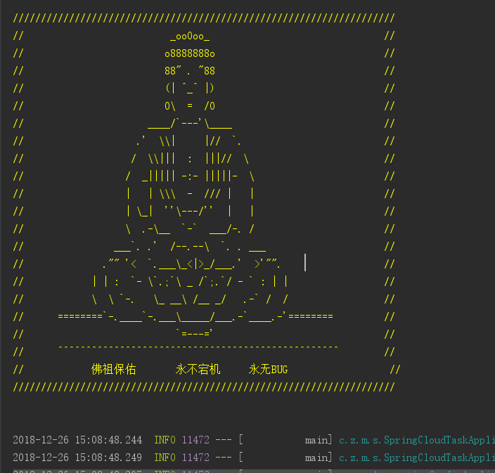

### 效果图：



### 设置步骤：

- 在`/src/main/resources`目录下创建banner.txt文件
- 将字符画复制到banner.txt文件中
- 启动springboot项目就可看到效果了

### 生成banner的网站

- [生成文字banner](http://patorjk.com/software/taag/#p=display&f=JS%20Capital%20Curves&t=Type%20Something%20)
- [生成图片banner](https://www.degraeve.com/img2txt.php)

### 安利一下

```
////////////////////////////////////////////////////////////////////
//                          _ooOoo_                               //
//                         o8888888o                              //
//                         88" . "88                              //
//                         (| ^_^ |)                              //
//                         O\  =  /O                              //
//                      ____/`---'\____                           //
//                    .'  \\|     |//  `.                         //
//                   /  \\|||  :  |||//  \                        //
//                  /  _||||| -:- |||||-  \                       //
//                  |   | \\\  -  /// |   |                       //
//                  | \_|  ''\---/''  |   |                       //
//                  \  .-\__  `-`  ___/-. /                       //
//                ___`. .'  /--.--\  `. . ___                     //
//              ."" '<  `.___\_<|>_/___.'  >'"".                  //
//            | | :  `- \`.;`\ _ /`;.`/ - ` : | |                 //
//            \  \ `-.   \_ __\ /__ _/   .-` /  /                 //
//      ========`-.____`-.___\_____/___.-`____.-'========         //
//                           `=---='                              //
//      ^^^^^^^^^^^^^^^^^^^^^^^^^^^^^^^^^^^^^^^^^^^^^^^^^^        //
//            佛祖保佑       永不宕机     永无BUG                  //
////////////////////////////////////////////////////////////////////
```