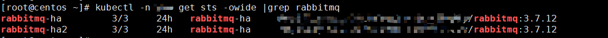
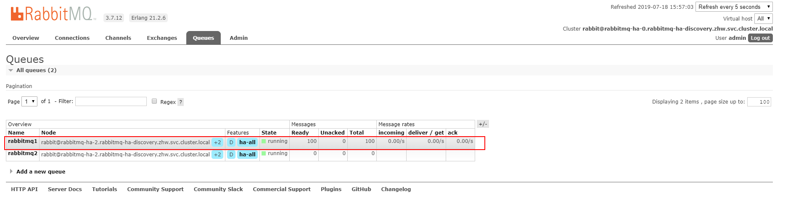
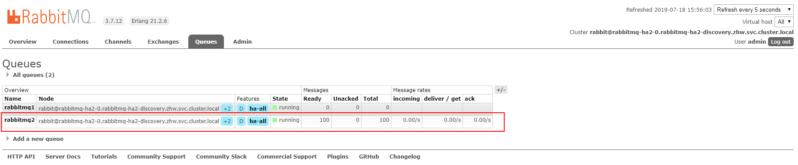

#### 简介

`MQ` 是开发中很平常的中间件，本文讲述的是怎么在一个`Spring Boot`项目中配置多源的`RabbitMQ`，这里不过多的讲解`RabbitMQ`的相关知识点。如果你也有遇到需要往多个`RabbitMQ`中发送消息的需求，希望本文可以帮助到你。

#### 环境

- rabbitmq 3.7.12
- spring boot 2.1.6.RELEASE

当然软件的版本不是硬性要求，只是我使用的环境而已，唯一的要求是需要启动两个`RabbitMQ`，我这边是在`kubernetes`集群中使用`helm `官方提供的`charts`包快速启动的两个`rabbitmq-ha`高可用`rabbitmq`集群。



想要了解	`kubernetes`或者`helm`,可以参看以下 github仓库：

- kubernetes : <https://github.com/kubernetes/kubernetes>
- helm:  <https://github.com/helm/helm>
- charts: <https://github.com/helm/charts>

#### SpringBoot中配置两个RabbitMQ源

在springboot 中配置单个RabbitMQ是极其简单的，我们只需要使用Springboot为我们自动装配的RabbitMQ相关的配置就可以了。但是需要配置多个源时，第二个及其以上的就需要单独配置了，这里我使用的都是单独配置的。

##### 代码：

```java
/**
 * @author innerpeacez
 * @since 2019/3/11
 */
@Data
public abstract class AbstractRabbitConfiguration {

    protected String host;
    protected int port;
    protected String username;
    protected String password;

    protected ConnectionFactory connectionFactory() {
        CachingConnectionFactory connectionFactory = new CachingConnectionFactory();
        connectionFactory.setHost(host);
        connectionFactory.setPort(port);
        connectionFactory.setUsername(username);
        connectionFactory.setPassword(password);
        return connectionFactory;
    }
}
```

**第一个源的配置代码**

```java
package com.zhw.study.springbootmultirabbitmq.config;

import org.springframework.amqp.rabbit.config.SimpleRabbitListenerContainerFactory;
import org.springframework.amqp.rabbit.connection.ConnectionFactory;
import org.springframework.amqp.rabbit.core.RabbitAdmin;
import org.springframework.amqp.rabbit.core.RabbitTemplate;
import org.springframework.beans.factory.annotation.Qualifier;
import org.springframework.boot.autoconfigure.amqp.SimpleRabbitListenerContainerFactoryConfigurer;
import org.springframework.boot.context.properties.ConfigurationProperties;
import org.springframework.context.annotation.Bean;
import org.springframework.context.annotation.Configuration;
import org.springframework.context.annotation.Primary;

/**
 * @author innerpeacez
 * @since 2019/3/8
 */

@Configuration
@ConfigurationProperties("spring.rabbitmq.first")
public class FirstRabbitConfiguration extends AbstractRabbitConfiguration {

    @Bean(name = "firstConnectionFactory")
    @Primary
    public ConnectionFactory firstConnectionFactory() {
        return super.connectionFactory();
    }

    @Bean(name = "firstRabbitTemplate")
    @Primary
    public RabbitTemplate firstRabbitTemplate(@Qualifier("firstConnectionFactory") ConnectionFactory connectionFactory) {
        return new RabbitTemplate(connectionFactory);
    }

    @Bean(name = "firstFactory")
    public SimpleRabbitListenerContainerFactory firstFactory(SimpleRabbitListenerContainerFactoryConfigurer configurer,
                                                             @Qualifier("firstConnectionFactory") ConnectionFactory connectionFactory) {
        SimpleRabbitListenerContainerFactory factory = new SimpleRabbitListenerContainerFactory();
        configurer.configure(factory, connectionFactory);
        return factory;
    }

    @Bean(value = "firstRabbitAdmin")
    public RabbitAdmin firstRabbitAdmin(@Qualifier("firstConnectionFactory") ConnectionFactory connectionFactory) {
        return new RabbitAdmin(connectionFactory);
    }
}
```

**第二个源的配置代码**

```java
package com.zhw.study.springbootmultirabbitmq.config;

import org.springframework.amqp.rabbit.config.SimpleRabbitListenerContainerFactory;
import org.springframework.amqp.rabbit.connection.ConnectionFactory;
import org.springframework.amqp.rabbit.core.RabbitAdmin;
import org.springframework.amqp.rabbit.core.RabbitTemplate;
import org.springframework.beans.factory.annotation.Qualifier;
import org.springframework.boot.autoconfigure.amqp.SimpleRabbitListenerContainerFactoryConfigurer;
import org.springframework.boot.context.properties.ConfigurationProperties;
import org.springframework.context.annotation.Bean;
import org.springframework.context.annotation.Configuration;

/**
 * @author innerpeacez
 * @since 2019/3/8
 */

@Configuration
@ConfigurationProperties("spring.rabbitmq.second")
public class SecondRabbitConfiguration extends AbstractRabbitConfiguration {

    @Bean(name = "secondConnectionFactory")
    public ConnectionFactory secondConnectionFactory() {
        return super.connectionFactory();
    }

    @Bean(name = "secondRabbitTemplate")
    public RabbitTemplate secondRabbitTemplate(@Qualifier("secondConnectionFactory") ConnectionFactory connectionFactory) {
        return new RabbitTemplate(connectionFactory);
    }

    @Bean(name = "secondFactory")
    public SimpleRabbitListenerContainerFactory secondFactory(SimpleRabbitListenerContainerFactoryConfigurer configurer,
                                                             @Qualifier("secondConnectionFactory") ConnectionFactory connectionFactory) {
        SimpleRabbitListenerContainerFactory factory = new SimpleRabbitListenerContainerFactory();
        configurer.configure(factory, connectionFactory);
        return factory;
    }

    @Bean(value = "secondRabbitAdmin")
    public RabbitAdmin secondRabbitAdmin(@Qualifier("secondConnectionFactory") ConnectionFactory connectionFactory) {
        return new RabbitAdmin(connectionFactory);
    }
}
```

**配置信息**

```yaml
spring:
  application:
    name: multi-rabbitmq
  rabbitmq:
    first:
      host: 192.168.10.76
      port: 30509
      username: admin
      password: 123456
    second:
      host: 192.168.10.76
      port: 31938
      username: admin
      password: 123456
```

##### 测试

这样我们的两个RabbitMQ源就配置好了，接下来我们进行测试使用，为了方便使用，我写了一个MultiRabbitTemplate.class 方便我们使用不同的源。

```java
/**
 * @author innerpeacez
 * @since 2019/3/8
 */
@Component
public abstract class MultiRabbitTemplate {

    @Autowired
    @Qualifier(value = "firstRabbitTemplate")
    public AmqpTemplate firstRabbitTemplate;

    @Autowired
    @Qualifier(value = "secondRabbitTemplate")
    public AmqpTemplate secondRabbitTemplate;
}
```

第一个消息发送者类 TestFirstSender.class

```java
/**
 * @author innerpeacez
 * @since 2019/3/11
 */
@Component
@Slf4j
public class TestFirstSender extends MultiRabbitTemplate implements MessageSender {

    @Override
    public void send(Object msg) {
        log.info("rabbitmq1 , msg: {}", msg);
        firstRabbitTemplate.convertAndSend("rabbitmq1", msg);
    }

    public void rabbitmq1sender() {
        this.send("innerpeacez1");
    }
}
```

第二个消息发送者类 TestSecondSender.class

```java
/**
 * @author innerpeacez
 * @since 2019/3/11
 */
@Component
@Slf4j
public class TestSecondSender extends MultiRabbitTemplate implements MessageSender {

    @Override
    public void send(Object msg) {
        log.info("rabbitmq2 , msg: {}", msg);
        secondRabbitTemplate.convertAndSend("rabbitmq2", msg);
    }

    public void rabbitmq2sender() {
        this.send("innerpeacez2");
    }
}
```

动态创建Queue的消费者

```java
/**
 * @author innerpeacez
 * @since 2019/3/11
 */

@Slf4j
@Component
public class TestFirstConsumer implements MessageConsumer {

    @Override
    @RabbitListener(bindings = @QueueBinding(value = @Queue("rabbitmq1")
            , exchange = @Exchange("rabbitmq1")
            , key = "rabbitmq1")
            , containerFactory = "firstFactory")
    public void receive(Object obj) {
        log.info("rabbitmq1 , {}", obj);
    }

}
```

```java
/**
 * @author innerpeacez
 * @since 2019/3/11
 */

@Slf4j
@Component
public class TestSecondConsumer implements MessageConsumer {

    @Override
    @RabbitListener(bindings = @QueueBinding(value = @Queue("rabbitmq2")
            , exchange = @Exchange("rabbitmq2")
            , key = "rabbitmq2")
            , containerFactory = "secondFactory")
    public void receive(Object obj) {
        log.info("rabbitmq2 , {}", obj);
    }

}
```

测试类

```java
@RunWith(SpringRunner.class)
@SpringBootTest
@Slf4j
public class SpringBootMultiRabbitmqApplicationTests extends MultiRabbitTemplate {

    @Autowired
    private TestFirstSender firstSender;
    @Autowired
    private TestSecondSender secondSender;

    /**
     * 一百个线程向 First Rabbitmq 的 rabbitmq1 queue中发送一百条消息
     */
    @Test
    public void testFirstSender() {
        for (int i = 0; i < 100; i++) {
            new Thread(() ->
                    firstSender.rabbitmq1sender()
            ).start();
        }
        try {
            Thread.sleep(1000 * 10);
        } catch (InterruptedException e) {
            e.printStackTrace();
        }
    }

    /**
     * 一百个线程向 Second Rabbitmq 的 rabbitmq2 queue中发送一百条消息
     */
    @Test
    public void testSecondSender() {
        for (int i = 0; i < 100; i++) {
            new Thread(() ->
                    secondSender.rabbitmq2sender()
            ).start();
        }
        try {
            Thread.sleep(1000 * 10);
        } catch (InterruptedException e) {
            e.printStackTrace();
        }

    }
}
```

测试结果：





#### 总结

这样配置好之后我们就可向两个RabbitMQ中发送消息啦。这里只配置了两个源，当然如果你需要更多的源，仅仅只需要配置`*RabbitConfiguration.class`就可以啦。本文没有多说关于RabbitMQ的相关知识，如果未使用过需要自己了解一下相关知识。

---

> - **源码**：<https://github.com/innerpeacez/spring-boot-learning/tree/master/spring-boot-multi-rabbitmq>
>
> - **Github**: https://github.com/innerpeacez
> - **个人Blog**: https://ipzgo.top
> - 日拱一卒，不期速成