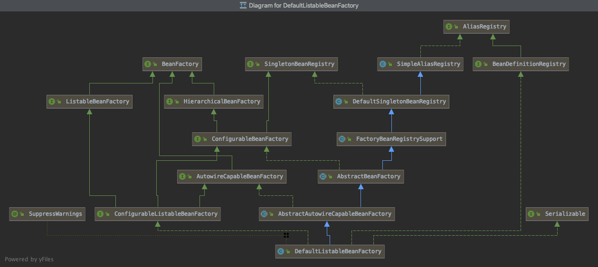

Spring 核心容器类图：

Spring-beans

Spring-core

Spring-context

Spring-context-support

Spring-context-indexer

Spring-expression

BeanFactory 是 Spring 底层 IoC 容器

ApplicationContext 

Spring IoC 容器的生命周期

- 启动
  - 创建 BeanFactory ，进行初步初始化过程（内建 Bean）
- 运行
- 停止