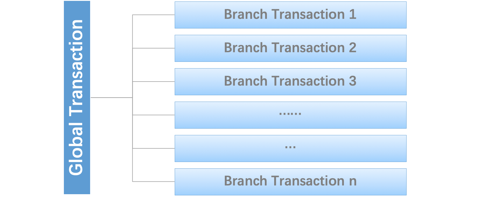

#### 分布式事务介绍

分布式事务通常由一个全局事务和多个分支事务组成，通常每个分支事务都是本地事务。

#### seata的三个基本组件

- **Transaction Coordinator（TC）**：管理全局事务和分支事务的状态，推进全局事务的提交和回滚。
- **Transaction Manager (TM)** ：定义全局事务的范围，开始一个全局事务，提交或者回滚一个全局事务。
- **Resource Manager(RM)**：管理分支事务处理的资源，通知 `TC`注册分支事务，并且报告分支事务的状态，推动分支事务的提交或者回滚。

#### seata管理分布式事务的生命周期

1. `TM` 告知 `TC` 开始一个全局事务，然后 `TC` 生成一个全局事务的 `XID`
2. `XID` 通过分布式微服务之间的调用传递
3. `RM` 将本地事务注册为 `XID` 对应 `TC` 的分支事务
4. `TM` 要求`TC`提交或者回滚XID 对应的分支事务
5. `TC`推动`XID`对应的全局事务下的所有分支事务完成提交或者回滚

