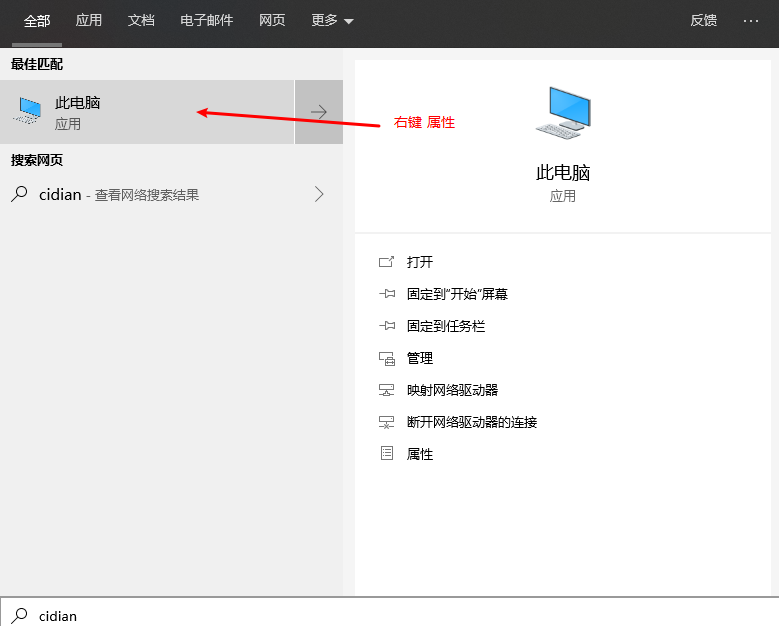
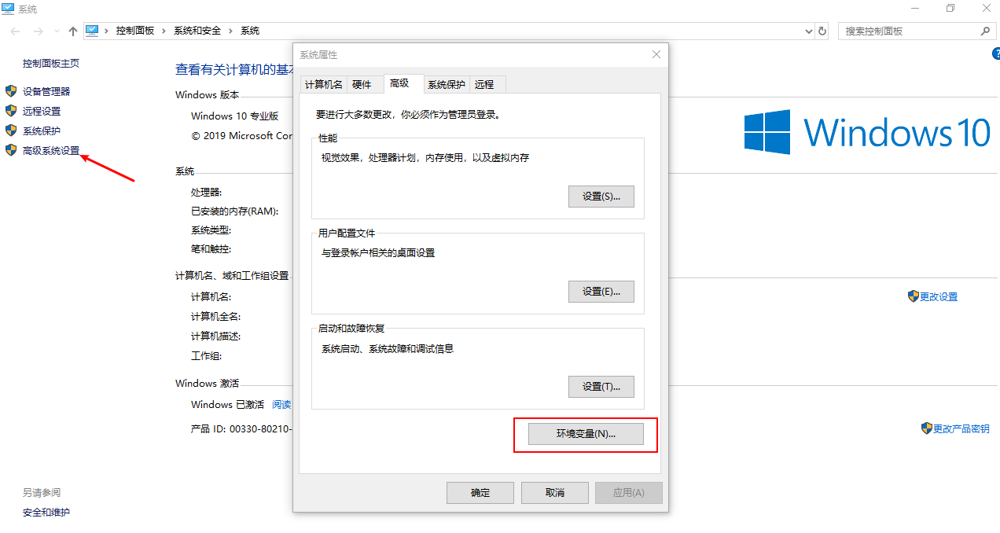
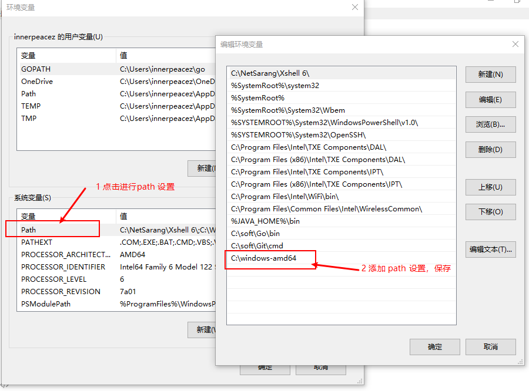
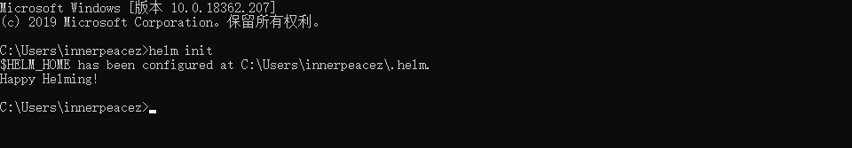
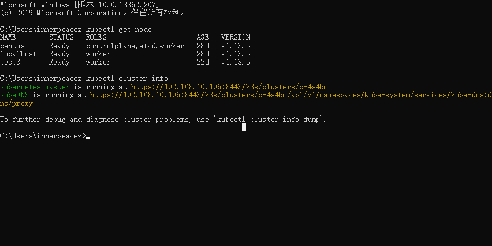

#### 简介：

主要原因是，我不会 vim ，在 linux 上修改 charts 的很蹩脚，所以就想着能不能再 windows 上执行 helm 命令，将 charts install linux 上搭建的 kubernetes 集群上，答案当然是可以的。本文将告诉大家怎么在 windows 上执行 helm 命令和 kubectl 命令，本文的先决条件是需要有一个 kubernetes 集群环境，如果没有请自行部署。

### 本文环境

- kubernetes 1.15
- helm 3 alpha.2
- kubectl 

#### Helm 3 是什么？

helm 是 kubernetes 官方的包管理工具, 	通过 helm 将发布在 kubenetes 环境的多个 yaml 以软件包(charts)的形式打包，简化了 kubernetes 集群环境中应用的部署及更新,helm 支持应用的部署,升级，回滚等操作。helm 3 是针对于 helm 来说的升级版，做了一个功能上的调整，以其 github 发布的版本号命名，目前最新的版本为 [Helm v3.0.0-alpha.2](https://github.com/helm/helm/releases/tag/v3.0.0-alpha.2)。个人认为helm 必定会成为未来 CICD 链中的关键一环。

#### kubectl 是什么？

熟悉 kubernetes 的同学肯定非常熟悉 kubectl ,甚至于每天都会使用到。kubectl是用于针对Kubernetes集群运行命令的命令行接口。

#### 调教经历

简单的了解的 helm 和 kubectl 之后，我们开始实现在 windows 上执行 helm 命令。

##### 安装helm3

1.下载 [helm3 windows 安装包](https://github.com/helm/helm/releases/tag/v3.0.0-alpha.2)，解压之后，你会看到有个 windows-amd64 的文件夹，其中有个 helm.exe 的可执行文件，我将这个文件夹直接放在了 `C:\windows-amd64`

2.设置 path





3. helm init 

打开 CMD，进行 helm 的初始化操作， 如果你如法访问 google 的 stable 仓库 ，将以下内容保存到$HOME\helm\repository\repositories.yaml 文件中。

```yaml
apiVersion: v1
generated: "2019-07-23T09:39:54.849920932+08:00"
repositories:
- caFile: ""
  cache: C:\Users\innerpeacez\.helm\repository\cache\stable-index.yaml
  certFile: ""
  keyFile: ""
  name: stable
  password: ""
  url: https://kubernetes-charts.storage.googleapis.com
  username: ""
```

出现下图所示，就说明初始化完成了



#### 安装 kubectl 

1.下载 [kubectl windows 安装包](https://storage.googleapis.com/kubernetes-release/release/v1.9.0/bin/windows/amd64/kubectl.exe)

2.设置path

这里为了方便，我将 kubectl.exe 文件和 helm.exe 文件放在了同一个目录，就不用设置两次path了

3.配置 kubernetes config 文件，这个文件是你在 linux 服务器上使用 kubectl 与kubernetes 交互的配置文件，我们只要在 linux 上找到 `$HOME/.kube/config` 文件，将其复制到windows 的`$HOME/.kube/config` ,即可，我的位置是 `C:\Users\innerpeacez\.kube\config`

4.测试 kubectl 



#### 通过 helm 部署应用到 kubernetes 中

配置好 helm 和 kuberctl 之后，我们还需要给helm 设置 conext ，因为 helm 3，的访问 k8s 集群权限是与 我们在 kubeconfig 设置的权限是一致的

查看当前 context

```shell
kubectl config current-context
```

设置 context 指定我们需要部署应用对应的 namespace ，不指定使用的是 default

```shell
kubectl config set-context <current-context> --namespace test
```

部署应用

```shell
helm -n test install promethues .\prometheus\
```

出现以下内容就说明应用已经开始部署了

> NAME: promethues
> LAST DEPLOYED: 2019-07-27 15:53:30.4257149 +0800 CST m=+0.775545401
> NAMESPACE: test
> STATUS: deployed
>
> NOTES:
> The Prometheus server can be accessed via port 80 on the following DNS name from within your cluster:
>
> .......

#### 总结

本文主要讲述了 windows 中我们怎么通过 helm 与 kubernetes 进行交互，写这篇文章是因为目前网上大部分介绍 windows 上使用 k8s 的都是在 windows 上使用 minikube 来玩的，还有就是为了方便调试 charts。希望可以帮助到你。

> - [**点击查看我的Github**](https://github.com/innerpeacez)
> - [**点击查看我的个人Blog**](https://ipzgo.top)
> - **日拱一卒，不期速成**

