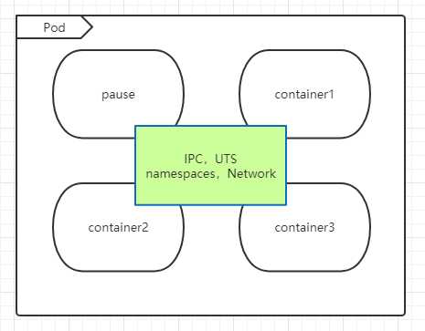
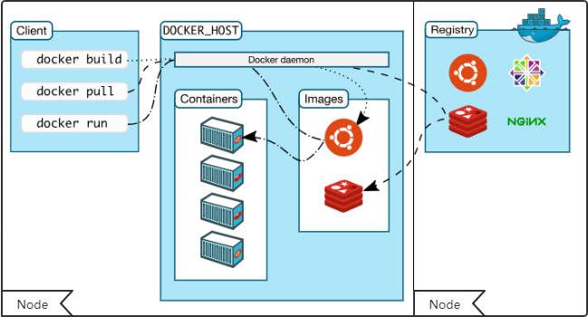
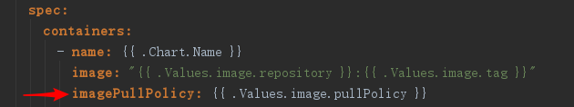
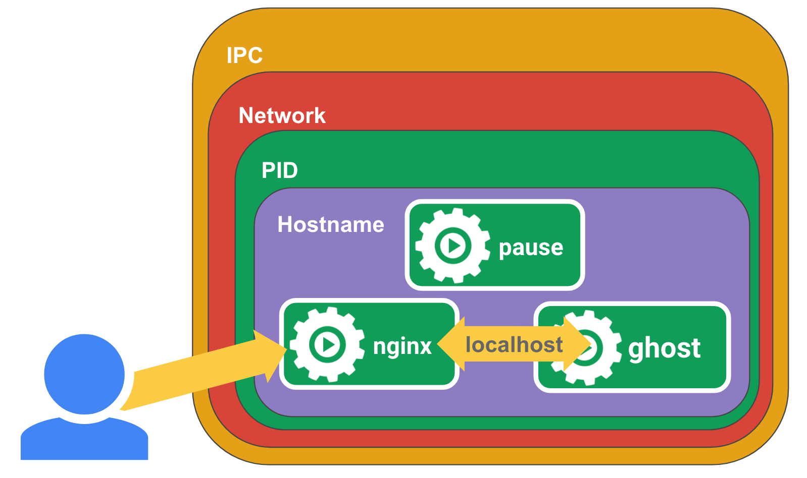
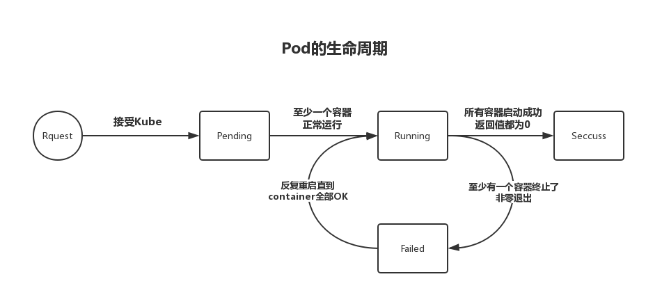
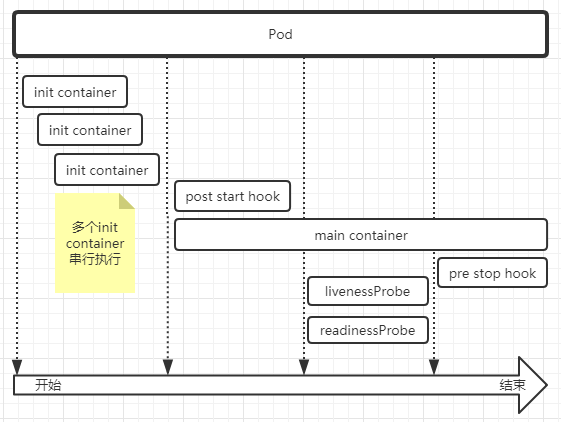

Pod是kubernetes中最基本也是最小的资源对象,一个Pod中可以包含多个容器，一个Pod中的多个容器必须运行在同一个节点（Node）上，Kubernetes会自动将其分配到同一个node上，应该尽可能的将不同的应用运行在不同的Pod中，Pod中的各个容器通过基础容器`pause`共享`Network`，`NTS Namespace`,`PID`,Pod是kubernetes进行动态扩缩容的基础单元。很少会直接在kubernetes中创建单个Pod,kubernetes提供了控制器（Controller）来管理Pod.



### Pod存在形式

- 单Pod单容器：一个Pod中运行一个容器
- 单Pod多容器：一个Pod中运行多个容器

#### Pod中单个容器模式

一般推荐使用这种模式，一个Pod对应一个应用实例，这样做更加灵活，kubernetes只能管理Pod,无法直接管理Pod中的容器，如果需要对Pod进行动态扩缩容，这种形式可独立的按需进行扩缩容。

#### Pod中多容器模式

对于一些特定的场景，需要辅助容器配合主容器完成一些功能，这时就需要在同一个Pod中运行多个容器

- Sidecar Pattern：为主容器提供一个辅助容器，每个容器独立运行
- Ambassador Pattern：为主容器提供一个访问远程服务代理的容器
- Adapter Pattern：为主容器提供一个适配其他服务的容器

个人感觉`Ambassador Pattern`和`Adapter Pattern`很相似，目前额外的容器存在的模式一般为`Sidecar Pattern`，如：istio sidecar,Helm hook

<center>
    
    <br>
    <div style="color:orange; border-bottom: 1px solid #d9d9d9;
    display: inline-block;
    color: #999;
    padding: 2px;">enjoy coding！</div>
</center>

### Pod的镜像获取策略



使用`yaml`文件中容器配置（containers）的`imagePullPolicy`字段用于指定拉取策略。



- Always：镜像`tag`为`latest`,或者本地镜像不存在时，总是从远程仓库拉取镜像
- IfNotPresent：本地镜像不存在时，从远程仓库拉取镜像
- Never：仅可使用本地镜像，禁止从远程仓库拉取镜像

注意：`tag`为`latest`的镜像，默认策略为`Always`,其他`tag`的镜像，默认策略为`IfNotPresent`。

### Pod中`pause`容器

每个Pod启动的时候，`kubelet`都会使用`kubernetes/pause`镜像为Pod创建一个基础pause容器，然后再创建其他进程。

#### pause容器的核心功能

- Pod中linux namespace共享的基础
- 启用PID Namespace隔离每个Pod，使得每个Pod都有自己的PID 1进程（init进程），关于PID 1 进程可以参考：[Linux下1号进程的前世(kernel_init)今生(init进程)](https://blog.csdn.net/gatieme/article/details/51532804)
- 管理僵尸进程



### Pod 的生命周期

Pod从创建到销毁为其生命周期



#### pod pause 是PodStatus中的一个字段，这个字段有几个值

- **Pending**：Pod资源对象已经存入etcd中，但还未被调度或者存在一个或多个容器未创建完成（正在拉去镜像）
- **Running**：Pod已经被调度到集群中的摸个Node上，并且容器都被创建，存在容器正在启动或者正在重启状态
- **Successed**：Pod中的所有容器都已经终止，并且不会再重启
- **Failed**：Pod 中的所有容器都已终止了，并且至少有一个容器是因为失败终止。也就是说，容器以非0状态退出或者被系统终止
- **Unknown**：API Server由于某些原因无法获取到Pod的状态，通常是因为与 Pod 所在Node的kubelet通信失败

#### Pod的创建过程


1. 用户通过Rest API (kubectl ,rancher API)提交Pod Spec给API Server
2. API 将相关信息保存到etcd中，待写入操作完成后，API Server会返回确认消息给客户端
3. `kube-scheduler`通过`watch`机制检查到etcd中的Pod状态为未绑定Node
4. `kube-scheduler`为Pod选择一个Node进行绑定，并且API Server将信息更新到etcd
5. 目标Node的`kubelet`调用docker启动容器，`kubelet`会获取Pod的状态，并将信息返回给API Server，API Server再将信息保存到etcd
6. etcd信息写入完成后，API Server将信息发送给kubelet将通过它被接受。

#### Pod 生命周期的重要行为



1. 创建init container：串行执行完成所有的init container之后才会创建应用container
2. 执行hook (post start)
3. 创建应用container
4. 探针检测（livenessProbe,readinessProbe）

### Pod Template

```yaml
apiVersion: v1
kind: Pod
metadata:
  name: string
  namespace: string
  labels:
    - name: string
  annotations:
    - name: string
spec:
  containers:
  - name: string
    image: string
    imagePullPolicy: [Always | Never | IfNotPresent]
    command: [string]
    args: [string]
    workingDir: string
    volumeMounts:
    - name: string
      mountPath: string
      readOnly: boolean
    ports:
    - name: string
      containerPort: init
      hostPort: in  
      protocol: string
    env:
    - name: string
      value: string
    resources:
      limits:
        cpu: string
        memory: string
    livenessProbe:
      exec:
        command: [string]
      httpGet:
        path: string
        port: number
        host: string
        scheme: string
        httpHeaders:
        - name: string
          value: string
        tcpSocket:
          port: number
        initialDelaySeconds: 0
        timeoutSeconds: 0
        periodSeconds: 0
        successThreshold: 0
        failureThreshold: 0
        securityContext:
          priviledge: false
    restartPolicy: [Always | Never | OnFailure]
    nodeSelector: object
    imagePullSecrets:
    - name: string
    hostNetwork: false
    volumes:
    - name: string
      emptyDir: {}
      hostPath:
        path: string
      secret:
        secretName: string
        items:
        - keys: string
          path: string
      configMap:
        name: string
        items:
        - key: string
          path: string
```

### 参考

- https://jimmysong.io/kubernetes-handbook/
- 《Kubernetes 进阶实战》--马永亮
- https://docs.docker.com
- https://blog.csdn.net/gatieme/article/details/51383322