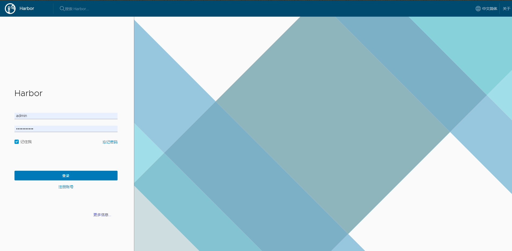
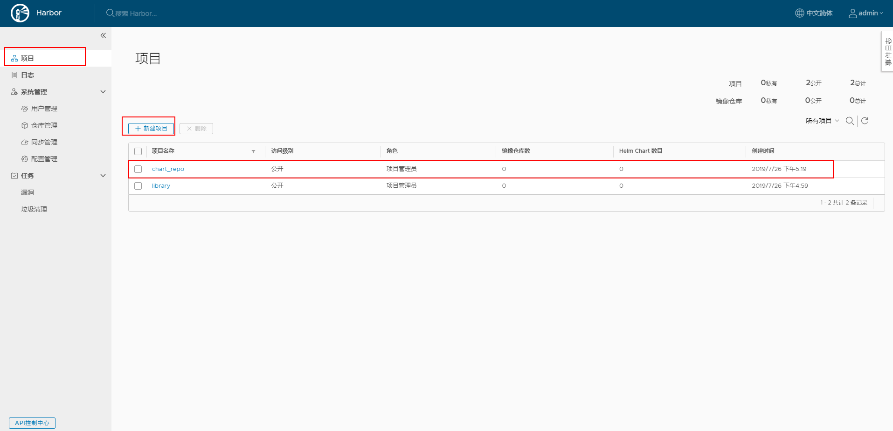
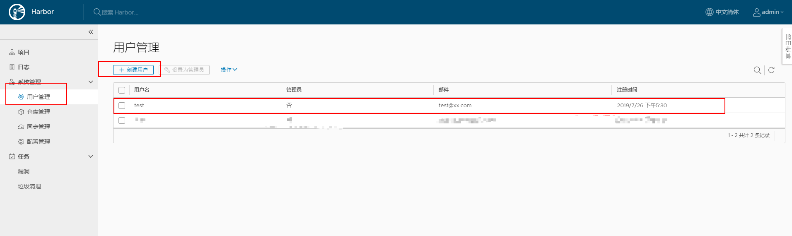

#### 简介

本文讲述的是调教 Helm 3 和 harbor 1.6+ 的经验，从 helm2 更新到 helm 3 并且将 charts 推送到 harbor 中进行存储，移除了原先的 helm serve,在讲述怎么操作之前先来看一下Helm 3 和 Harbor 1.6+ 的新特性。

#### Helm 3 新特性

- 移除了 Tiller
- 不同的 namespace 可以使用相同的 Release Name
- 简化模板对象 `.Capabilities`
- 使用`JSONSchema`验证 charts 的 Values
- 将`requirements.yaml`合并到`Chart.yaml`中
- helm install 时需要指定 Release Name，开启自动生成需要 `--generate-name` 参数
- 支持 push 到远端 registry （如：harbor）
- 移除 helm serve
- 命令行变化（将原先的命令保留为别名Aliases）
  - `helm delete` --> `helm uninstall` 
  - `helm inspect` -> `helm show`
  - `helm fetch` -> `helm pull`
- go 导入路径改变 `k8s.io/helm` --> `helm.sh/helm`

具体新特性可以参考[Helm 3 新特性](https://github.com/helm/helm/releases/tag/v3.0.0-alpha.1)，或者参考[Helm 官方文档](https://v3.helm.sh/)

#### Harbor v1.6.0 新特性

- 支持存储 helm charts 
- ...

这里没什么好说的，想要了解更多关于Harbor的，可以参考[官方Github](https://github.com/goharbor)

#### 调教开始

在了解了以上新的特性之后，让我着手来操作吧

##### 环境

- kubernetes 1.10+
- helm 3
- harbor 1.6+

##### 调教步骤

1. 确保kubernetes环境可用
2. 下载并初始化 helm 3
3. 安装 harbor 1.6+
4. 添加 harbor 中的 chartrepo 到 helm 3 中
5. 安装使用 helm-push 插件

###### 1.确保kubernetes环境可用

这里就不多说 kubernetes 环境的具体搭建过程了，搭建步骤随处可见。

###### 2.下载并初始化 helm 3

首先执行一下命令，下载并解压安装包

```shell
wget https://get.helm.sh/helm-v2.14.2-linux-amd64.tar.gz
tar zxvf helm-v2.14.2-linux-amd64.tar.gz
cd linux-amd64
cp helm /usr/local/bin
```

解压之后，你如果使用过helm 2 你会发现里面tiller的二进制文件不见了，前文的新特性中已经说了，helm 3 已经移除了 tiller

接下来初始化 helm

```shell
helm init
```


默认添加官方 repo `stable	https://kubernetes-charts.storage.googleapis.com`

###### 3.安装 harbor 1.6+

这里我使用的是 harbor 官方提供的 `charts repo`,好奇心驱使我打开了这个网站 https://helm.goharbor.io/


这熟悉的界面让我严重怀疑是使用的 helm serve 启的 repo（滑稽脸）

添加harbor repo

```shell
helm repo add goharbor https://helm.goharbor.io
```

这个 repo 只有一个charts harbor ，对应的 harbor 版本为1.8.1

在安装之前我们需要配置一下 kube config context

查看当前的context

```shell
kubectl config current-context
```

设置 context 指定对应的 namespace ，不指定使用的是 default

```shell
kubectl config set-context <current-context> --namespace test
```

这里是因为，helm 3 开始helm 3 的执行权限和kubectl config 的权限是一致的，通过kubectl config的方式来控制helm 3 的执行权限。

按时安装harbor ,这里为了简化测试操作，我关闭了数据卷的挂载并使用的是 NodePort 方式进行访问。

```shell
helm -n test install harbor goharbor/harbor --set persistence.enabled=false --set expose.type=nodePort --set expose.tls.enabled=false --set externalURL=http://192.168.10.196:30002
```

参数说明：

- persistence.enabled=false 关闭存储，为了方便操作，真实使用时需要挂在存储
- expose.type=nodePort 使用 NodePort 访问
- expose.tls.enabled=false 关闭tls
- externalURL=http://192.168.10.196:30002 设置登录 harbor 的外部链接

出现以下返回，就证明已经开始安装了

```shell
NAME: harbor
LAST DEPLOYED: 2019-07-23 11:00:38.525597536 +0800 CST m=+0.690703892
NAMESPACE: test
STATUS: deployed

NOTES:
Please wait for several minutes for Harbor deployment to complete.
Then you should be able to visit the Harbor portal at https://core.harbor.domain. 
For more details, please visit https://github.com/goharbor/harbor.
```

###### 4.添加 harbor 中的 chartrepo 到 helm 3 中

harbor 装好之后，我们访问 http://192.168.10.196:30002 进行登录 harbor, harbor 的默认账号密码是 admin/Harbor12345



新建一个chart repo



创建一个 test 用户



添加 repo 到 helm 中

```shell
helm repo add test http://192.168.10.76:30002/chartrepo/chart_repo
```

###### 5.安装使用 helm-push 插件

```shell
helm plugin install https://github.com/chartmuseum/helm-push
```

这里最好本地配置一下 github 的 dns 地址，不然可能会出现链接超时的现象

安装好插件之后，就可以push charts 到 harbor 里面了

```shell
helm push grafana-0.0.2.tgz test --username test --password xxx
```


出现以上就说明 push 成功了 ，恭喜！！！

#### 参考

- https://github.com/chartmuseum/helm-push
- https://github.com/goharbor/harbor
- https://github.com/helm/helm

------


> - **Github**: https://github.com/innerpeacez
> - **个人Blog**: https://ipzgo.top
> - **日拱一卒，不期速成**