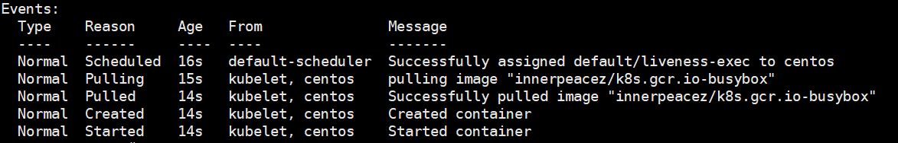
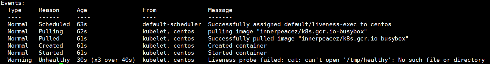
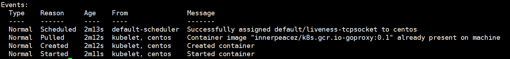
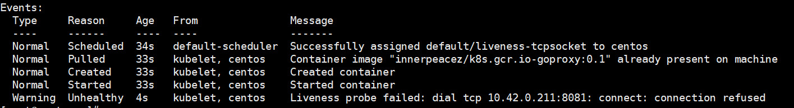

<center>
    
</center>

#### 判断 Pod 健康状态的两种方式

- livenessProbe 存活性探针
- readinessProbe 就绪性探针

##### 1.livenessProbe 存活性探针

用于判断容器是否存活，即 Running 状态。如果 livenessProbe 探针检测到容器不健康，则 kubelet 会杀死容器，并根据容器的重启策略进行容器的重启。如果容器没有定义 livenessProbe 探针，则 livenessProbe 返回状态永远为 Success。

##### 2.readinessProbe  就绪性探针

用于判断容器服务（service）是否可用，即 Ready 状态。如果 Ready 状态，则表示Service 与 Pod EndPoint 建立了关联，并且将其保存到 EndPoint 列表中，以供服务调用；如果状态变为 Failure , Kubernetes 会将其从 EndPoint 列表中移除，保证通过 Service 访问时不会将流量路由到不健康的 Pod 上，等到状态恢复到 Ready 状态再将其对应的 EndPoint 加入EndPoint 列表中。如果容器没有定义 readinessProbe 探针，则 readiness 返回状态永远为 Success。

#### 探针的配置方式

通过 kubectl 定期对容器进行诊断，判断容器状态是否健康或者存活。

##### livenessProbe 和 readinessProbe 探测方式

- ExecAction
- TCPSocketAction
- HTTPGetAction

###### 三种探针的可能返回结果

- Success：探测成功
- Failure：探测失败，更具重启策略重启容器
- Unknow：探测失败（未找到），不采取任何行动

<center>
    
    <br>
    <div style="color:orange; border-bottom: 1px solid #d9d9d9;
    display: inline-block;
    color: #999;
    padding: 2px;">enjoy coding！</div>
</center>

###### ExecAction

在容器中执行自定义命令以判断容器是否健康，命令退出时返回码为 0 ,则表示健康，其他值表示不健康。

例子：

```yaml
apiVersion: v1
kind: Pod
metadata:
  labels:
    test: liveness
  name: liveness-exec
spec:
  containers:
  - name: liveness
    image: innerpeacez/k8s.gcr.io-busybox
    args:
    - /bin/sh
    - -c
    - touch /tmp/healthy; sleep 20; rm -rf /tmp/healthy; sleep 60
    livenessProbe:
      exec:
        command:
        - cat
        - /tmp/healthy
      initialDelaySeconds: 10
      periodSeconds: 5
```

这个例子中，busybox 镜像其中之后执行了 `touch /tmp/healthy` 创建出 `/tmp/healthy` 目录，30 s 后删除这个目录，livenessProbe 设置了 `initialDelaySeconds: 10`，会在容器启动之后 10s 后进行初次探测，返回结果不出意外为 Success ,表示容器健康。使用以下命令查看 Pod Event

```shell
kubectl describe  pod liveness-exec
```



一段时间后你可能会看到以下结果，显示目录不存在了。原因是`periodSeconds: 5`设置了 5s 后再次探测，但是目录已经被删除了，所以探测返回结果为：`Failure`。



###### TCPSocketAction

通过容器的 IP 和 port 进行 TCP 检查，如果能够建立 TCP 连接，则表示容器健康。

例子：

```yaml
apiVersion: v1
kind: Pod
metadata:
  name: liveness-tcpsocket
  labels:
    app: liveness-tcpsocket
spec:
  containers:
  - name: liveness-tcpsocket
    image: innerpeacez/k8s.gcr.io-goproxy:0.1
    ports:
    - containerPort: 8080
    livenessProbe:
      tcpSocket:
        port: 8080
      initialDelaySeconds: 15
      periodSeconds: 20
```

执行命令：

```shell
vim livenessProbe-tcpSocket.yaml # 将上面内容粘贴进来

kubectl apply -f livenessProbe-tcpSocket.yaml
```

例子中，livenessProbe 会与容器中的 localhost:8080 建立 TCP 连接，进行健康检查。因为容器启动时，容器端口被设定为 8080，所以可以建立 TCP 连接，livenessProbe 健康检查返回 Success 。我们可以手动将 `tcpSocket` 检查端口设置为 8081 ,此时将无法建立 TCP 连接，可以通过下面的命令查看 Pod Event。

```yaml
kubectl describe  pod liveness-tcpsocket
```



修改成 `8081` 再次查看 `Pod Event`



可以看出 `unhealthy` ,证明 `tcpsocket` 检查返回值为 `failure` 。

###### HTTPGetAction

通过容器的 IP Port 以及访问路径，发送 HTTP 请求进行调用，如果返回的状态码范围为 [200 , 400) ，则表示容易健康。

例子：

```yaml
apiVersion: v1
kind: Pod
metadata:
  labels:
    test: liveness
  name: liveness-http
spec:
  containers:
  - name: liveness
    image: innerpeacez/k8s.gcr.io-liveness
    args:
    - /server
    livenessProbe:
      httpGet:
        path: /healthz
        port: 8080
        httpHeaders:
        - name: Custom-Header
          value: Awesome
      initialDelaySeconds: 3
      periodSeconds: 3
```

执行命令：

```shell
vim livenessProbe-httpget.yaml # 将上面内容粘贴进来

kubectl apply -f livenessProbe-httpget.yaml
```

同时可以执行以下命令查看 Event 

```shell
kubectl describe pod liveness-http
```

##### readinessProbe 探测

方式和 livenessProbe 是一样的，所以上述设置 livenessProbe 的地方同时也可以设置 readinessProbe 。如：

```yaml
livenessProbe:
  exec:
    command:
    - cat
    - /tmp/healthy
  initialDelaySeconds: 10
  periodSeconds: 5
readinessProbe:
  exec:
    command:
    - cat
    - /tmp/healthy
  initialDelaySeconds: 10
  periodSeconds: 5
```
```yaml
livenessProbe:
  tcpSocket:
    port: 8080
  initialDelaySeconds: 15
  periodSeconds: 20
readinessProbe:
  tcpSocket:
    port: 8080
  initialDelaySeconds: 15
  periodSeconds: 20
```
```yaml
livenessProbe:
  httpGet:
    path: /healthz
    port: 8080
    httpHeaders:
    - name: Custom-Header
      value: Awesome
  initialDelaySeconds: 3
  periodSeconds: 3
readinessProbe:
  httpGet:
    path: /healthz
    port: 8080
    httpHeaders:
    - name: Custom-Header
      value: Awesome
  initialDelaySeconds: 3
  periodSeconds: 3
```
#### livenessProbe 和 readinessProbe 相关配置

如上述的 initialDelaySeconds ，表示初次进行探测的时间，以下是完整的配置列表

| configure probe     | description                                                  |
| ------------------- | ------------------------------------------------------------ |
| initialDelaySeconds | 容器启动后，探测开始之前的时间（单位为：s）                  |
| periodSeconds       | 探测频率，默认值为：10s. 最小值为 1s                         |
| timeoutSeconds      | 探测请求发出后，等待响应的时间（单位为：s）,超时会触发重启容器。默认值为：1s ,最小值为：1s |
| successThreshold    | 探测失败后，再次判断容器健康的探测次数。默认值为：1 ，最小值为：1。 |
| failureThreshold    | 容器启动后，探测失败，kubernetes 在重启容器前，尝试再次判断容器是否健康的次数，即失败重试。如果设置在 readiness 中，则 Service 对应的 EndPoint 列表中将不会存在 此 Pod 对应的 End Point。默认值为：3 ，最小值为 1。 |

#### 不同类型探针的相关配置

##### ExecAction

只存在 command ,即只能以执行自定义命令的方式进行探测。

##### TCPSocketAction

只需要设置需要建立 TCP 连接的 port。

##### HTTPGetAction

| configure http probe | description                                    |
| -------------------- | ---------------------------------------------- |
| host                 | 主机名，默认为Pod IP                           |
| scheme               | 请求方式 （HTTP 或者 HTTPS ）, 默认值为： HTTP |
| path                 | 访问路径                                       |
| httpHeaders          | 请求头                                         |
| port                 | 访问容器的端口号，范围 ：[1,65535)             |

#### Pod readiness gate

除了上述的两种方式，在 kubernetes 1.14 中 readiness gate 发布了 stable 版本。这个属性在 1.11 时加入，当时命令为 `Pod ready++` 

例子：

```yaml
Kind: Pod
...
spec:
  readinessGates:
    - conditionType: "www.example.com/feature-1"
status:
  conditions:
    - type: Ready  # this is a builtin PodCondition
      status: "False"
      lastProbeTime: null
      lastTransitionTime: 2018-01-01T00:00:00Z
    - type: "www.example.com/feature-1"   # an extra PodCondition
      status: "False"
      lastProbeTime: null
      lastTransitionTime: 2018-01-01T00:00:00Z
  containerStatuses:
    - containerID: docker://abcd...
      ready: true
...
```

根据官网的文档，我们可以在 spec 定义期望 readinessGates 来检测 Pod 是否健康，需要在 status.conditions 设置 `type: "www.example.com/feature-1"`  自定义一个 `condition` ,如果不设置，默认为 false , 并且这个condition 的 status 可以被外部修改，也就是说我们可以外部设置这个 Pod 是否能够被 Service 调度到。

##### 设置了 readinessGates 之后判断一个 Pod 是否健康的条件

- Pod 中所有的容器都为 ready 状态
- 设置的所有的 ReadinessGates 状态都为 true

只有满足以上两个条件，这个 Pod 参可能被认为可暴露的，也就是说 Service 对应的 EndPoint 列表中才会包含这个 Pod 对应的 EndPoint。

#### 参考

- <https://kubernetes.io/docs/tasks/configure-pod-container/configure-liveness-readiness-probes/>
- <https://kubernetes.io/docs/reference/command-line-tools-reference/feature-gates/>
- 《kubernetes 权威指南》 第四版