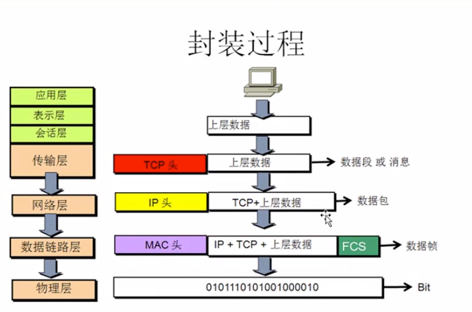
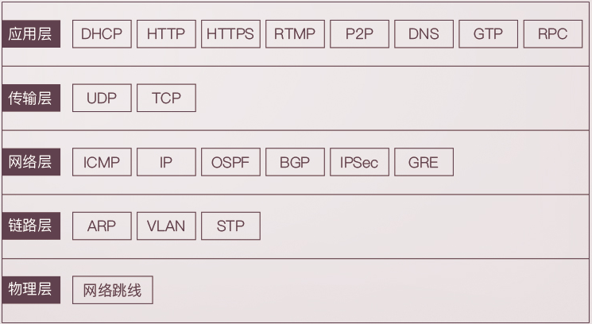

#### OSI 参考模型

应用层：所有能产生网络流量的应用程序

表示层：在传输之前是否进行加密，压缩处理

会话层：查木马

传输层： 可靠传输，流量控制，不可靠传输

网络层：选择最佳路径，规划IP地址

数据链路层：帧的开始和结束 实现透明传输 差错校验

物理层：网络设备的接口标准 电器标准 如何在物理链路上传输更快

### 五层网络

- 应用层
- 传输层
- 网络层
- 数据链路层
- 物理层