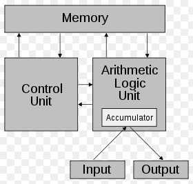
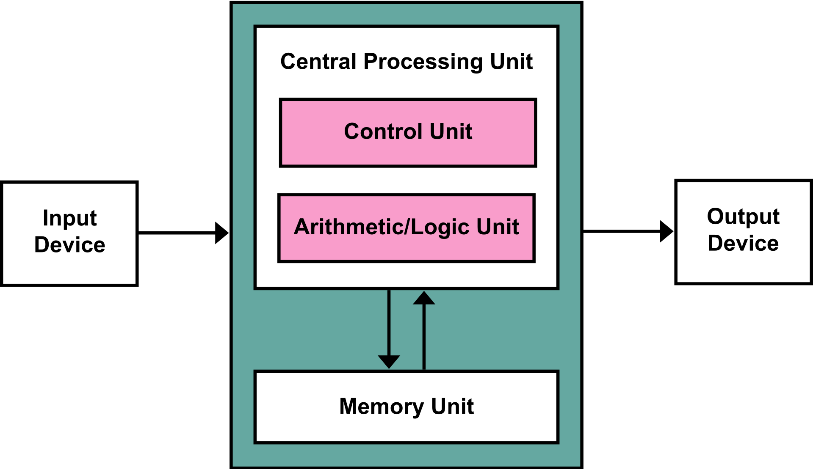
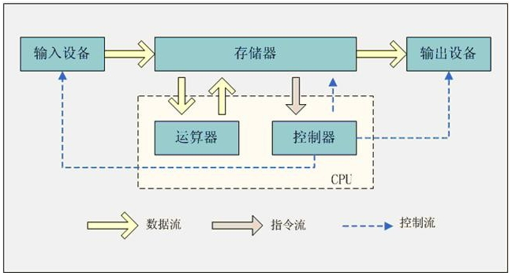

####  冯·诺伊曼结构

**冯·诺伊曼结构**（英语：Von Neumann architecture），也称**冯·诺伊曼模型**（Von Neumann model）或**普林斯顿结构**（Princeton architecture），是一种将程序指令存储器和数据存储器合并在一起的计算机设计概念结构。依本结构设计出的计算机又称**存储程序计算机**

#### 存储程序计算机在体系结构上主要特点：

1. 以运算单元为中心
2. 采用存储程序原理
3. 存储器是按地址访问、线性编址的空间
4. 控制流由指令流产生
5. 指令由操作码和地址码组成
6. 数据以二进制编码

#### 结构示意图

- Memory 内存
- Control Unit 控制器单元
- Arithmetic Logic Unit 算术逻辑单元
- Input 输入设备
- Output 输出设备

算术逻辑单元和控制端元共同组成了CPU

[First Draft of a Report on the EDVAC](https://en.wikipedia.org/wiki/First_Draft_of_a_Report_on_the_EDVAC)