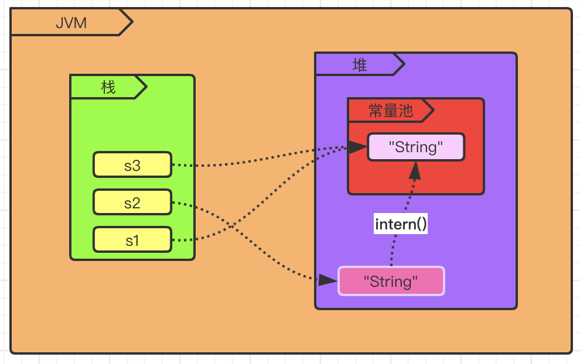

#### String 相关的面试题

从三个方面开始回答

1. 底层数据结构
2. 构造函数
3. 常见方法的源码实现


##### String 类型的底层数据结构

String 的底层数据结构为 char[], 源码如下：

```java
public final class String implements java.io.Serializable, Comparable<String>, CharSequence {
    ...
    /** The value is used for character storage. */
    private final char value[];
    ...
}
```


##### String 类型的常见构造函数

无参数

```java
public String() {
    this.value = "".value;
}
```

String 为参数

```java
public String(String original) {
    this.value = original.value;
    this.hash = original.hash;
}
```

char[] 为参数

```java
public String(char value[]) {
    this.value = Arrays.copyOf(value, value.length);
}
```

StringBuffer 为参数

```java
public String(StringBuffer buffer) {
    synchronized(buffer) {
        this.value = Arrays.copyOf(buffer.getValue(), buffer.length());
    }
}
```

StringBuilder 为参数

```java
public String(StringBuilder builder) {
    this.value = Arrays.copyOf(builder.getValue(), builder.length());
}
```

常见的几种构造函数如上源码所示，其余的基本上围绕这几种进行了功能增强.

###### **扩展：**

1. 在 char[],StringBuffer,StringBuilder 为参数的构造中使用了 Arrays.copyof() 方法，总最终调用的 java 本地方法 System.arraycopy()

```java
public static <T,U> T[] copyOf(U[] original, int newLength, Class<? extends T[]> newType) {
    @SuppressWarnings("unchecked")
    T[] copy = ((Object)newType == (Object)Object[].class)
        ? (T[]) new Object[newLength]
        : (T[]) Array.newInstance(newType.getComponentType(), newLength);
    System.arraycopy(original, 0, copy, 0,
                     Math.min(original.length, newLength));
    return copy;
}
```

2. String 为不可变字符，直接进行字符串的拼接操作，耗时较长，所以 Java 中提供了两种可变字符用了完成字符串的拼接操作。

   StringBuffer 线程安全

   ```java
   public synchronized StringBuffer append(CharSequence s) {
       toStringCache = null;
       super.append(s);
       return this;
   }
   ```

   StringBuilder 线程不安全

   ```java
   public StringBuilder append(String str) {
       super.append(str);
       return this;
   }
   ```

   两者的实现基本相似，而 StringBuffer 中采用了 synchronized 关键字来确保线程安全，但效率低于 StringBuilder ，即在不用考虑安全性的情况下拼接字符串，推荐使用 StringBuilder.


##### String 类型的常见方法

**equals()** 比较两个字符串是否相等

== 与 equals 在 Object 类中的操作结果是相同的,下面是 Object 中 equals() 方法的源码，== 比较基本类型是，直接判断俩个基本类型的值是否相等，而比较引用类型时，比较的是两个引用类型的句柄是否相同。

```java
public boolean equals(Object obj) {
    return (this == obj);
}
```

String 重写了 Object 中的 equals() 方法，已实现判断两个字符串是否完全相同，源码如下：

```java
public boolean equals(Object anObject) {
    if (this == anObject) {
        return true;
    }
    if (anObject instanceof String) {
        String anotherString = (String)anObject;
        int n = value.length;
        if (n == anotherString.value.length) {
            char v1[] = value;
            char v2[] = anotherString.value;
            int i = 0;
            while (n-- != 0) {
                if (v1[i] != v2[i])
                    return false;
                i++;
            }
            return true;
        }
    }
    return false;
}
```

操作：

1. 由于参数类型为 Object ,首先使用 instanceof 判断参数是否为 String
2. 判断两个字符串底层数据结构的 char[] 的长度是否相等
3. 遍历判断两个字符串底层数据结构 char[] 每个对应位置的字符是否相等
4. 全部相同返回 true， 否则false

**compareTo() ** 比较两个字符串是否相等

String 类中还提供了另外一种比较两个字符串是否相等的方法，源码如下

```java
public int compareTo(String anotherString) {
    int len1 = value.length;
    int len2 = anotherString.value.length;
    int lim = Math.min(len1, len2);
    char v1[] = value;
    char v2[] = anotherString.value;

    int k = 0;
    while (k < lim) {
        char c1 = v1[k];
        char c2 = v2[k];
        if (c1 != c2) {
            return c1 - c2;
        }
        k++;
    }
    return len1 - len2;
}
```

与 equals() 方法的操作基本相同，两点需要注意：1.入参为String 类型 2.返回值为 int 类型，为 0 表示两个字符串相同，其他均为不同。

**charAt()** 获取底层 char[] 中指定索引位置的字符，源码如下

```java
public char charAt(int index) {
    if ((index < 0) || (index >= value.length)) {
        throw new StringIndexOutOfBoundsException(index);
    }
    return value[index];
}
```

**indexOf()** 查询指定字符串/字符首次出现的索引位置,源码如下

```java
public int indexOf(String str) {
    return indexOf(str, 0);
}

public int indexOf(int ch) {
    return indexOf(ch, 0);
}
```

找到则返回索引值，找不到返回 -1，表示字符传中不存在这个字符。

**lastIndexOf()** 查询指定字符串/字符最后出现的索引位置,源码如下：

```java
public int lastIndexOf(int ch) {
    return lastIndexOf(ch, value.length - 1);
}

public int lastIndexOf(String str) {
    return lastIndexOf(str, value.length);
}
```

**contains()** 查询字符串中是否包含另一个字符串

```java
public boolean contains(CharSequence s) {
    return indexOf(s.toString()) > -1;
}
```

**toLowerCase()** 将所有字符转换成小写

```java
public String toLowerCase() {
    return toLowerCase(Locale.getDefault());
}
```

**toUpperCase()** 将所有字符转换成大写

```java
public String toUpperCase() {
    return toUpperCase(Locale.getDefault());
}
```

**trim()** 去除字符串首尾空格

```java
public String trim() {
    int len = value.length;
    int st = 0;
    char[] val = value;    /* avoid getfield opcode */

    while ((st < len) && (val[st] <= ' ')) {
        st++;
    }
    while ((st < len) && (val[len - 1] <= ' ')) {
        len--;
    }
    return ((st > 0) || (len < value.length)) ? substring(st, len) : this;
}
```

**length()** 字符串长度

```java
public int length() {
    return value.length;
}
```

**replace()** 替换所有匹配的字符为指定字符

```java
public String replace(char oldChar, char newChar) {
    if (oldChar != newChar) {
        int len = value.length;
        int i = -1;
        char[] val = value; /* avoid getfield opcode */

        while (++i < len) {
            if (val[i] == oldChar) {
                break;
            }
        }
        if (i < len) {
            char buf[] = new char[len];
            for (int j = 0; j < i; j++) {
                buf[j] = val[j];
            }
            while (i < len) {
                char c = val[i];
                buf[i] = (c == oldChar) ? newChar : c;
                i++;
            }
            return new String(buf, true);
        }
    }
    return this;
}
```

**replaceFirst()** 替换第一个匹配的字符串为指定字符串

```java
public String replaceFirst(String regex, String replacement) {
    return Pattern.compile(regex).matcher(this).replaceFirst(replacement);
}

public String replaceFirst(String replacement) {
    if (replacement == null)
        throw new NullPointerException("replacement");
    reset();
    if (!find())
        return text.toString();
    StringBuffer sb = new StringBuffer();
    appendReplacement(sb, replacement);
    appendTail(sb);
    return sb.toString();
}
```

**replaceAll()** 替换所有匹配的字符串为指定字符串

```java
public String replaceAll(String replacement) {
    reset();
    boolean result = find();
    if (result) {
        StringBuffer sb = new StringBuffer();
        do {
            appendReplacement(sb, replacement);
            result = find();
        } while (result);
        appendTail(sb);
        return sb.toString();
    }
    return text.toString();
}
```

**split()** 根据指定的字符串切割字符串为字符串数组

```java
public String[] split(String regex) {
    return split(regex, 0);
}
public String[] split(String regex, int limit) {
    /* fastpath if the regex is a
     (1)one-char String and this character is not one of the
        RegEx's meta characters ".$|()[{^?*+\\", or
     (2)two-char String and the first char is the backslash and
        the second is not the ascii digit or ascii letter.
     */
    char ch = 0;
    if (((regex.value.length == 1 &&
         ".$|()[{^?*+\\".indexOf(ch = regex.charAt(0)) == -1) ||
         (regex.length() == 2 &&
          regex.charAt(0) == '\\' &&
          (((ch = regex.charAt(1))-'0')|('9'-ch)) < 0 &&
          ((ch-'a')|('z'-ch)) < 0 &&
          ((ch-'A')|('Z'-ch)) < 0)) &&
        (ch < Character.MIN_HIGH_SURROGATE ||
         ch > Character.MAX_LOW_SURROGATE))
    {
        int off = 0;
        int next = 0;
        boolean limited = limit > 0;
        ArrayList<String> list = new ArrayList<>();
        while ((next = indexOf(ch, off)) != -1) {
            if (!limited || list.size() < limit - 1) {
                list.add(substring(off, next));
                off = next + 1;
            } else {    // last one
                //assert (list.size() == limit - 1);
                list.add(substring(off, value.length));
                off = value.length;
                break;
            }
        }
        // If no match was found, return this
        if (off == 0)
            return new String[]{this};

        // Add remaining segment
        if (!limited || list.size() < limit)
            list.add(substring(off, value.length));

        // Construct result
        int resultSize = list.size();
        if (limit == 0) {
            while (resultSize > 0 && list.get(resultSize - 1).length() == 0) {
                resultSize--;
            }
        }
        String[] result = new String[resultSize];
        return list.subList(0, resultSize).toArray(result);
    }
    return Pattern.compile(regex).split(this, limit);
}
```

**join()** 将字符串数组转换成字符串

例

```java
String[] strs = {"hello", "String", "bye"};

String join = String.join("-", strs);
```


##### 问题延伸

String 在 JVM 上的存储形式

```java
String s1 = "String";
String s2 = new String("String");
String s3 = "Str" + "ing";
System.out.println(s1 == s2);
System.out.println(s1 == s3);

s2 = s2.intern();
System.out.println(s1 == s2);
```



测试结果：

```
false
true
true
```

1. 首先 s1 和 s2 对比，两种方式都可以创建字符串，但是在 JVM 上的存储形式是截然不同的， s1 会先在常量池中寻找是否有为 “String” 的字符串，如果有直接返回字符串引用，没有则在常量池中创建字符串 “String”,然后返回其引用；s2 会直接在堆中创建字符串对象，只有调用 intern() 方法后，将字符串对象保存到常量池中。需要注意的是 jdk 1.7 时，常量池被移动到了堆中。

2. 再看 s1 和 s3 对比，测试结果为 true, 查看反编译结果，可以看出 s3 直接被编译成了 "String".

```jvm
   0: ldc           #2                  // String String
   2: astore_1
   3: new           #3                  // class java/lang/String
   6: dup
   7: ldc           #2                  // String String
   9: invokespecial #4                  // Method java/lang/String."<init>":(Ljava/lang/String;)V
  12: astore_2
  13: ldc           #2                  // String String
  15: astore_3
```

