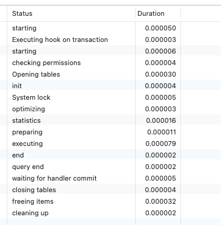

## 面试整理

### MySQL

#### 数据库的隔离级别

- 未提交读，read uncommited : 一个事务可以读到另一个事务未提交的数据（脏读）
- 已提交读， read commited：一个事务只能读到另一个事务提交之后的数据
- 不可重复的，repeatable read：一个事务在开始读取数据时，不允许修改操作 （mysql 默认级别）
- 序列化，serializable

#### 你用的Mysql是哪个引擎，各引擎之间有什么区别?

##### 一、InnoDB 

InnoDB 从 MySQL5.5（2010年） 版本代替 MyISAM 成为默认引擎, 相比MyISAM强调性能，InnoDB 侧重于提供事务支持以及外部键等高级数据库功能。InnoDB 的特点:

1. 支持事务。默认的事务隔离级别为可重复读（REPEATABLE-READ），通过MVCC（并发版本控制）来实现。
2. 使用的锁粒度默认为行级锁，可以支持更高的并发；当然，也支持表锁。
3. 支持外键约束；外键约束其实降低了表的查询速度，但是增加了表之间的耦合度。
4. 可以通过自动增长列，方法是auto_increment。
5. 配合一些热备工具可以支持在线热备份；
6. 在 InnoDB 中存在着缓冲管理，通过缓冲池，将索引和数据全部缓存起来，加快查询的速度；
7. 对于 InnoDB 类型的表，其数据的物理组织形式是聚簇表。所有的数据按照主键来组织。数据和索引放在一块，都位于B+数的叶子节点上；
8. InnoDB 表的select count(*) 比 MyISAM 慢很多；当执行 select count(*) from t 时，会先把数据读出来，一行一行的累加，最后返回总数量。 是的，真的会很慢。**需要注意的是，当count(\*) 语句包含 where 条件时，两种表的操作是一样的。**
9. DELETE FROM table时，InnoDB不会重新建立表，而是一行一行的删除。
10. InnoDB 的存储表和索引有下面两种形式：
    - 共享表空间存储：所有的表和索引存放在同一个表空间中。
    - 多表空间存储：表结构放在.frm文件，数据和索引放在.ibd文件中。分区表的话，每个分区对应单独的.ibd文件，分区表的定义可以查看我的其他文章。使用分区表的好处在于提升查询效率。

##### 二、MyISAM

1. 不支持事务。不支持事务，像是挣脱了枷锁，在读写（Insert、select）效率上，要高于InnoDB不少。场景在：日志记录、调查统计表时，绝对值得一用。对了，不支持事务，自然就不支持锁！

2. 体积小，质量大。MyISAM的索引和数据是分开的，并且索引是有压缩的，内存使用率就对应提高了不少。同时能加载更多索引，而Innodb的索引和数据是紧密捆绑的，没有使用压缩从而会造成 Innodb 比 MyISAM 数据文件体积庞大很多。每张MyISAM表在磁盘上会对应三个文件。

   （1）.frm文件：存储表的定义数据

   （2）.MYD文件：存放表具体记录的数据

   （3）.MYI文件：存储索引

3. 如果和 MyISAM 比 Insert 写操作的话，Innodb还达不到MyISAM的写性能，如果是针对基于索引的update操作，确实MyISAM会慢于 InnoDB。

4. MyISAM表的select count(*) 是非常快的；在 MyISAM 存储引擎中，把表的总行数（row）存储在磁盘上，当执行 select count(*) from t 时，直接返回总数据。但是，当 count(*) 语句包含 where条件时，MyISAM 和 InnoDB 这两种引擎的操作是一样的。

5. DELETE FROM table时，MyISAM会先将表结构备份到一张虚拟表中，然后执行drop，最后根据备份重建该表。

##### 三、Memory

1. 支持的数据类型有限制，比如：不支持TEXT和BLOB类型。对于字符串类型的数据，只支持固定长度的行，VARCHAR(64)会被自动存储为CHAR(64)类型；
2. 只支持表级锁。所以，在访问量比较大时，表级锁会成为MEMORY存储引擎的瓶颈；
3. 于数据是存放在内存中，一旦[服务器](https://cloud.tencent.com/product/cvm?from=10680)宕机，数据就会丢失；数据库主从切换的配置要设置好。
4. 查询的时候，如果有用到临时表，而且临时表中有BLOB，TEXT类型的字段，那么这个临时表就会转化为MyISAM类型的表，性能会急剧降低；
5. 默认使用hash索引。

#### 如何对查询命令进行优化?

##### 一、**MySQL优化基础**

传统关系型数据库里面的优化器分为CBO(Cost_Based Optimizer)和RBO(Rule-Based Optimizer)两种 

**CBO** : CBO 会从目标诸多的执行路径中选择一个成本最小的执行路径来作为执行计划。这里的成本实际代表了MySQL根据相关统计信息计算出来目标SQL对应的步骤的IO，CPU等消耗。也就是意味着执行目标SQL所需要IO,CPU等资源的一个估计值。而成本值是根据索引，表，行的统计信息计算出来的。MySQL里Cardinality是CBO特有的概念，它是指指定集合包含的记录数，说白了就是指定结果集的行数。Cardinality和成本值的估计息息相关，特别是IO资源消耗，随着该结果集的递增而递增。

**RBO** : RBO 所用的判断规则是一组内置的规则，这些规则是硬编码在数据库的编码中的，RBO会根据这些规则去从SQL诸多的路径中来选择一条作为执行计划 RBO最大问题在于硬编码在数据库里面的一系列固定规则，来决定执行计划。并没有考虑目标SQL中所涉及的对象的实际数量，实际数据的分布情况，这样一旦规则不适用于该SQL，那么很可能选出来的执行计划就不是最优执行计划。

##### 二、**MySQL索引特点**

1. 必须有主键

2. 二级索引-回表操作

   

   仅对二级索引获取结果是非常有效的，做到隔离的其他数据，但对于不在二级索引范围内的，就是回表操作，这部分需要谨慎考虑。

3. 索引-其他：

   - 返回20%以上数据使用全表扫描数据；
   - 数据集合小的表作为驱动表；
   - 多个条件使用，组合索引；
   - 索引键上不做运算；

##### 三、**MySQL优化命令行**

##### **EXPLAIN**

在不执行实际SQL语句的情况下，EXPLAIN可以说dba，开发人员常用的SQL优化命令行，EXPLAIN适用于SELECT、DELETE、INSERT、REPLACE和UPDATE语句,当EXPLAIN语句一起使用时，MySQL会显示优化器关于语句执行计划的信息。也就是说，MySQL解释了它将如何处理这条语句，包括有关表如何连接和以何种顺序连接的信息，EXPLAIN会展示预执行计划信息.

执行之前，要了解下显示字段代表意义：


###### EXPLAIN

```mysql
EXPLAIN SELECT * FROM <table_name>;
```


###### EXPLAIN FORMAT=TREE：

```mysql
EXPLAIN FORMAT=TREE SELECT * FROM <table_name>;
```


###### EXPLAIN FORMAT=JSON

```json
{
    "query_block":{
        "select_id":1,
        "cost_info":{
            "query_cost":"3.85"
        },
        "table":{
            "table_name":"member",
            "access_type":"ALL",
            "rows_examined_per_scan":36,
            "rows_produced_per_join":36,
            "filtered":"100.00",
            "cost_info":{
                "read_cost":"0.25",
                "eval_cost":"3.60",
                "prefix_cost":"3.85",
                "data_read_per_join":"5K"
            },
            "used_columns":[
                "id",
                "member_id",
                "user_id",
                "group_id",
                "parent_member_id",
                "invitation_code",
                "grade_id",
                "member_type",
                "growth_value",
                "expiration_date",
                "delete_flag",
                "creator_id",
                "updater_id",
                "create_time",
                "update_time"
            ]
        }
    }
}
```

备注：3种方式算是预评估计划，但实际可能按照当时的情况，会变动。3种方式下多了一些字段：如 cost ,read_cost,eval_cost prefix_cost,data_read_per_join都是估计的成本相关信息，所以这些成本信息仅作为参考。毫秒为单位

###### EXPLAIN ANALYZE

```mysql
EXPLAIN ANALYZE SELECT * FROM <table_name>;
```

MySQL 8.0.18引入了EXPLAIN ANALYZE，输出的信息是关于优化器估计执行成本和实际成本。 EXPLAIN ANALYZE可以用于SELECT语句，多表UPDATE和DELETE语句。

###### EXPLAIN CONNECTION

```mysql
EXPLAIN [options] FOR CONNECTION connection_id;
```

##### **PROFILE**

PROFILE语句显示当前会话过程中执行的语句的资源使用情况。

```mysql
SHOW PROFILE [type [, type] ... ] [FOR QUERY n] [LIMIT row_count [OFFSET offset]] type: { ALL | BLOCK IO | CONTEXT SWITCHES | CPU | IPC | MEMORY | PAGE FAULTS | SOURCE | SWAPS }

```

- ALL 显示所有性能信息
- BLOCK IO 显示块IO操作的次数
- CONTEXT SWITCHES 显示上下文切换次数，不管是主动还是被动
- CPU 显示用户CPU时间、系统CPU时间
- IPC 显示发送和接收的消息数量
- MEMORY [当前没有实现]
- PAGE FAULTS 显示页错误数量
- SOURCE 显示源码中的函数名称与位置
- SWAPS 显示SWAP的次数

```mysql
show variables like '%profiling%';
```


```mysql
SHOW PROFILES;

SHOW PROFILE FOR QUERY 1;
```




```mysql
SHOW PROFILE CPU FOR QUERY 1;
```


资源方面影响SQL语句执行效率的时候，可通过这个方式获取信息，特别是IO，CPU，网络等方面的问题，能有效的定位。

##### OPTIMIZER_TRACE

```mysql
show variables like '%optimizer_trace%';
```


- optimizer_trace：enabled：启用/禁用optimizer_trace功能 ， one_line：决定了跟踪信息的存储方式，为on表示使用单行存储，否则以JSON树的标准展示形式存储。
- optimizer_trace_features：该变量中存储了跟踪信息中可控的打印项，可以通过调整该变量，greedy_search,range_optimizerdynamic_range,repeated_subselect
- optimizer_trace_max_mem_size ：optimizer_trace内存的大小，如果跟踪信息超过这个大小，信息将会被截断
- optimizer_trace_offset：则是约束偏移量。和 LIMIT 一样，optimizer_trace_offset 从0开始计算


使用方式：

```mysql
1.SET OPTIMIZER_TRACE="enabled=on";
2.执行 sql 语句
3. SELECT * FROM INFORMATION_SCHEMA.OPTIMIZER_TRACE limit 30 ;
4.关闭 SET OPTIMIZER_TRACE="enabled=off";
```

TRACE过程: 


##### 问题 SQL 抓取

MySQL怎样抓有问题的sql 语句。目前接触的经验，可以归纳为3个方面：

- 慢日志；
- performance_schema系统性能表；
- 业务的一些反馈， 死锁检查，jdbc探针，网络流量镜像等方式； 下面只普遍的前2种方式说明。

###### 慢日志

最普遍常用的方式，当语句执行时间较长时，通过日志的方式进行记录，这种方式就是慢查询的日志。 开启慢查询日志，可以让MySQL记录下查询超过指定时间的语句，通过定位分析性能的瓶颈，才能更好的优化数据库系统的性能。

参数说明：


慢日志分析方式： 

1）使用MySQL官方提供的开源工具mysqldumpslow进行分析

```mysql
 mysqldumpslow -t 10  /data/mysql/mysql-slow.log  #显示出慢查询日志中最慢的10条sql
```

2）perconal提供的pt-query-digest工具进行分析

```mysql
pt-query-digest  /data/mysql/mysql-slow.log
```


备注： 

第一部分：显示出了日志的时间范围，以及总的sql数量和不同的sql数量。 

第二部分：显示出统计信息。 

第三部分：每一个sql具体的分析

如何通过pt-query-digest 慢查询日志发现有问题的sql

- 查询次数多且每次查询占用时间长的sql 通常为pt-query-digest分析的前几个查询
- IO消耗大的sql 注意pt-query-digest分析中的Rows examine项
- 索引命中统计 注意pt-query-digest分析中Rows examine（扫描行数） 和 Rows sent （发送行数）的对比 ，如果扫描行数远远大于发送行数，则说明索引命中率并不高。

###### **events_statements_summary_by_digest 统计的 SQL 语句**

性能监控 performance_schema 下记录 SQL 执行情况： 

events_statements_summary_by_digest：sql语句汇总统计数据，表结构说明如下:


备注：数据行数performance_schema_digests_size控制，默认是10000，如果超过这个最大值，新的sql语句无法插入。

#### 数据库的优化?

#### Sql注入是如何产生的，如何防止?

##### SQL注入的原理

SQL 注入的原理主要有以下 4 点：

###### 1）恶意拼接查询

我们知道，SQL 语句可以查询、插入、更新和删除数据，且使用分号来分隔不同的命令。例如：

```mysql
SELECT * FROM users WHERE user_id = $user_id
```

其中，user_id 是传入的参数，如果传入的参数值为“1234; DELETE FROM users”，那么最终的查询语句会变为：

```mysql
SELECT * FROM users WHERE user_id = 1234; DELETE FROM users
```

如果以上语句执行，则会删除 users 表中的所有数据。

###### 2）利用注释执行非法命令。

SQL 语句中可以插入注释。例如：

```mysql
SELECT COUNT(*) AS 'num' FROM game_score WHERE game_id=24411 AND version=$version
```

如果 version 包含了恶意的字符串`'-1' OR 3 AND SLEEP(500)--`，那么最终查询语句会变为：

```mysql
SELECT COUNT(*) AS 'num' FROM game_score WHERE game_id=24411 AND version='-1' OR 3 AND SLEEP(500)--
```

以上恶意查询只是想耗尽系统资源，SLEEP(500) 将导致 SQL 语句一直运行。如果其中添加了修改、删除数据的恶意指令，那么将会造成更大的破坏。

###### 3）传入非法参数

SQL 语句中传入的字符串参数是用单引号引起来的，如果字符串本身包含单引号而没有被处理，那么可能会篡改原本 SQL 语句的作用。 例如：

```mysql
SELECT * FROM user_name WHERE user_name = $user_name
```

如果 user_name 传入参数值为 G'chen，那么最终的查询语句会变为：

```mysql
SELECT * FROM user_name WHERE user_name ='G'chen'
```

一般情况下，以上语句会执行出错，这样的语句风险比较小。虽然没有语法错误，但可能会恶意产生 SQL 语句，并且以一种你不期望的方式运行。

###### 4）添加额外条件

在 SQL 语句中添加一些额外条件，以此来改变执行行为。条件一般为真值表达式。例如：

```mysql
UPDATE users SET userpass='$userpass' WHERE user_id=$user_id;
```

如果 user_id 被传入恶意的字符串“1234 OR TRUE”，那么最终的 SQL 语句会变为：

```mysql
UPDATE users SET userpass= '123456' WHERE user_id=1234 OR TRUE;
```

这将更改所有用户的密码。

##### 避免SQL注入

对于 SQL 注入，我们可以采取适当的预防措施来保护数据安全。下面是避免 SQL 注入的一些方法。

###### 1. 过滤输入内容，校验字符串

过滤输入内容就是在数据提交到数据库之前，就把用户输入中的不合法字符剔除掉。可以使用编程语言提供的处理函数或自己的处理函数来进行过滤，还可以使用正则表达式匹配安全的字符串。

如果值属于特定的类型或有具体的格式，那么在拼接 SQL 语句之前就要进行校验，验证其有效性。比如对于某个传入的值，如果可以确定是整型，则要判断它是否为整型，在浏览器端（客户端）和服务器端都需要进行验证。

###### 2.参数化查询

参数化查询目前被视作是预防 SQL 注入攻击最有效的方法。参数化查询是指在设计与数据库连接并访问数据时，在需要填入数值或数据的地方，使用参数（Parameter）来给值。

MySQL 的参数格式是以“?”字符加上参数名称而成，如下所示：

UPDATE myTable SET c1 = ?c1, c2 = ?c2, c3 = ?c3 WHERE c4 = ?c4

在使用参数化查询的情况下，数据库服务器不会将参数的内容视为 SQL 语句的一部分来进行处理，而是在数据库完成 SQL 语句的编译之后，才套用参数运行。因此就算参数中含有破坏性的指令，也不会被数据库所运行。

###### 3. 安全测试、安全审计

除了开发规范，还需要合适的工具来确保代码的安全。我们应该在开发过程中应对代码进行审查，在测试环节使用工具进行扫描，上线后定期扫描安全漏洞。通过多个环节的检查，一般是可以避免 SQL 注入的。

有些人认为存储过程可以避免 SQL 注入，存储过程在传统行业里用得比较多，对于权限的控制是有一定用处的，但如果存储过程用到了动态查询，拼接 SQL，一样会存在安全隐患。

下面是在开发过程中可以避免 SQL 注入的一些方法。

###### 1. 避免使用动态SQL

避免将用户的输入数据直接放入 SQL 语句中，最好使用准备好的语句和参数化查询，这样更安全。

###### 2. 不要将敏感数据保留在纯文本中

加密存储在数据库中的私有/机密数据，这样可以提供了另一级保护，以防攻击者成功地排出敏感数据。

###### 3. 限制数据库权限和特权

将数据库用户的功能设置为最低要求；这将限制攻击者在设法获取访问权限时可以执行的操作。

###### 4. 避免直接向用户显示数据库错误

攻击者可以使用这些错误消息来获取有关数据库的信息。

#### NoSQL和关系数据库的区别?

#### MySQL与MongoDB本质之间最基本的差别是什么

#### Mysql数据库中怎么实现分页?

LIMIT出现在查询语句的最后，可以使用一个参数或两个参数来限制取出的数据。其中第一个参数代表偏移量：offset（可选参数），第二个参数代表取出的数据条数：rows。

##### 单参数用法
当指定一个参数时，默认省略了偏移量，即偏移量为0，从第一行数据开始取，一共取rows条。

```mysql
/* 查询前5条数据 */
SELECT * FROM Student LIMIT 5;
```

##### 双参数用法
当指定两个参数时，需要注意偏移量的取值是从0开始的，此时可以有两种写法：

```mysql
/* 查询第1-10条数据 */
SELECT * FROM Student LIMIT 0,10;
/* 查询第11-20条数据 */
SELECT * FROM Student LIMIT 10 OFFSET 10;
```

#### 什么是数据的完整性?

数据完整性分为四类：实体完整性（Entity Integrity）、域完整性（Domain Integrity）、参照完整性（Referential Integrity）、用户自定义完整性（User-definedIntegrity）。

**1、实体完整性**

实体完整性是在关系模型中，数据库完整性三项规则的其中之一。实体完整性这项规则要求每个数据表都必须有主键，而作为主键的所有字段，其属性必须是独一及非空值。

**2、域完整性**

域完整性：是指一个列的输入有效性，是否允许为空值。强制域完整性的方法有：限制类型（通过设定列的数据类型）、格式（通过CHECK约束和规则）或可能值的范围（通过FOREIGN KEY约束、CHECK约束、DEFAULT定义、NOT NULL定义和规则）。如：学生的考试成绩必须在0～100之间，性别只能是“男”或“女”。

**3、参照完整性**

参照完整性：是指保证主关键字（被引用表）和外部关键字（引用表）之间的参照关系。它涉及两个或两个以上表数据的一致性维护。

外键值将引用表中包含此外键的记录和被引用表中主键与外键相匹配的记录关联起来。

在输入、更改或删除记录时，参照完整性保持表之间已定义的关系，确保键值在所有表中一致。这样的一致性要求确保不会引用不存在的值，如果键值更改了，那么在整个数据库中，对该键值的所有引用要进行一致的更改。

参照完整性是基于外键与主键之间的关系。

**4、用户自定义完整性**

用户自定义完整性是针对某一具体关系数据库的约束条件，它反映某一具体应用所涉及的数据必须满足的语义要求。主要包括非空约束、唯一约束、检查约束、主键约束、外键约束。

数据库采用多种方法来保证数据完整性，包括外键、约束、规则和触发器。系统很好地处理了这四者的关系，并针对不同的具体情况用不同的方法进行，相互交叉使用，相补缺点。

#### MySQL的复制原理以及流程

**主**：binlog线程——记录下所有改变了数据库数据的语句，放进master上的binlog中；

**从**：io线程——在使用start slave 之后，负责从master上拉取 binlog 内容，放进 自己的relay log中；

**从**：sql执行线程——执行relay log中的语句；

